# Day05

## 存储引擎

1. MySQL的体系结构

   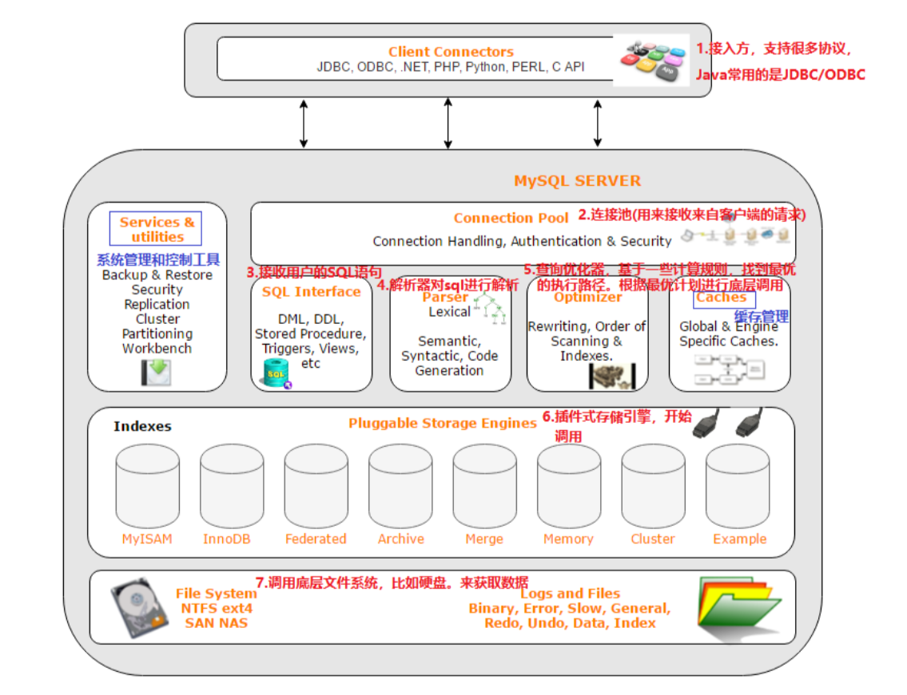

   - 连接层：
     - 包含 Sock 通信以及 TIP/IP 通信的客户端的连接，主要去完成类似于连接处理，授权认证，包含线程池的概念，通过SSL保证和验证安全连接的权限
   - 服务层：
     - SQL接口，缓存查询，SQL的分析和优化，包含一些内置函数执行，优化sql,确定表的查询顺序，以及是否用索引也是再这里，生成相应的执行操作。查询语句还会查询内部的缓存，提高查询效率。
   - 引擎层：
     - 真正的负责 MySQL 中的数据的存储和查取，服务器通过 api 和存储引擎通信。不同的引擎具有不同的功能，根据业务需求选取引擎。
   - 存储层：
     - 做数据库的存储和提取，数据，索引，二进制日志，错误日志，查询日子，慢查询日志等存储到系统文件上，通过存储引擎进行交互。

2. 注意：MySQL默认使用 Innodb 引擎。

   - SHOW create table emp; 查看创建表的语句

   - 查询当前数据库支持的引擎 SHOW ENGINES

   - 默认的存储引擎可在 my.ini 配置文件中使用 default-storage-engine 选项指定。

   - 想去修改存储引擎

     ```sql
     ALTER TABLE TABLENAME ENGINE = INNODB;
     ```

     

3. 如何创建表的时候添加引擎

   ```sql
   REATE TABLE `emp` (
     `id` int NOT NULL AUTO_INCREMENT COMMENT 'ID',
     `name` varchar(50) NOT NULL COMMENT '姓名',
     `age` int DEFAULT NULL COMMENT '年龄',
     `dept_id` int DEFAULT NULL COMMENT '部门ID',
     PRIMARY KEY (`id`),
     KEY `fk_emp_dept_id` (`dept_id`),
     CONSTRAINT `fk_emp_dept_id` FOREIGN KEY (`dept_id`) REFERENCES `department` (`id`) ON DELETE SET NULL ON UPDATE SET NULL
   ) ENGINE=InnoDB AUTO_INCREMENT=7 DEFAULT CHARSET=utf8mb4 COLLATE=utf8mb4_0900_ai_ci COMMENT='员工表';
   ```

   ### 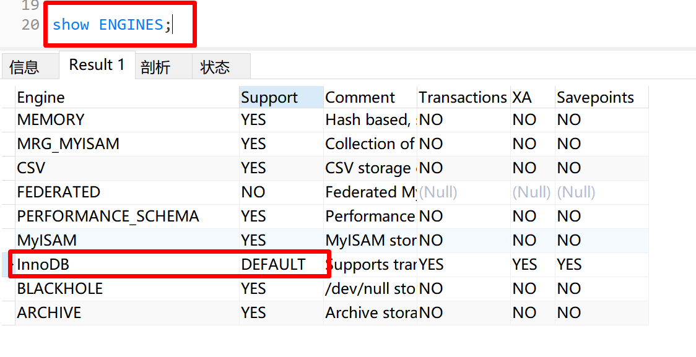

### Innodb

1. 概述：InnoDB数据引擎是一种兼顾高可信和高性能通用存储引擎，5.5之后是默认的存储引擎。

2. 特点：

   - 支持事务（DML遵循 ACID模型）
   - 支持外键 FOREIGN KEY 约束，保证数据的完整性和正确性
   - 支持行级锁，提高并发访问的性能

3. 文件，tableName.ibd: tableName 表名，innodb引擎每张表都会生成一个对应的表空间文件，存储表的结构，数据，索引。

   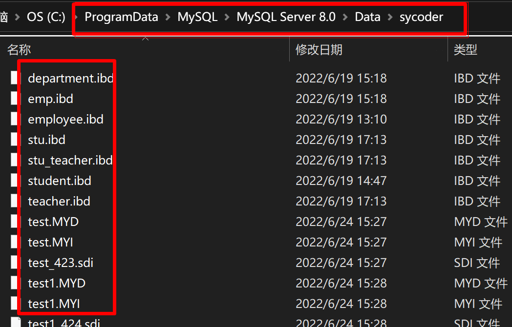

   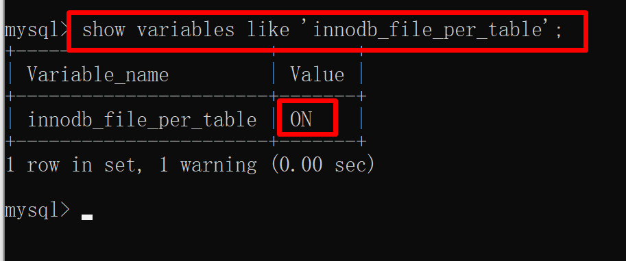

4. 注意：直接打开 idb 文件是二进制文件，是乱码的，如果想去查看和观察，mysql 提供了一个指令 idb2sdi (sdi-是新版本的存储表结构的方式，frm-之前版本的)

   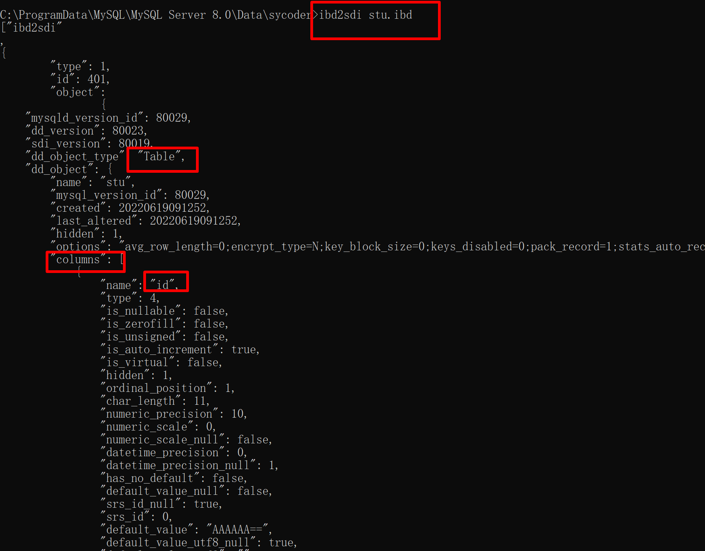

5. 储存结构图

   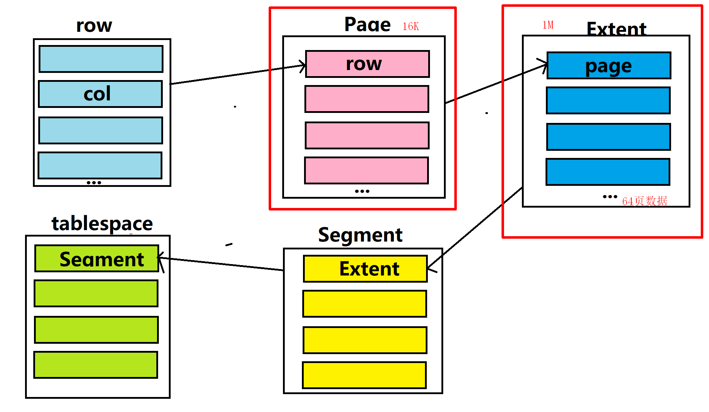

   - 表空间（tablespace）:Innodb 存储引擎逻辑结构的最高层，ibd 文件其实就是我们的表空间文件，表空间中包含多个 Segment(段)
   - 段（Segment）:数据段，索引段，回滚段等。一个段里面包含多个区。
   - 区（Extent）:区是表空间的单元结构，每个区大小为1M，一个区包含64页数据
   - 页（page）:页是最小的组成单元，它是 InnoDB 存储引擎磁盘管理的最小单元，大小默认是 16K。
   - 行（row）:每一行定义存储字段，还有一些隐藏字段。

### MyiSam

1. 概述：是mysql早期的存储引擎
2. 特点：
   - 不支持事务，不支持外键
   - 支持表锁，不支持行锁
   - 访问速度快
3. 文件
   - emp.sdi:存储表结构信息
   - emp.MYD:存储数据
   - emp.MYI:存储索引

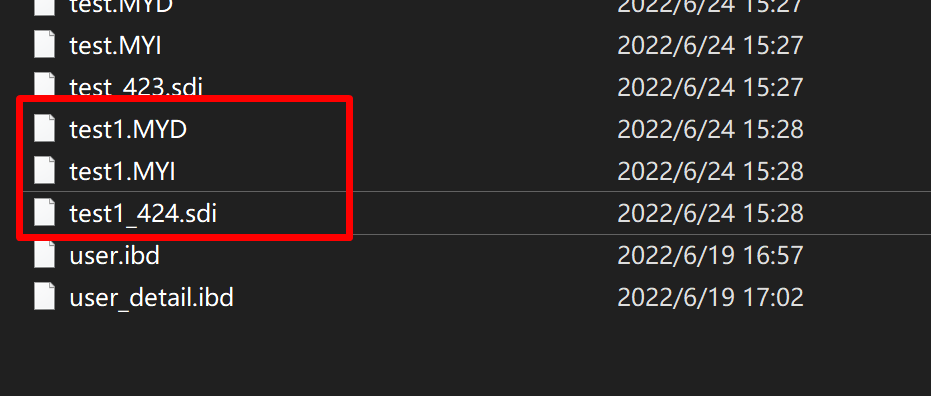

### Memory

1. 概述：使用内存来进行操作，会受到断电影响，所以只能用来做临时表或缓存。
2. 特点：
   - 内存存放，支持 hash 索引（默认）查询速度很快
3. 文件
   - sdi:存储表结构信息

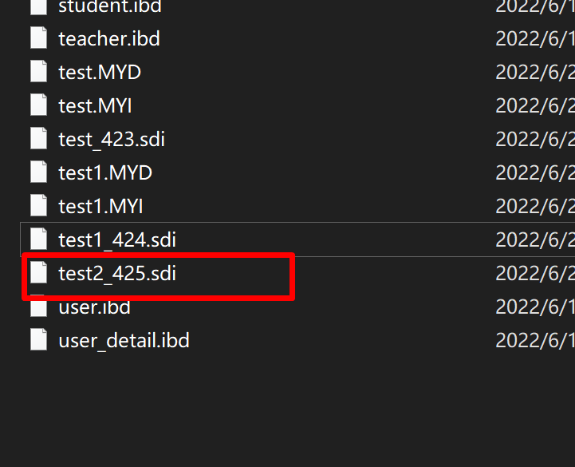

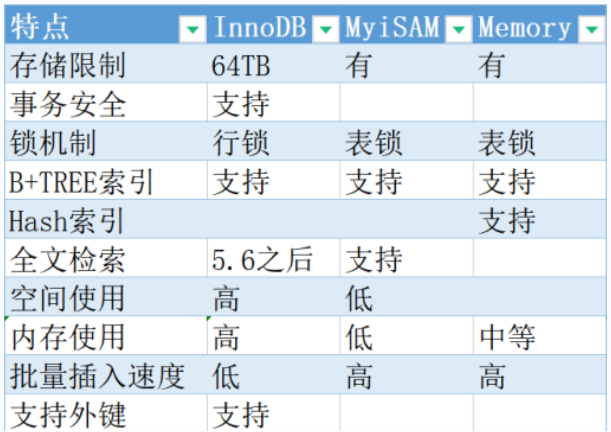

### 存储引擎的选用

- Innodb:支持事务、外键，应用对于事务的完整性有比较高要求的时候选择 Innodb(更新，删除)
- MyiSAM:应用在读和插入比较多的地方，（更新和删除少）并且对事务的完整性并发性要求不高。
- Memory:把数据保存到内存中，访问速度快，对于临时表缓存就非常友好，对于表的大小是有限制的，不能去保证数据安全的。


## 事务

1. 注意：一定要使用 Innodb 存储引擎

2. 概述：一组操作的集合，是不可分割的工作单元，会把一个部分当成一个整体来处理，事务会把操作同时提交或者是撤销。要么同时成功，要么同时失败。

3. 比如：上云转账1000元给张三，第一，上云账户少1000，第二，张三账户多一千。

   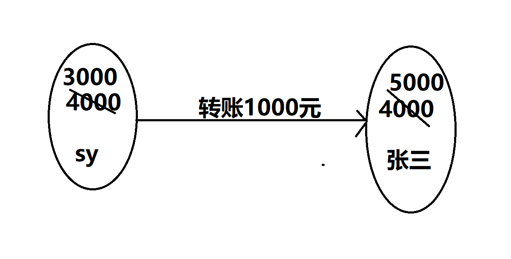

### 事务操作

1. 数据准备

   ```sql
   drop table if exists account; 
   #创建账户信息表
   create table account( 
   	id int primary key AUTO_INCREMENT comment 'ID',
   	name varchar(10) comment '姓名', 
   	money double(10,2) comment '余额' 
   ) comment '账户表'; 
   
   insert into account(name, money) VALUES ('上云',4000), ('张三',4000);
   ```

   

#### 未控制事务演示

1. 正常转账的情况下

   ```sql
   #正常转账的情况下
   select * from account;
   
   #减少上云账户上的1000元
   update account set money = money -1000 where name = '上云'; 
   #增加张三账户上的1000元
   update account set money = money + 1000 where name = '张三';
   ```

   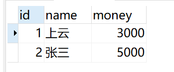

2. 异常转账的情况下

   ```sql
   select * from account;
   
   update account set money = 4000;
   
   update account set money = money -1000 where name = '上云'; 
   
   出错了
   
   update account set money = money + 1000 where name = '张三';
   ```


#### 控制事务方式1

1. 查看事务提交方式

   ```sql
   SELECT @@autocommit
   
   
   1:自动提交
   0:手动提交
   ```

2. 设置事务提交方式

   ```sql
   set @@autocommit=0;#设置成手动提交
   ```

3. 提交事务

   ```sql
   commit;
   ```

4. 回滚事务

   ```sql
   rollback;
   ```


#### 控制事务方式2

1. 开启事务

   ```sql
   start transaction 或者 begin;
   ```

2. 提交事务

   ```sql
   commit;
   ```

3. 回滚事务

   ```sql
   rollback;
   ```


### 事务的作用对象

1. 只能回滚 insert、delete 和 update 语句，不能回滚 select（回滚 select 没有任何意义），对于
   create、drop、alter 这些无法回滚.


### 事务的四大特征（ACID）

1. 原子性（Atomicity）：整个事务中的所有操作，必须作为一个单元全部完成（或全部取消）不可分割，要么全部成功，要么全部失败。
2. 一致性（Consistency）：事务完成时，数据保持一致的状态。
3. 隔离性(Isolation)：数据库会提供隔离机制，并发不会相互影响和干扰。一个事务不会影响其他事务的运行。
4. 持久性(Durability)：在事务完成以后，该事务对数据库所作的更改将持久地保存在数据库之中，并不会被回滚。


### 并发事务的问题（面试经常问）

1. 脏读：一个事务读到另外一个事务还没有提交的数据
   - 事务B读取到事务A还没有提交的数据

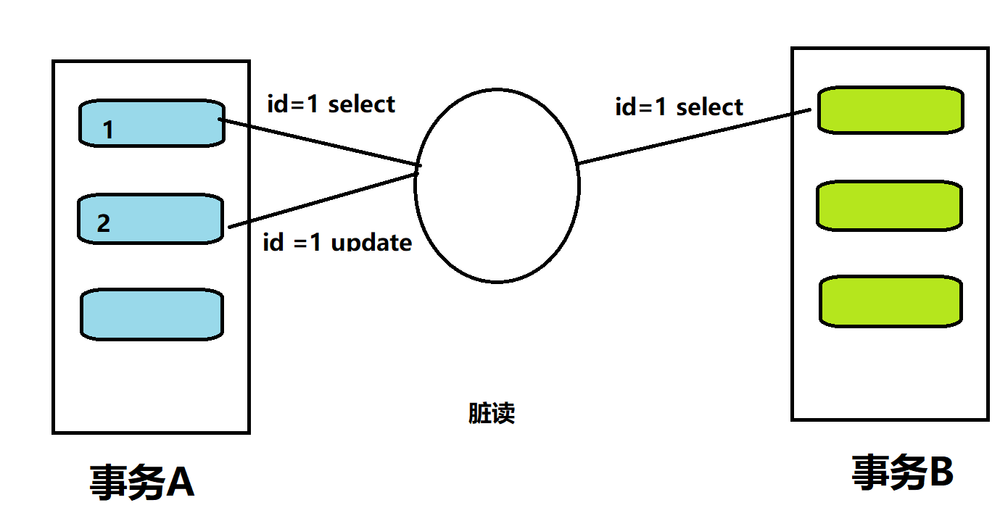


2. 不可重复读：一个事务先后读取同一条记录，但两次读取的数据不同，称之为不可重复读。
   - 事务A两次读取同一条数据，但是读取到的数据不一样

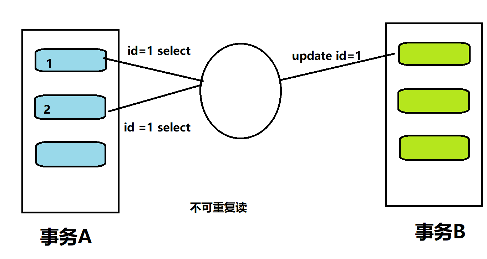


3. 幻读：一个事务按照条件查询数据时，没有对应的数据行，但是在插入数据时，又发现这行数据已经存在，好像出现了 "幻影"。

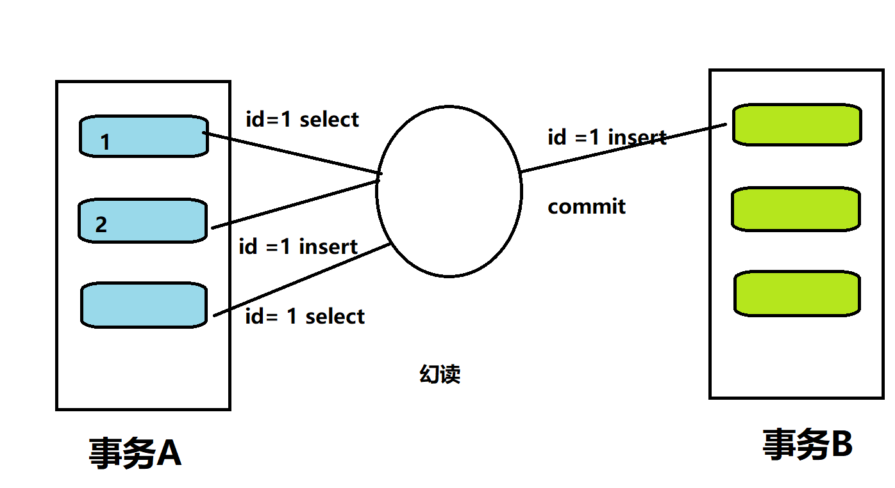

### 事务的隔离级别

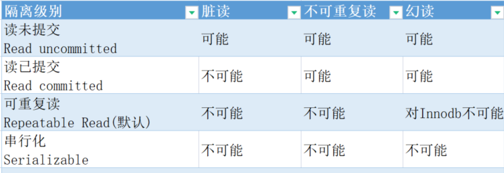

1. 注意：隔离级别越高，数据越安全，但是性能低。需要在性能和安全之间进行取舍。

2. 查看隔离级别：

   ```sql
   SELECT @@TRANSACTION_ISOLATION;
   ```

   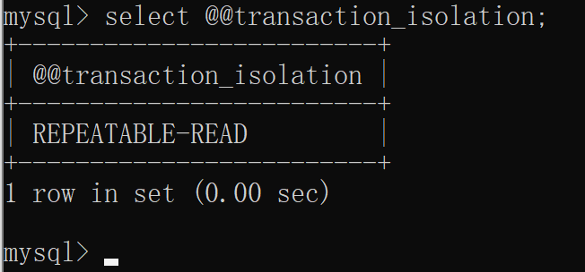

3. 设置隔离级别

   ```sql
   SET [ SESSION | GLOBAL ] TRANSACTION ISOLATION LEVEL { READ UNCOMMITTED | READ COMMITTED | REPEATABLE READ | SERIALIZABLE }
   ```

   - 隔离级别分为全局的和会话级的

     - 全局的：对所有会话有效
     - 会话级的：只对当前的会话有效

     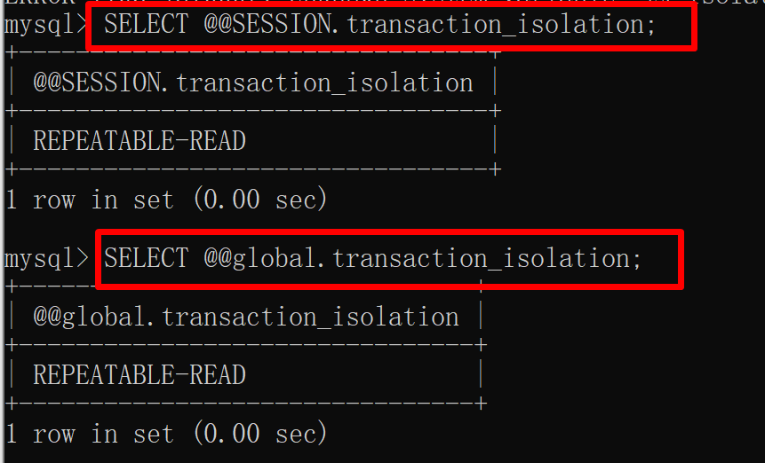

#### 演示

1. 脏读(read uncommitted 未提交读)

   | 会话1                                                    | 会话2                  |
   | -------------------------------------------------------- | ---------------------- |
   | use transaction;                                         | use transaction;       |
   | set global transaction isolation level read uncommitted; |                        |
   | start transaction;                                       |                        |
   |                                                          | start transaction;     |
   | insert into account values(2,'sy',100);                  |                        |
   |                                                          | select * from account; |
   | rollback;                                                |                        |
   |                                                          | select * from account; |
   |                                                          |                        |

2. read committed(已提交读)

   | 会话1                                                  | 会话2                                  |
   | ------------------------------------------------------ | -------------------------------------- |
   | set global transaction isolation level read committed; |                                        |
   | start transaction;                                     |                                        |
   |                                                        | start transaction;                     |
   | insert into account values(2,'sy',100);                |                                        |
   | select * from account;                                 |                                        |
   |                                                        | select * from account;(不能查询出数据) |
   | commit;                                                |                                        |
   |                                                        | select * from account;(查询出数据)     |
   |                                                        |                                        |

3. repeatable read(可重复读)

   | 会话1                                                   | 会话2                           |
   | ------------------------------------------------------- | ------------------------------- |
   | set global transaction isolation level repeatable read; |                                 |
   | start transaction;                                      |                                 |
   |                                                         | start transaction;              |
   | insert into account values(3,'xxxxy',100);              |                                 |
   |                                                         | select * from account(读不出来) |
   | commit;                                                 |                                 |
   |                                                         | select * from account(能读出来) |
   |                                                         |                                 |
   |                                                         |                                 |

   