# 索引

## 索引的概述

1. 概念：索引（index）是帮助数据库高效获取数据的数据结构，数据库系统维护查找数据的特定数据结构，这些数据结构指向我们的数据，通过高效算法实现高效查找。

2. 学习过的数据结构：

   - 链表
   - hash表
   - 二叉树
   - 红黑树

3. 无索引的查询

   ```sql
   select * from emp where age = 19;
   ```

   - 无索引的情况下，需要全文检索，全表扫描，性能会很低。

   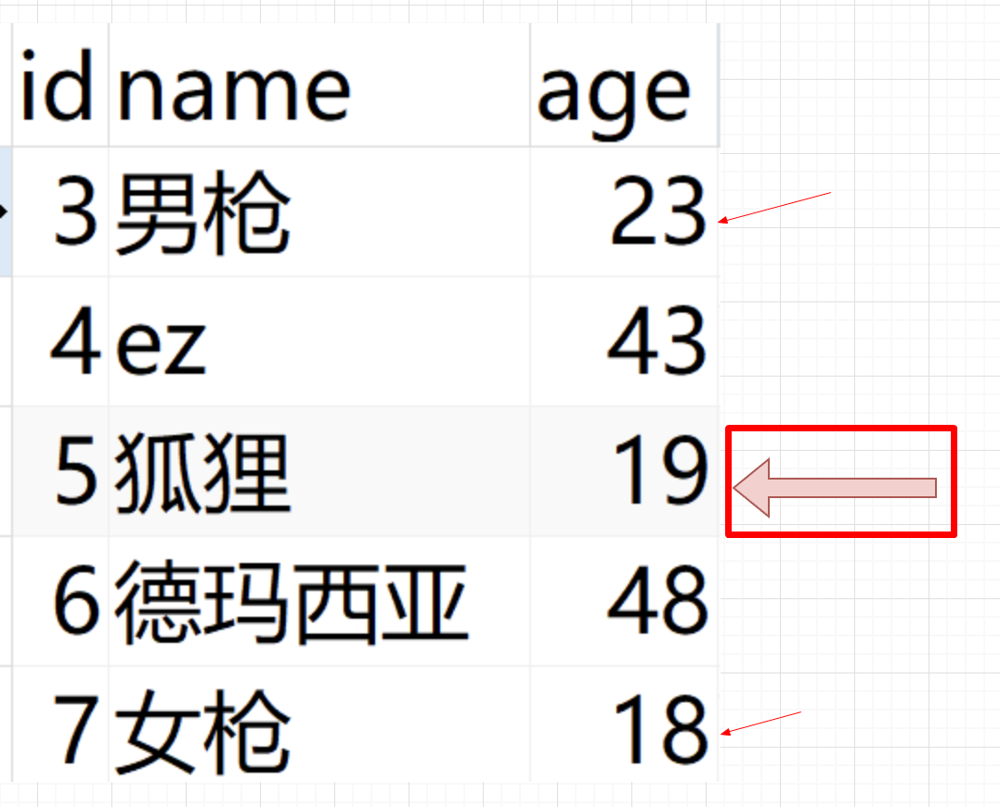

4. 有索引查询

   ```sql
   select * from emp where age = 19;
   ```

   - 有索引，扫描特别快，时间复杂度极大降低，提高了查询速度

     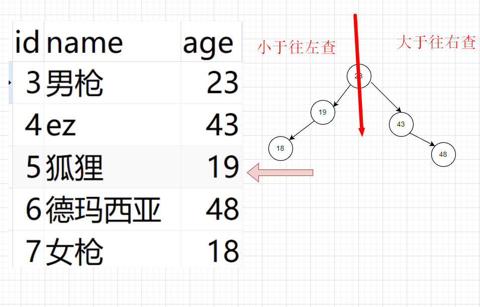

5. 优缺点

   | 优点                                                    | 缺点                                   |
   | ------------------------------------------------------- | -------------------------------------- |
   | 提高了查询速度，降低数据库 io 的成本                    | 索引也需要维护，也需要占用空间         |
   | 通过索引列对数据进行排序，降低排序成本，降低了CPU的消耗 | 对于表的 INSERT,UPDATE,DELETE 效率降低 |

   

## 索引结构


1. 存储引擎层支持索引，也就是说不同的存储引擎可能支持不同的索引。

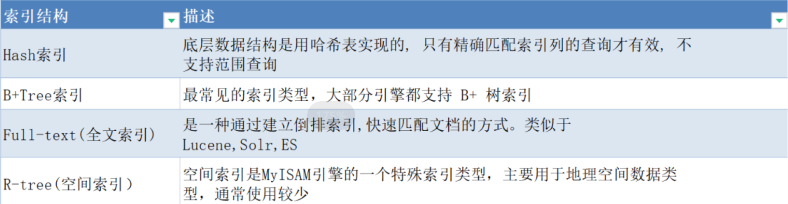


2. 数据引擎和索引结构之间的关系

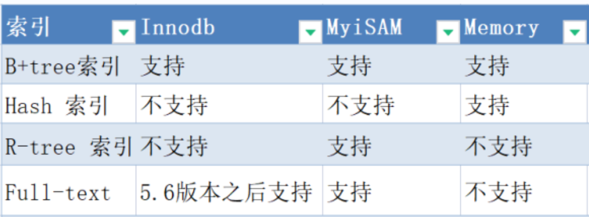

3. **注意：没有特别说明，提问的数据索引都是 B+树索引**

### Hash 索引

1. 使用 Hash算法，将键值换算成hash 值，映射到对应的槽位上存储在hash 表中。

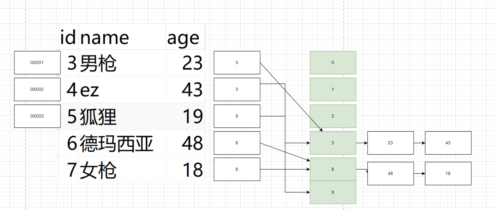


2. 特点：查询非常快
   - Hash 索引只支持对等比较（=，in）,不支持范围查询（between,>,<）
   - 索引不支持排序
   - 如果没有hash 冲突的时候，查找一次就行了。比B+tree 索引还要快。
3. Mysql 支持 Hash 索引的就是 Memory,Innodb 支持hash 索引，是通过指定条件下自动构建。


### 二叉树

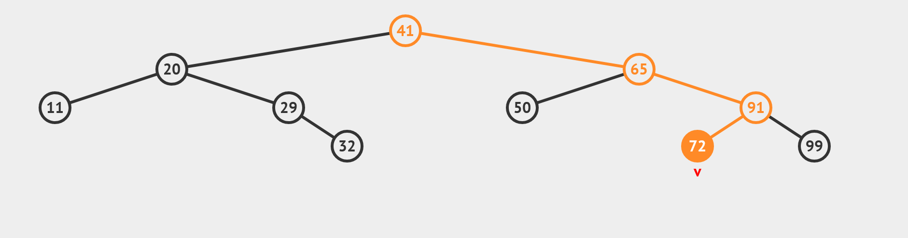

1. 注意：加入我们mysql 构建的二叉树数据结构索引，比较理想的就是平衡的二叉树。

2. 问题：

   - id的插入是自增的，此时二叉树变成了单向链表

     

   - 此时做查询时，会存在如下问题

     - 顺序插入的时候，会形成链表，查询性能很低。
     - 如果数据量很大的情况，层级会很深，查询速度会很慢。

   - 演示网址

     - https://www.cs.usfca.edu/~galles/visualization/
     - https://visualgo.net

### 红黑树

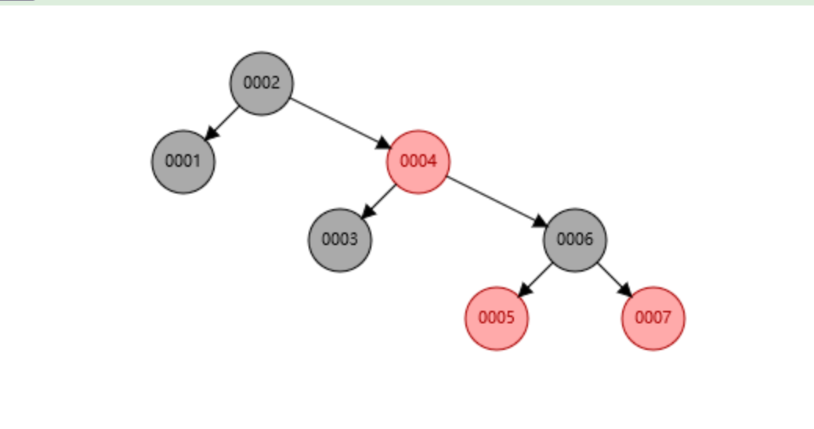

1. 问题：
   - 红黑树还是一颗二叉树，会存在层级较深的问题，查询速度也会很慢

### B-Tree

1. 多叉路平衡查找树，相对于每个二叉树，每个节点有多个分支（多叉）。

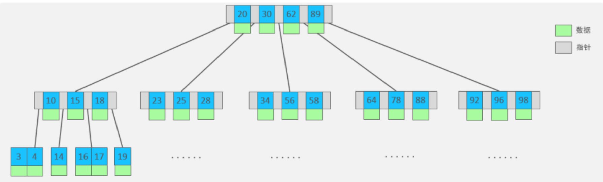

2. 度数：一个节点子节点的个数，一个最大度数为4（4级）的b-tree为例，每个节点只能存储3key,4个指针。

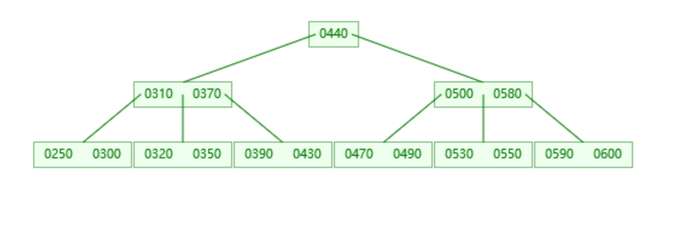

3. 特点：
   - 5阶B数，每一个节点最多有4个K，有5个指针。
   - 当存储元素达到key 的数量时，中间元素向上分裂。
   - **叶子节点和非叶子节点都会存放数据**。

### B+Tree

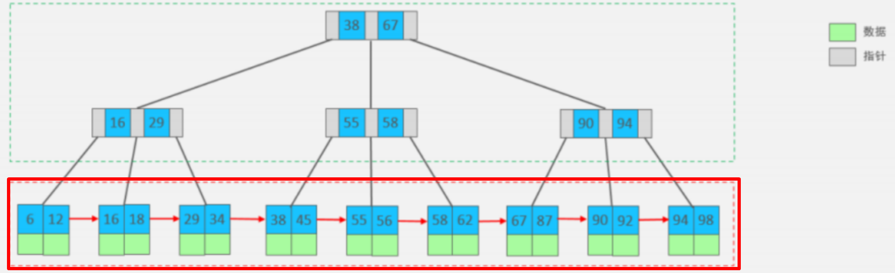

1. 注意：

   - **叶子节点存放数据，非叶子节点存放索引结构**。
   - 叶子节点通过一个指针进行关联，编程了一个链表的结构
   - 当需要裂变的时候，非叶子节点的数据也会出现在叶子节点
   - 蓝色框的只存索引结构

   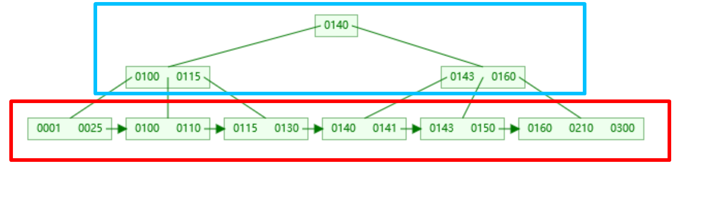

   **注意：**Mysql B+Tree 其实进行优化的，在原来的 B+Tree 的基础上，增加了一个指向相邻叶子节点的链表指针，就形成了带有顺序的指针B+Tree,提高区间访问性能。


## 索引分类

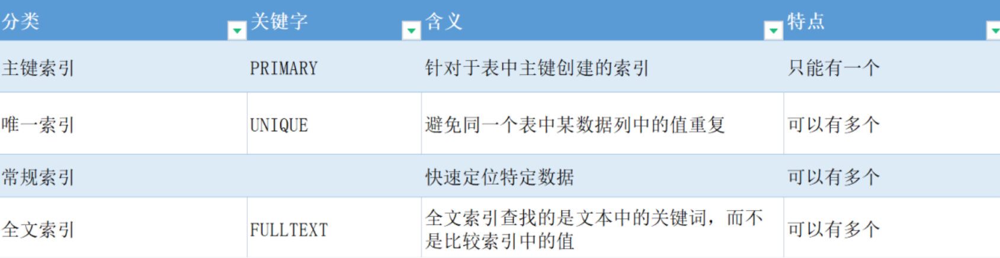

- 主键索引
- 唯一索引
- 常规索引

### 聚集索引与二级索引


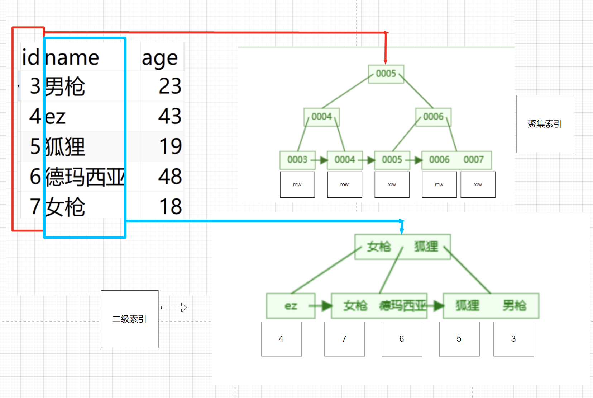

1. 需求

   - 查询步骤
     - 根据 name 去二级索引查询到具体的id=4
     - 根据得到的id=4去到聚集索引里面查找，最终拿到这一行的数据

   ```sql
   select *from  emp where name = 'ez';
   ```

2. 注意：

   - 数据关联在聚集索引子节点的
   - 二级索引只是关联聚集索引的id
   - 非聚集索引的查询都是通过回表查询查询出的数据

3. 聚集索引的选取规则：

   - 如果存在主键，选择主键作为聚集索引
   - 如果不存在主键，会去选择第一个唯一索引（UNIQUE）作为聚集索引。
   - 如果都没有，那么 Innodb 会默认生成一个 rowid 作为隐藏的聚集索引。

## 面试题

1. innodb 为什么选择 B+Tree 做为索引结构

   - 对于Hash 索引，Hash 索引不支持范围查询不支持排序
   - 对于二叉树索引，层级更多，搜索效率低
   - B-Tree 来说，无论是子节点，还是非叶子节点都存放数据，每一页的数据只有16K，如果非叶子节点存放数据了，那么每一页存储的数据就会变少，指针和键值都会变少

2. 分析sql 判断查询效率高低

   - id 是主键
   - name 建立了普通索引

   ```sql
   A select * from emp where id = 3;
   
   B select * from emp where name ='ez';
   ```

   - 答案：
     - A sql 查询速度高于B sql
     - Asql 直接使用聚集索引，可以直接返回 row 信息
     - Bsql 先使用二级索引去查找出id=3 然后再去通过聚集索引查找出 row,需要回表查询，所以效率低

3. Innodb 主键索引使用 B+Tree 能够存储多少数据？

   - 假设一行数据为1K，一页可以存储16行数据。Innodb 指针固定占用 6个字节，主键bigint 8,int 4
   - 高度为2
     - 16*1024 = x * 8 + (x+1)*6  x = 1170 指针就是 1171 *16
   - 高度为3
     - 1171*1171 * 16 =千万级的

## 索引语法

1. 查询索引

   ```sql
   SHOW INDEX FROM table_name ;
   ```

2. 创建

   ```sql
   CREATE [ UNIQUE | FULLTEXT ] INDEX index_name ON table_name ( index_col_name,... ) ;
   ```

3. 删除索引

   ```sql
   DROP INDEX index_name ON table_name ;
   ```

4. 通过sql 操作索引

   - 为用户名创建索引

     ```sql
     create index ix_user_name on user(user_name);
     ```

   - 给 phone 建立索引（唯一索引）

     ```sql
     create unique  index  ix_phone on user(phone);
     ```

   - 给专业和年龄和状态建立联合索引

     ```sql
     
     create index ix_p_age_s on user(profession,age,status);
     ```

   - 给专业建索引

     ```sql
     create index ix_p on user(profession);
     ```

   - 查一下所有索引

     ```sql
     show index from user;
     ```

   - 删除 ix_p 索引

     ```sql
     drop index ix_p on user;
     ```


## SQL性能分析

### SQL执行频次

1. 语法：

   ```sql
   SHOW GLOBAL STATUS LIKE 'COM_+类型';
   COM_insert; 插入次数
   com_delete; 删除次数
   com_update; 更新次数
   com_select; 查询次数
   com_______;
   ```

   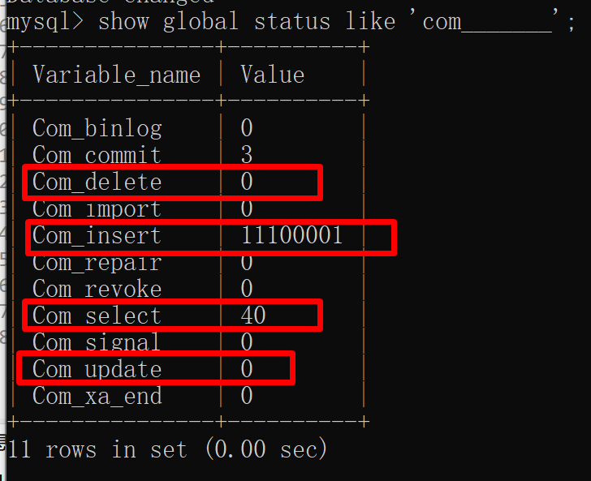

2. 注意：通过语法，可以查询到数据库的实际状态，就可以知道数据库是以增删改为主，还是以查询为主，如果是以查询为主，就可以考虑sql 的索引优化。

### 慢查询日志

1. 概述：慢查询日志记录了超过指定时间的查询sql，指定参数（long_query_time,单位是秒，默认值是10秒）

2. 如何查看慢查询功能是否打开？

   ```sql
   show variables like 'slow_query_log';
   ```

   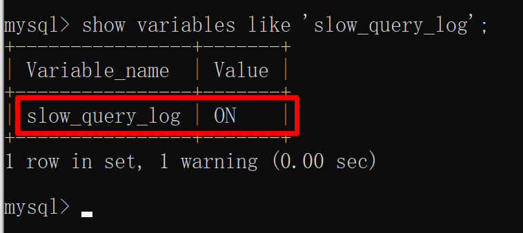

   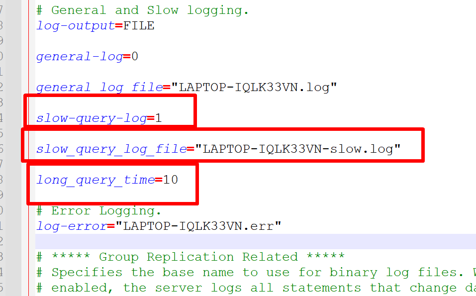

3. 参数说明

   - slow-query-log=1 代表开启 =0 代表关闭
   - long_query_time=10 代表慢查询超过10秒日志会记录
   - slow_query_log_file 慢查询的日志文件

4. 演示慢查询

   - 把慢查询打开 slow-query-log=1
   - 把慢查询时间设置段 1秒 long_query_time=1
   - 重启一下mysql 的服务

5. 分析慢查询日志

   - 当sql 出现到慢查询日志中的时候，就可以考虑对这条sql 进行优化了。

   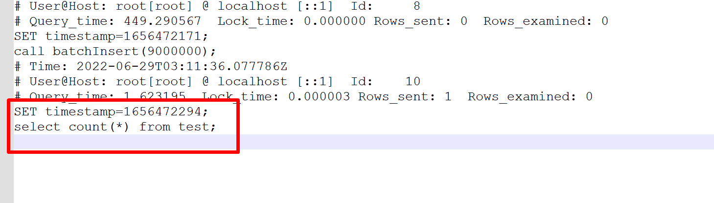


### Profile 详情

1. 概述：show profiles 能够用来做 SQL优化时协助我们了解时间消耗去哪里

2. 查看Profile 是否开启

   ```sql
   select @@profiling;
   ```

   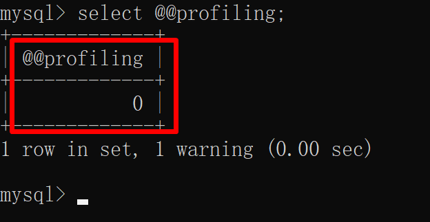

3. 设置Profile 开启

   ```sql
   set [session/global] profiling=1
   ```

4. 通过 profile 了解时间的消耗

   ```sql
   select * from user;
   
   select count(*) from user;
   
   select * from user where id = 10;
   
   select * from user where name = '荆轲';
   ```

   - 使用profiles 文件观察时间消耗；

     - show profiles;(每次执行，query_id 都会变)

       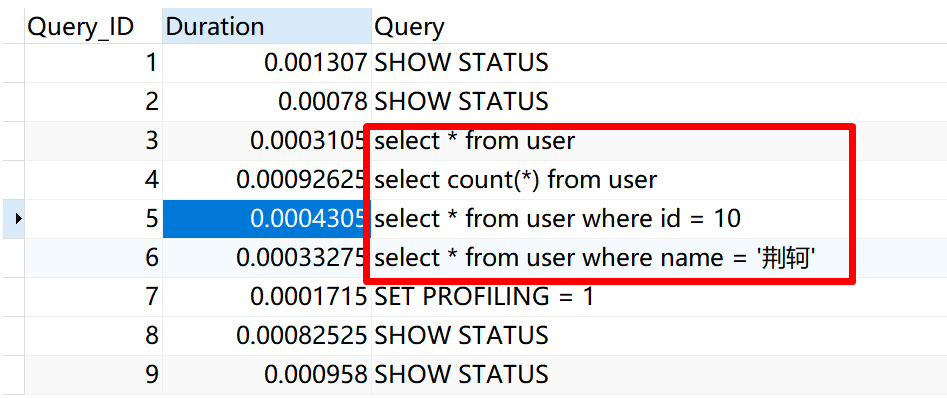

     - show proflie for query query_id;(注意 query_id 是使用 show profiles 查询出来的)

       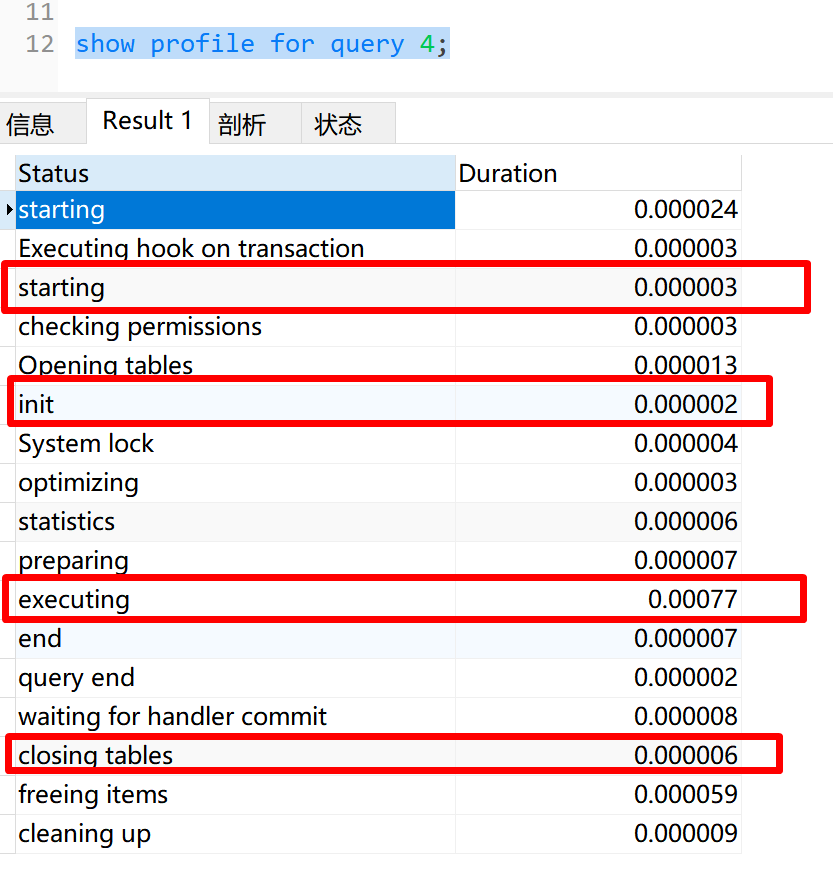

     - show profile cpu for query query_id

       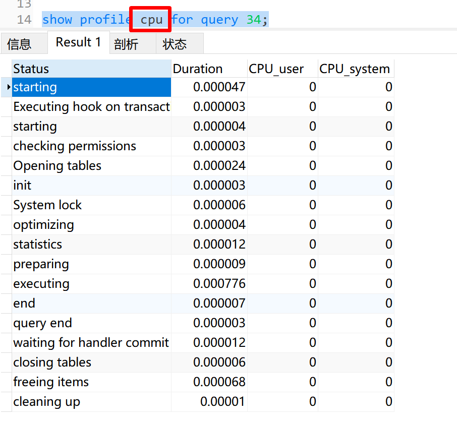

### explain

1. explain 或者 desc 都可以去获取 mysql 执行 select 语句的信息，包含索引选用、连接表等信息；

2. 语法：

   ```sql
   explain 查询语句；
   ```

   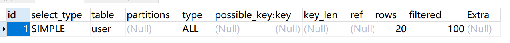

   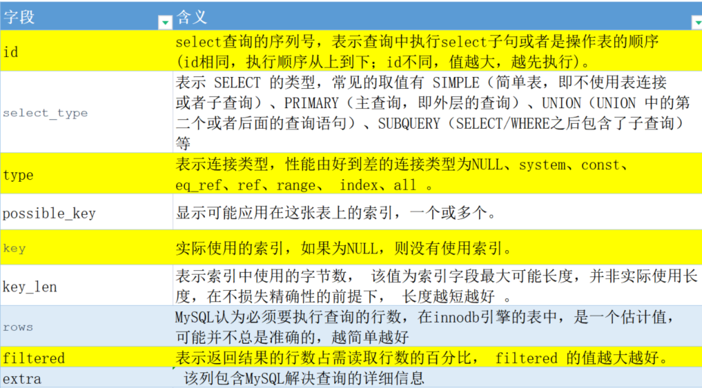

   - 演示 id 执行先后的

     ```sql
     explain select * from emp where dept_id = (select id from dept where name = '研发部')
     ```

   - 演示 type(const 使用主键或者唯一索引的时候)

     ```sql
     explain select id from dept where name = '研发部'; all
     
     explain select * from emp where id = 1;
     
     explain select * from user where phone = '13508895543'; ref
     
     
     ```

   - key 演示

     ```sql
     explain select * from user where id  > 5
     ```

     

## 索引的使用

1. 索引效率验证

   - 添加主键索引（添加的时候，需要维护索引数据，所以速度较慢）

     - 没有主键索引的时候耗时情况

       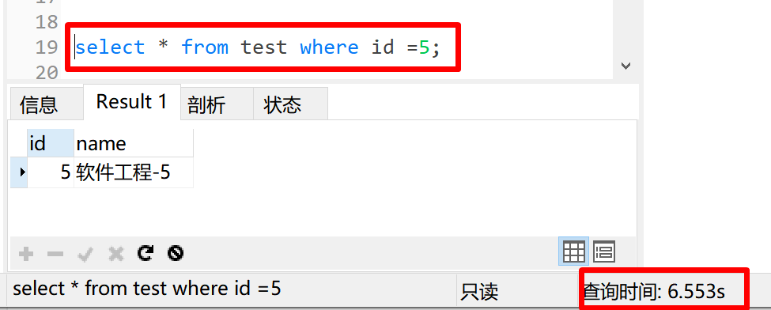

     - 添加了主键索引的时候耗时情况

       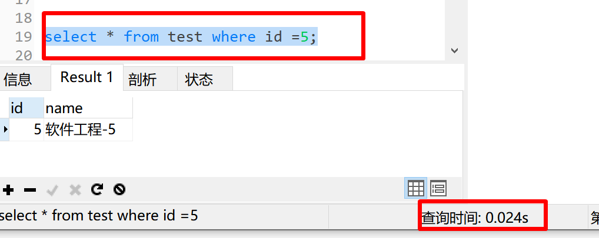

   - 给 name 字段添加索引列

     - name 没有添加索引列的时候

       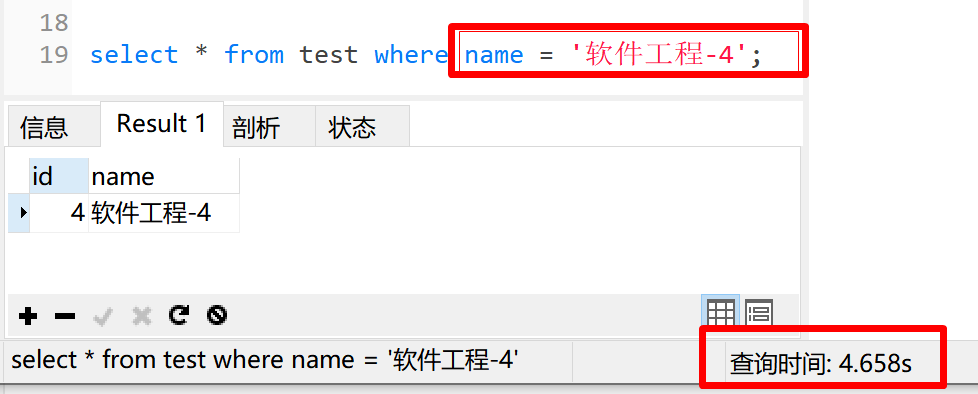

     - 给name 添加了索引列之后

       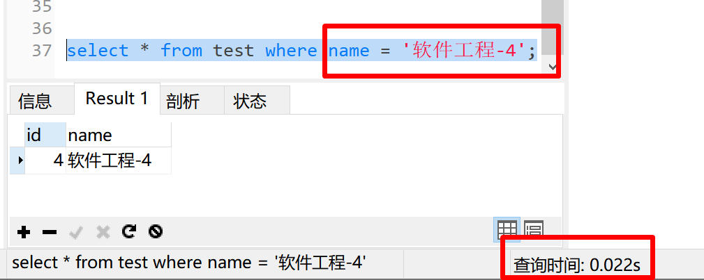

     

   2. **结论：索引确实能提升查询速度，而且是质的提升。**

   

### 最左前缀法则

1. 最左前缀法则适用于联合索引；查询从索引的最左列开始，不跳过其中的列，如果跳过其中的列将会导致索引失效（后面字段的索引失效）。

2. 验证最左前缀法则

   - 三个列的联合索引都同时使用

     ```sql
     explain select * from user where profession = '通讯工程' and age = 17 and gender = 1;
     ```

     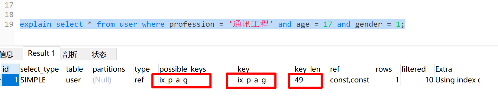

   - 只使用专业和年龄查询

     ```sql
     explain select * from user where profession = '通讯工程' and age = 17;
     ```

     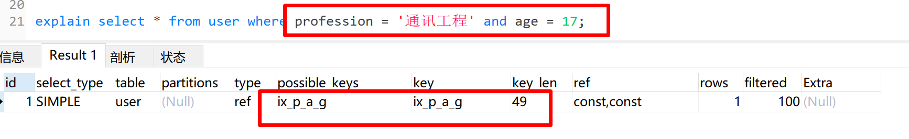

   - 只使用专业查询

     ```sql
     explain select * from user where profession = '通讯工程';
     ```

     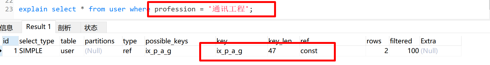

     

3. 最左原则使用索引的情况（A+B+C）

   - A
   - AB
   - ABC
   - BC(X)
   - AC(使用A索引)
   - CBA( 顺序无关，只要列存在即可)

   

### 索引失效

#### 字符串不加引号

```sql
explain select *from user where phone = 13708822169;
```

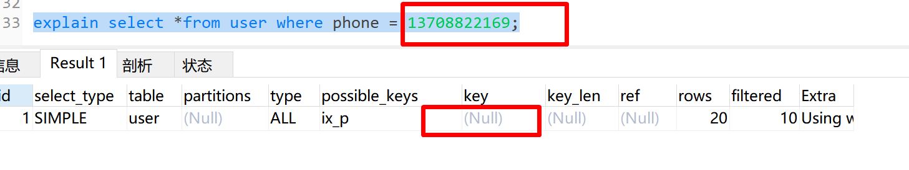

#### or 连接（or 前后没有建立索引的时候不会被用到）

```sql
explain select *from user where phone = 13708822169 or status = 0;
```

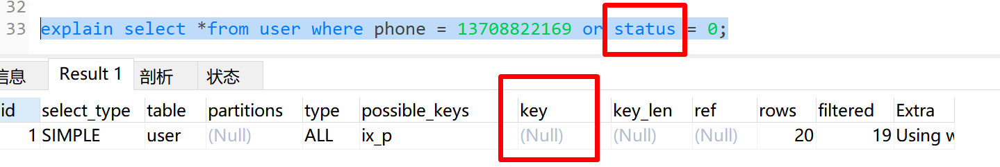

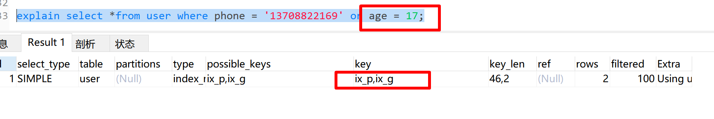

#### 模糊查询

```sql
explain select * from user where phone like '%0' ;
```

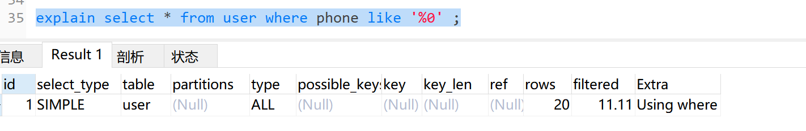

#### 对于索引使用函数运算

```sql
explain select * from user where substring(phone,1,2) = '19' ;
```

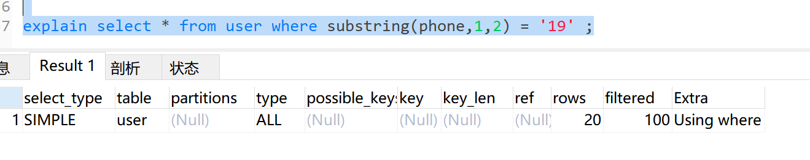

#### 数据分布影响

```sql
explain select * from user where phone > '13508822168';
```

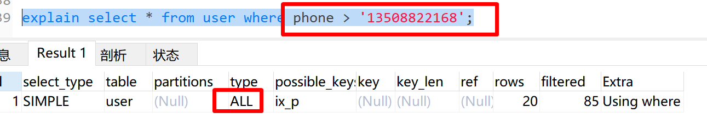

```sql
explain select * from user where gender = 1;
```


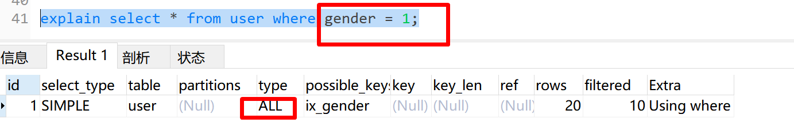


## 索引的使用和设计原则

### 使用原则

1. 避免使用 select * from table_name;

   - 可能避免了回表查询（减少一次查询，提高了效率，前提是查询的结果已经再二级索引的叶子节点出现）

2. 使用前缀索引代替全索引

   - 计算前缀长度（唯一索引的性能是最高的，唯一索引的前缀长度是1）

   - 不重复的索引基数/数据表的总记录数

     ```sql
     select count(*) from user;
     
     select count(distinct email) from user;
     
     select count(distinct substring(email ,1,8)) from user;
     
     select count(distinct substring(email ,1,2))/count(*) from user;
     ```

3. 单列索引和联合索引

   - 使用多个单列索引查询时，并不会全用索引，会根据mysql优化器的指引进行选择某一个

     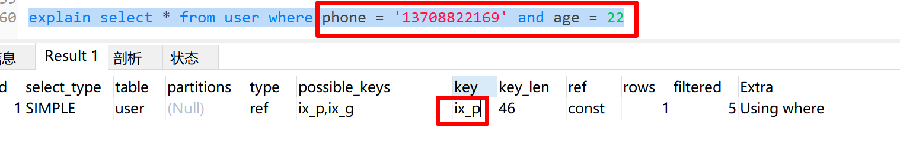

### 设计原则

1. 数据量大的时候，一定要建索引
2. 针对于经常查询的多列，去建联合索引
3. 如果是字符串类型，而且数据很大，尽量去使用前缀索引，前缀度我们尽量去靠近1
4. 索引还需要控制数量，索引不是越多越好，一定要合适就行，越多增删改越慢，影响用户体验
5. 要去选择区分度高的列做索引，尽量去建立唯一索引
6. 设计列尽量不要去存空数据


