<font size="20" color="blue">学完SpringMVC再来学实战应用</font>

# 一、Maven分模块开发

## 1.场景介绍

- 实战开发中，一个项目是非常庞大的，会有很多模块：
  - 支付中心
  - 订单服务
  - 用户中心
  - ...
- 目前存在的问题：
  - 如果把所有的内容放到同一个项目中来管理，项目会很臃肿
  - 分工不明确，耦合太严重

- Maven 就可以解决这个问题

  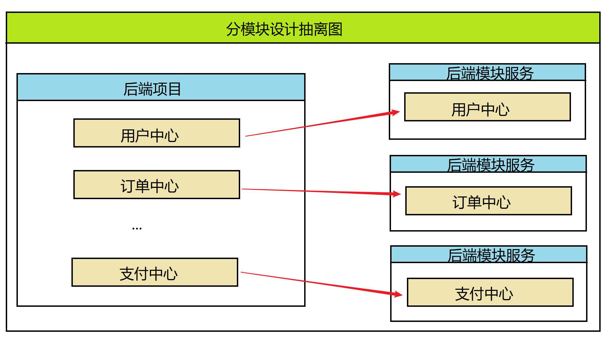

## 2.分模块开发

### 2.1构建传统冗杂在一起的老项目

- 导入依赖

  ```java
  <dependencies>
          <dependency>
              <groupId>org.springframework</groupId>
              <artifactId>spring-webmvc</artifactId>
              <version>5.2.17.RELEASE</version>
          </dependency>
  
          <dependency>
              <groupId>org.springframework</groupId>
              <artifactId>spring-jdbc</artifactId>
              <version>5.2.17.RELEASE</version>
          </dependency>
  
          <dependency>
              <groupId>org.springframework</groupId>
              <artifactId>spring-test</artifactId>
              <version>5.2.17.RELEASE</version>
          </dependency>
  
          <dependency>
              <groupId>org.mybatis</groupId>
              <artifactId>mybatis</artifactId>
              <version>3.5.6</version>
          </dependency>
  
          <dependency>
              <groupId>org.mybatis</groupId>
              <artifactId>mybatis-spring</artifactId>
              <version>1.3.0</version>
          </dependency>
  
          <dependency>
              <groupId>mysql</groupId>
              <artifactId>mysql-connector-java</artifactId>
              <version>8.0.29</version>
          </dependency>
  
          <dependency>
              <groupId>com.alibaba</groupId>
              <artifactId>druid</artifactId>
              <version>1.1.16</version>
          </dependency>
  
          <dependency>
              <groupId>junit</groupId>
              <artifactId>junit</artifactId>
              <version>4.12</version>
              <scope>test</scope>
          </dependency>
  
          <dependency>
              <groupId>javax.servlet</groupId>
              <artifactId>javax.servlet-api</artifactId>
              <version>3.1.0</version>
              <scope>provided</scope>
          </dependency>
          <dependency>
              <groupId>org.projectlombok</groupId>
              <artifactId>lombok</artifactId>
              <version>1.18.22</version>
          </dependency>
  
          <dependency>
              <groupId>com.fasterxml.jackson.core</groupId>
              <artifactId>jackson-databind</artifactId>
              <version>2.9.0</version>
          </dependency>
      </dependencies>
  ```

- 配置 springmvc

  - 提供SpringMVC 配置

    ```java
    @Configuration
    @ComponentScan(value = {"cn.sycoder.controller"})
    @EnableWebMvc
    public class SpringMvcConfig {
    }
    ```

  - 注册Servlet

    ```java
    public class ServletConfig extends AbstractAnnotationConfigDispatcherServletInitializer {
        @Override
        protected Class<?>[] getRootConfigClasses() {
            return new Class[0];//配置Spring交给Web 管理
        }
    
        @Override
        protected Class<?>[] getServletConfigClasses() {
            return new Class[]{SpringMvcConfig.class};
        }
    
        @Override
        protected String[] getServletMappings() {
            return new String[]{"/"};
        }
    }
    ```

  - 提供三个Controller

    - 用户中心

      ```java
      @RestController
      @RequestMapping("/user")
      public class UserController {
          @GetMapping("/{id}")
          public String getById(@PathVariable Long id){
              return "OK:user"+id;
          }
      }
      ```

    - 支付中心

      ```java
      @RestController
      @RequestMapping("/pay")
      public class PayController {
          @GetMapping("/{id}")
          public String getById(@PathVariable Long id){
              return "OK:pay"+id;
          }
      }
      ```

    - 订单中心

      ```java
      @RestController
      @RequestMapping("/order")
      public class OrderController {
          @GetMapping("/{id}")
          public String getById(@PathVariable Long id){
              return "OK:order"+id;
          }
      }
      ```

  - 项目结构图

    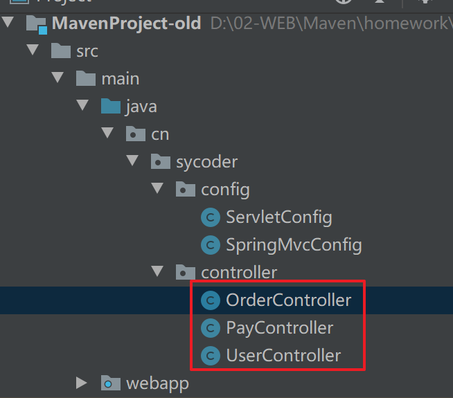

    

### 2.2分模块开发

- 创建空项目

#### 2.2.1<font color="red">创建一个父模块</font>

- 添加父模块

  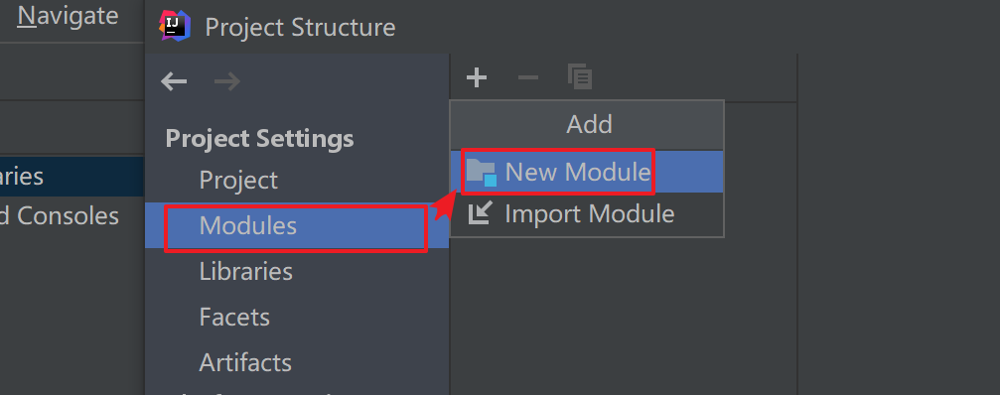

- 删除src 文件

  

- 修改pom.xml

  ```java
  <?xml version="1.0" encoding="UTF-8"?>
  <project xmlns="http://maven.apache.org/POM/4.0.0"
           xmlns:xsi="http://www.w3.org/2001/XMLSchema-instance"
           xsi:schemaLocation="http://maven.apache.org/POM/4.0.0 http://maven.apache.org/xsd/maven-4.0.0.xsd">
      <modelVersion>4.0.0</modelVersion>
  
      <groupId>cn.sycodeer</groupId>
      <artifactId>maven-parent</artifactId>
      <version>1.0-SNAPSHOT</version>
      <packaging>pom</packaging>
  
  </project>
  ```

#### 2.2.2<font color="red">创建用户中心</font>

- 新添加用户中心模块

  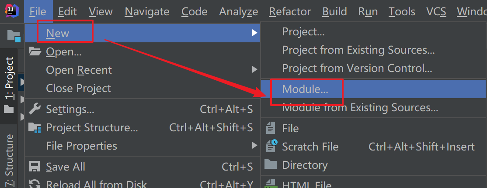

- 添加父模块

  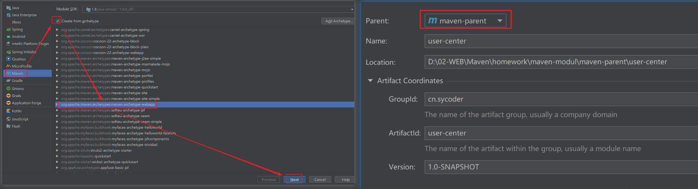

- 新建好结构图

  

#### 2.2.3<font color="red">创建订单中心</font>

- 新建订单中心模块

  

- 目前的项目结构

  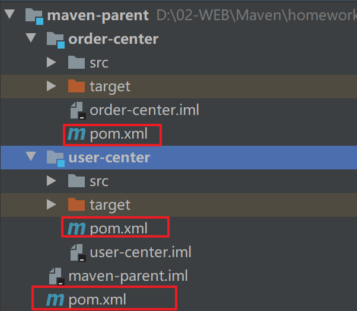

#### 2.2.4<font color="red">创建支付中心</font>

- 新建支付模块

  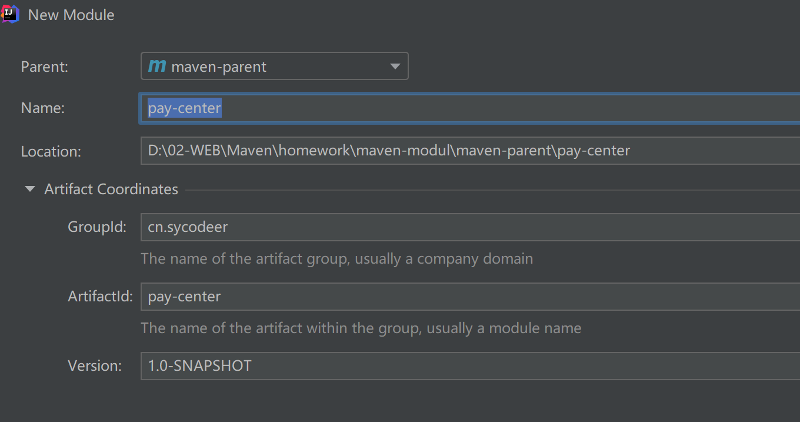

- 项目结构

  

# 二、聚合和继承

## 1.聚合

- 概述：将多个模块组织成一个整体，同时进行项目构建的过程（聚合用于管理整个项目）

### 1.1.聚合工程

- 概述：一个不具有业务功能的"空"工程（有且仅有个pom文件）

- 项目结构图

  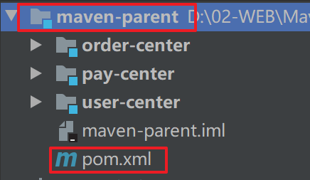

### 1.2.作用

- 作用：当工程中某个模块发生更新（变更）时，必须保障工程中与已更新模块关联的模块同步更新，此时可以使用聚合工程来解决批量模块同步构建的问题


### 1.3.实际开发应用

#### 1.3.1创建公共服务

- 打包方式
  - jar 默认（表名这是一个java项目）
  - war (表名这是一个web项目)
  - pom(表名这是一个聚合或继承项目)

- 创建通过服务模块

  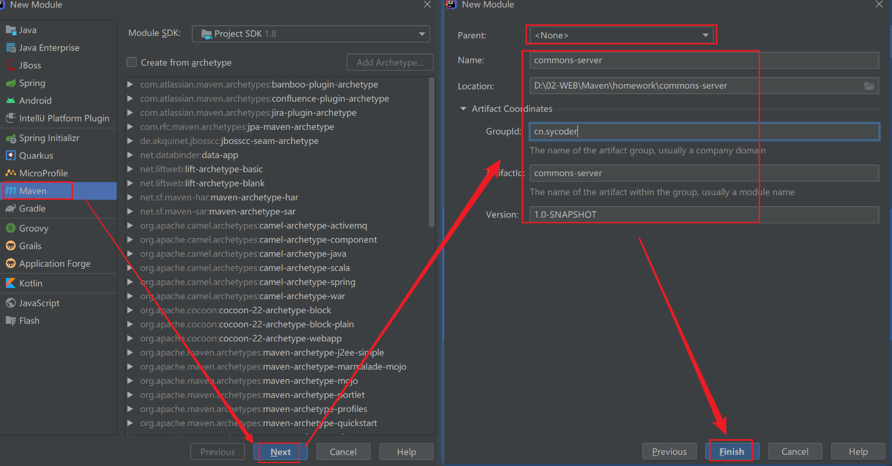

  

- 提供一个工具类

  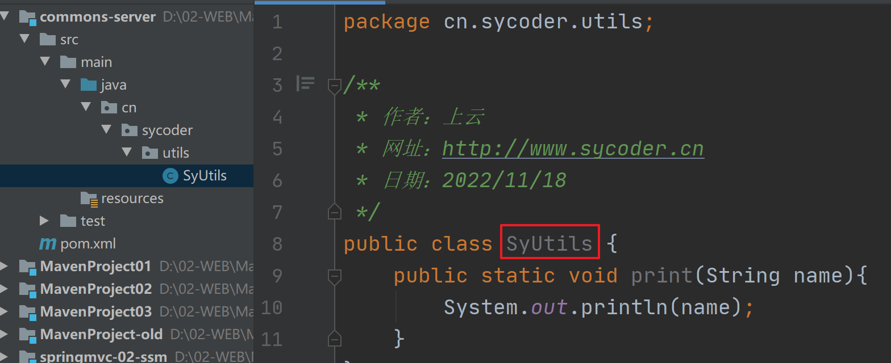

  

#### 1.3.2在其他服务中引用公共服务

- 将公共服务 install 到仓库中

  ```java
  mvn install
  ```

  

- 在用户中心引用公共服务

  ```java
  <dependency>
      <groupId>cn.sycoder</groupId>
      <artifactId>commons-server</artifactId>
      <version>1.0-SNAPSHOT</version>
  </dependency>
  ```

  

- maven 依赖的细节

  


## 2.继承

- 概述：子工程可以继承父工程中的配置信息，常见于依赖关系的继承

### 2.1没有使用继承的问题

- 存在兄弟模块之间依赖重复问题

  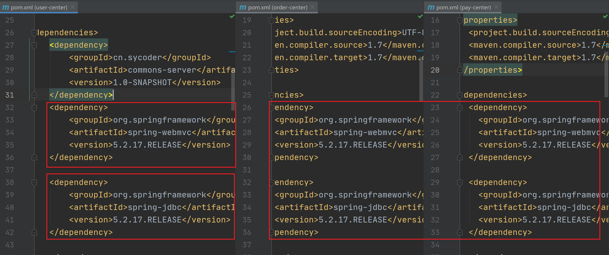

### 2.2作用

- 简化配置
- 减少版本冲突

### 2.3实际开发应用

#### 2.3.1抽重

- 将相同的依赖全部抽到父工程中

  ```java
  <?xml version="1.0" encoding="UTF-8"?>
  <project xmlns="http://maven.apache.org/POM/4.0.0"
           xmlns:xsi="http://www.w3.org/2001/XMLSchema-instance"
           xsi:schemaLocation="http://maven.apache.org/POM/4.0.0 http://maven.apache.org/xsd/maven-4.0.0.xsd">
      <modelVersion>4.0.0</modelVersion>
  
      <groupId>cn.sycodeer</groupId>
      <artifactId>maven-parent</artifactId>
      <version>1.0-SNAPSHOT</version>
      <modules>
          <module>user-center</module>
          <module>order-center</module>
          <module>pay-center</module>
      </modules>
      <packaging>pom</packaging>
  
      <dependencies>
          <dependency>
              <groupId>org.springframework</groupId>
              <artifactId>spring-webmvc</artifactId>
              <version>5.2.17.RELEASE</version>
          </dependency>
  
          <dependency>
              <groupId>org.springframework</groupId>
              <artifactId>spring-jdbc</artifactId>
              <version>5.2.17.RELEASE</version>
          </dependency>
  
          <dependency>
              <groupId>org.springframework</groupId>
              <artifactId>spring-test</artifactId>
              <version>5.2.17.RELEASE</version>
          </dependency>
  
          <dependency>
              <groupId>org.mybatis</groupId>
              <artifactId>mybatis</artifactId>
              <version>3.5.6</version>
          </dependency>
  
          <dependency>
              <groupId>org.mybatis</groupId>
              <artifactId>mybatis-spring</artifactId>
              <version>1.3.0</version>
          </dependency>
  
          <dependency>
              <groupId>mysql</groupId>
              <artifactId>mysql-connector-java</artifactId>
              <version>8.0.29</version>
          </dependency>
  
          <dependency>
              <groupId>com.alibaba</groupId>
              <artifactId>druid</artifactId>
              <version>1.1.16</version>
          </dependency>
  
          <dependency>
              <groupId>junit</groupId>
              <artifactId>junit</artifactId>
              <version>4.12</version>
              <scope>test</scope>
          </dependency>
          <dependency>
              <groupId>javax.servlet</groupId>
              <artifactId>javax.servlet-api</artifactId>
              <version>3.1.0</version>
              <scope>provided</scope>
          </dependency>
          <dependency>
              <groupId>org.projectlombok</groupId>
              <artifactId>lombok</artifactId>
              <version>1.18.22</version>
          </dependency>
  
          <dependency>
              <groupId>com.fasterxml.jackson.core</groupId>
              <artifactId>jackson-databind</artifactId>
              <version>2.9.0</version>
          </dependency>
      </dependencies>
  
  </project>
  ```

#### 2.3.2定义依赖管理

- 通过 dependencyManagement 标签，可以配置供子类选用的依赖jar包

  ```java
  <dependencyManagement>
      <dependencies>
          <dependency>
              <groupId>cn.sycoder</groupId>
              <artifactId>commons-server</artifactId>
              <version>1.0-SNAPSHOT</version>
          </dependency>
      </dependencies>
  
  </dependencyManagement>
  ```

  

- 子类可以正常引用

  ```java
  <dependencies>
      <dependency>
          <groupId>cn.sycoder</groupId>
          <artifactId>commons-server</artifactId>
          <version>1.0-SNAPSHOT</version>
      </dependency>
  </dependencies>
  ```

  

## 3.聚合和继承区别

- 作用

  - 聚合
    - 用于对项目整体管理
  - 继承
    - 配置子项目的依赖

- 异同

  - 相同点
    - 均以 pom 结构打包
  - 不同点
    - 聚合通过父项目管理子项目，并且能够知道聚合的具体的模块
    - 继承通过父项目管理子项目的依赖，无法感知子模块需要哪些依赖


# 三、属性和版本管理

## 1.属性

### 1.1目前存在问题

- 目前版本控制:版本分离控制，如果有更改会出现依赖，并且需要改的地方很多

  ```java
  <dependency>
      <groupId>org.springframework</groupId>
      <artifactId>spring-webmvc</artifactId>
      <version>5.2.17.RELEASE</version>
  </dependency>
  
  <dependency>
      <groupId>org.springframework</groupId>
      <artifactId>spring-jdbc</artifactId>
      <version>5.2.17.RELEASE</version>
  </dependency>
  
  <dependency>
      <groupId>org.springframework</groupId>
      <artifactId>spring-test</artifactId>
      <version>5.2.17.RELEASE</version>
  </dependency>
  ```

- 提出解决版本：抽出一个公共的版本属性

  

### 1.2properties标签解决

- 通过修改pom-version 信息

  ```java
  <properties>
      <spring-version>5.2.17.RELEASE</spring-version>
  </properties>
  <dependencies>
      <dependency>
          <groupId>org.springframework</groupId>
          <artifactId>spring-webmvc</artifactId>
          <version>${spring-version}</version>
      </dependency>
  
      <dependency>
          <groupId>org.springframework</groupId>
          <artifactId>spring-jdbc</artifactId>
          <version>${spring-version}</version>
      </dependency>
  
      <dependency>
          <groupId>org.springframework</groupId>
          <artifactId>spring-test</artifactId>
          <version>${spring-version}</version>
      </dependency>
  </dependencies>
  ```

  

## 2.版本信息

- 目前会经常遇到的版本

  

### 2.1经常使用版本信息

- SNAPSHOT：快照版本
  - 项目研发过程中的临时版本
  - 快照版本会不断更新
- RELEASE：发布版本
  - 项目研发成熟比较稳定后的发布版本
  - 如果进行迭代升级，也不会去改变当前版本的内容

### 2.2其它版本信息

- alpha版:内测版
  - 自己公司内部测试使用,研发基本完成，但是会存在不少bug
- beta版:公测版
  - 公司测试没问题了，需要广大用户进行公测，还存在bug
- 纯数字版本
  - 以数字标识

# 四、测试

## 1.操作普通打包

- 直接点击maven生命周期中的 package

  

- 经过如下几个过程

  - 清除
  - 验证
  - 编译
  - 测试
  - 打包

## 2.经常出现场景

- 线上出现紧急bug,需要紧急修复并且上线部署

- 模拟测试异常

  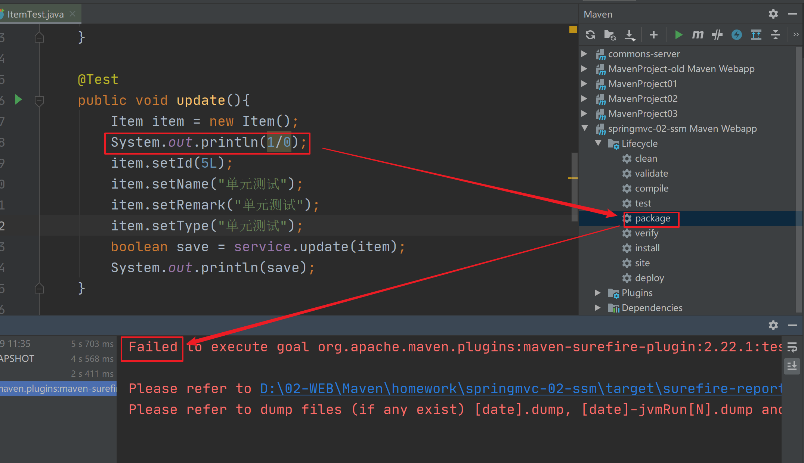

## 3.解决办法

- 通过跳过测试解决

  - 通过idea maven 工具实现跳过

    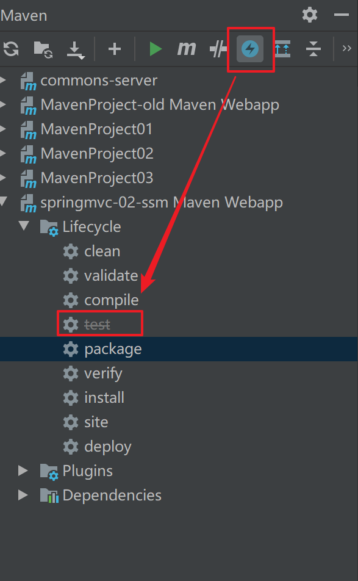

- 通过命令行

  ```java
  mvn package -D skipTests=true
  ```

# 五、私服

## 1.回顾私服与中央仓库

### 1.1.私服

- 概述：公司内部搭建的用于存储Maven资源的服务器


### 1.2.中央仓库

- Maven开发团队维护的用于存储Maven资源的服务器


### 1.3.目前开发现状

- 架构师会写一些基础公共的代码

  - commons-server
    - utils
    - constant

- 目前团队共享jar资源只能通过网络传输

  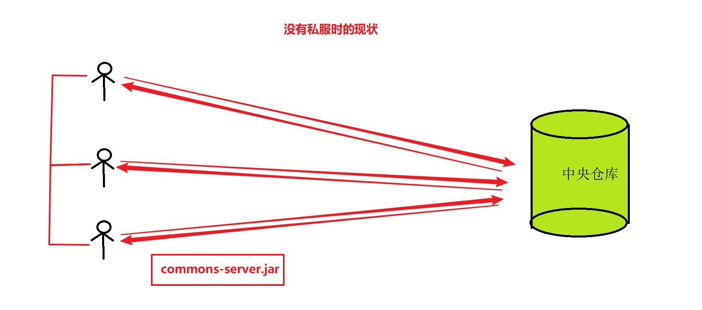

- 有私服之后

  

## 2.私服下载与安装

### 2.1下载

- 网址：https://help.sonatype.com/repomanager3/product-information/download

- 下载截图

  

### 2.2安装

- 解压压缩包

  

- 启动私服（不要解压到中文目录下）

  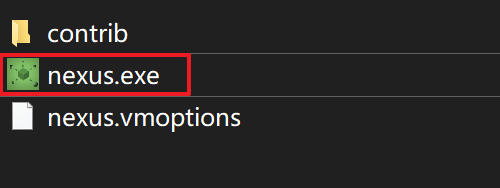

  

  - 执行命令

    ```java
    nexus.exe /run nexus
    ```

  - 看到如下内容，说明启动成功

    

  

### 2.3访问 nuxus

- 账号密码
  - admin
  - 123456

- 访问地址

  ```java
  localhost:8081
  ```

- 如下页面说明访问成功

  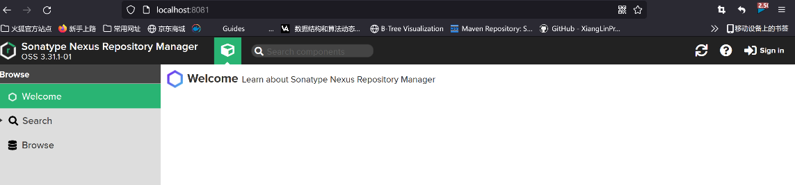

- 登录

  

- 密码位置

  

- 重置密码

  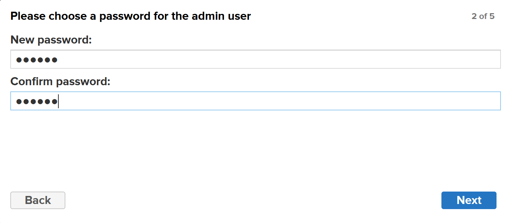

- 匿名访问设置

  

## 3.仓库分类

- 如果端口占用，请修改端口信息重启即可
  - etc/nexus-default.properties

- 分类
  - 宿主仓库hosted
    - 存放一些无法从中央仓库获取的jar
    - 公司内容开发的jar
    - 收费的jar
  - 代理仓库proxy
    - 代理访问远程仓库的，比如访问阿里云镜像仓库
  - 仓库组group 
    - 将多个仓库设置成一个组群，可以有效的简化配置
    - 不去保存资源的，只不过做协调工作


## 4.私服配置仓库

- 配置仓库

  

  

- 新创建两个不同版本的仓库

  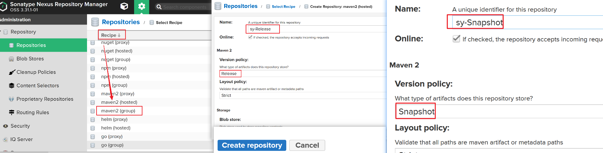

  

  

- 将创建的宿主仓库交给仓库组group 管理

  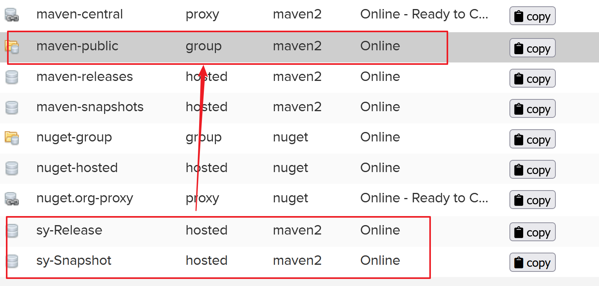

  

  


## 5.本地仓库与私服配置

- 本地拉包是通过maven去操作的

### 5.1配置本地对neuxs 私服的访问信息

- 配置访问信息

  ```xml
   <servers>
        <server>
            <id>sy-Release</id>
            <username>admin</username>
            <password>123456</password>
        </server>
        <server>
            <id>sy-Snapshot</id>
            <username>admin</username>
            <password>123456</password>
        </server>
        <server>
            <id>maven-public</id>
            <username>admin</username>
            <password>123456</password>
        </server>
    </servers>
  ```

- 配置私服访问地址

  ```xml
  <mirror>
  <!--          配置组名称-->
    <id>maven-public</id>
  <!--          所有内容都可以拉取-->
    <mirrorOf>*</mirrorOf>
  <!--          仓库地址-->
    <url>http://localhost:8081/repository/maven-public/</url>
  
  </mirror>
  ```

  

## 6.jar上传与下载

- 手动上传

  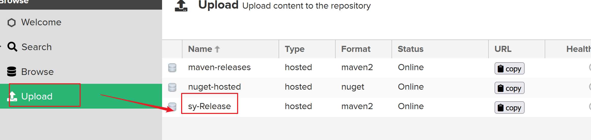

### 6.1自动上传

- distributionManagement

- 在需要上传的pom 中添加如下配置(注意配置一定要和setting.xml 中的一致)

  ```java
  <distributionManagement>
      <repository>
          <id>sy-Release</id>
          <url>http://localhost:8081/repository/sy-Release/</url>
      </repository>
      <snapshotRepository>
          <id>sy-Snapshot</id>
          <url>http://localhost:8081/repository/sy-Snapshot/</url>
      </snapshotRepository>
  </distributionManagement>
  ```

- 发布项目到nexus

  

  

### 6.2修改中央代理的地址


## 7.获取仓库的包

- 直接配置jar pom 地址即可

  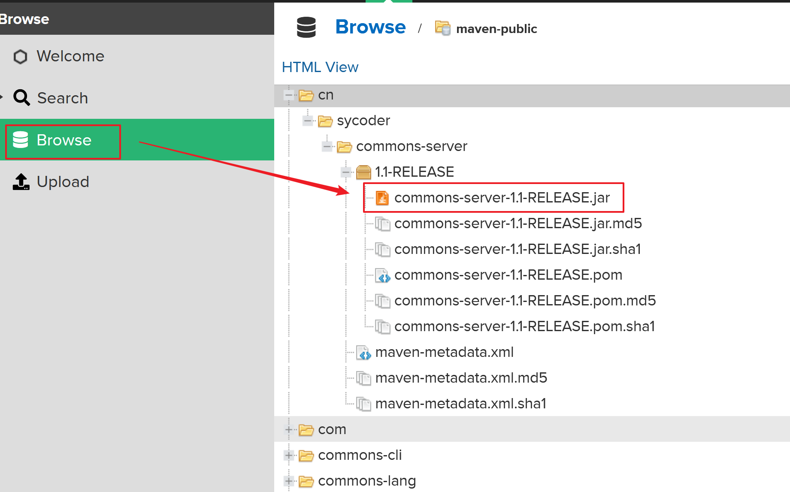


<font size="40" color="red">风里雨里，云哥在 SpringBoot 等你</font>