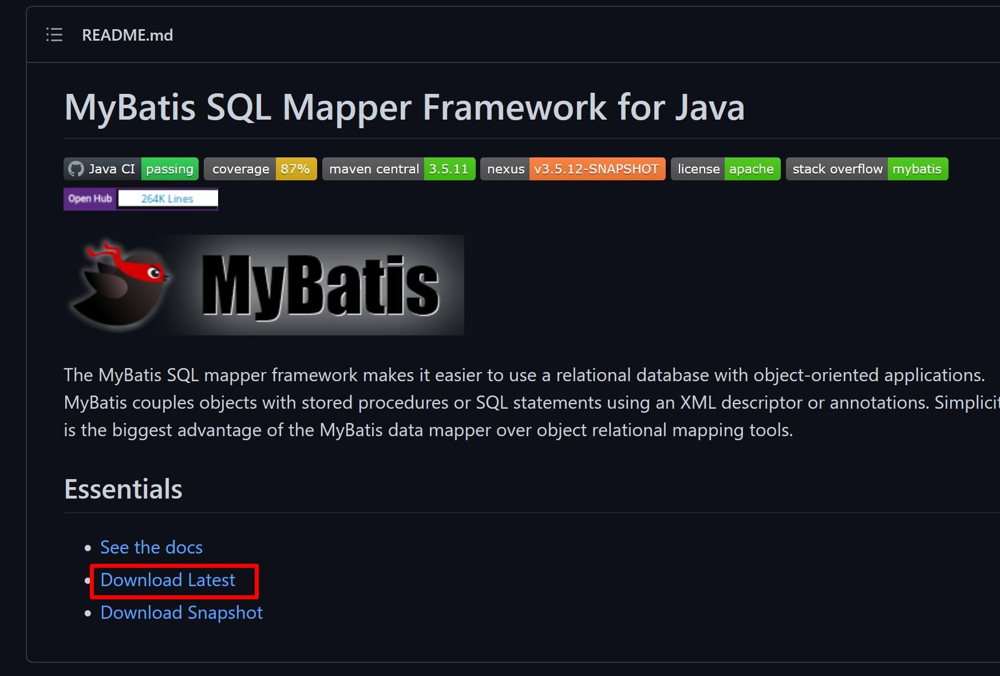
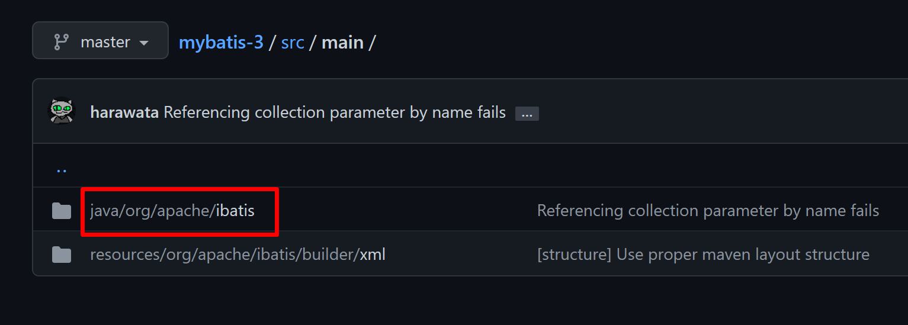
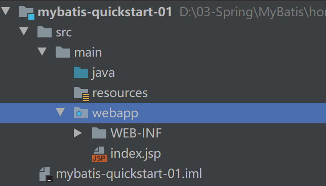
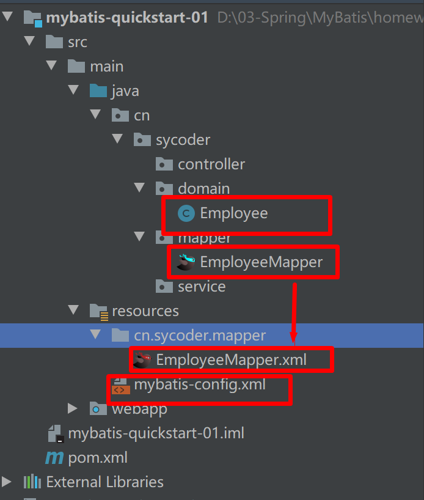
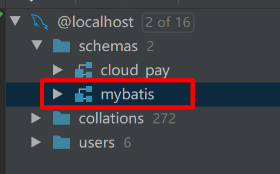
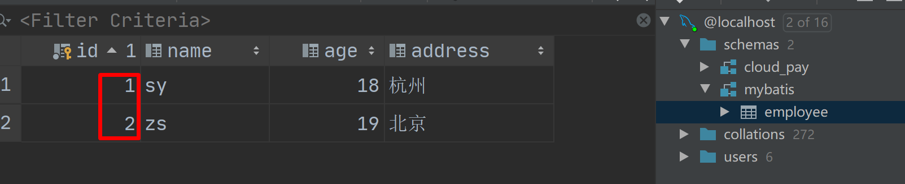
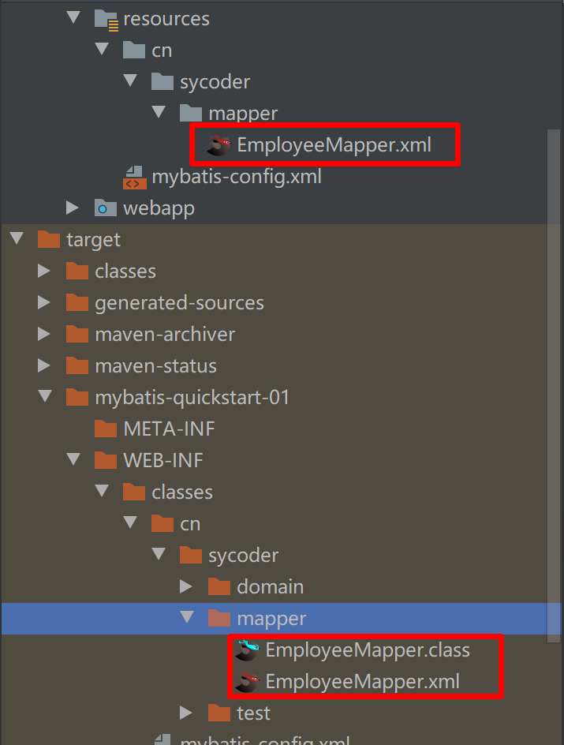
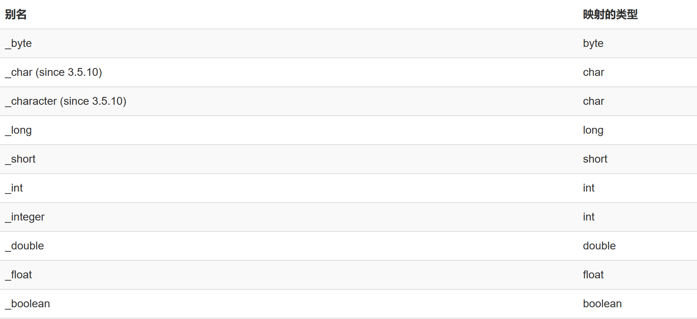
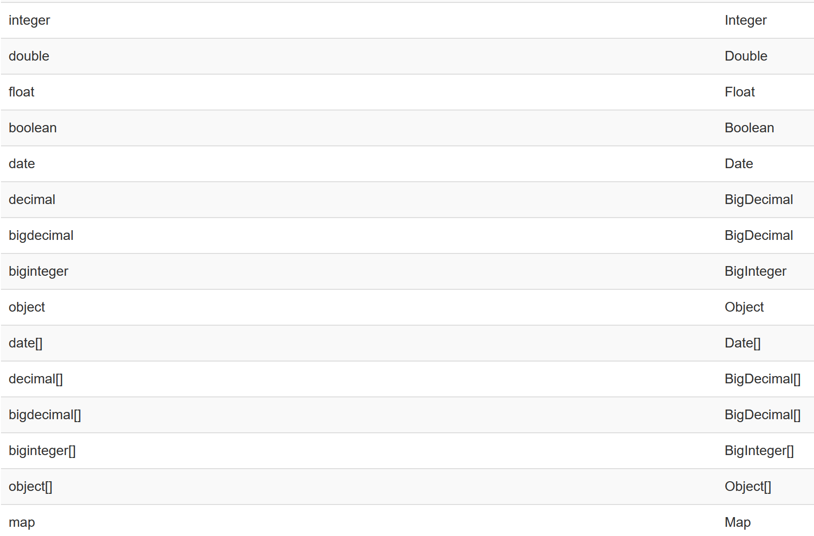
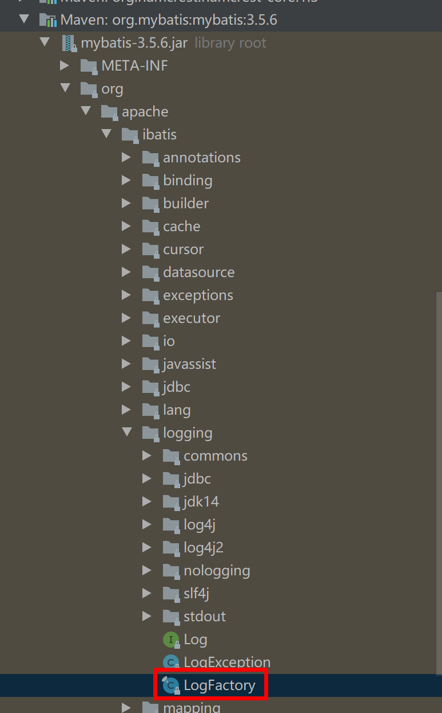

# 一、简介

- 本次课程跟着MyBatis 中文文档学习
- 中文学习地址 https://mybatis.org/mybatis-3/zh_CN/configuration.html

## 1.什么是 MyBatis

- 概述：MyBatis 是一款优秀的**持久层**框架，它支持自定义 SQL、存储过程以及高级映射。MyBatis 免除了几乎所有的 JDBC 代码以及**设置参数**和**获取结果集**的工作。MyBatis  可以通过简单的 XML 或注解来配置和映射原始类型、接口和 Java POJO（Plain Old  Java Objects，普通老式 Java 对象）为数据库中的记录。

- 源码地址：

  ```java
  https://github.com/mybatis/mybatis-3
  ```

- 如果需要看源码，下载

  

- MyBatis 前身是 iBatis

  

  

## 2.和 JDBC 对比

- JDBC 缺点：
  - 需要自己封装结果集
  - 需要自己处理参数
  - 没有共用性
  - SQL 写在 java 代码里面，耦合度很高

# 二、入门

## 1.引入依赖

- 引入 MyBatis 依赖

  ```java
  //MyBatis 依赖
  <dependency>
      <groupId>org.mybatis</groupId>
      <artifactId>mybatis</artifactId>
      <version>3.5.6</version>
  </dependency>
  ```

  

- 引入数据库驱动依赖

  ```java
  <dependency>
      <groupId>mysql</groupId>
      <artifactId>mysql-connector-java</artifactId>
      <version>8.0.29</version>
  </dependency>
  ```

- 引入 junit 测试依赖

  ```java
  <dependency>
      <groupId>junit</groupId>
      <artifactId>junit</artifactId>
      <version>4.12</version>
      <scope>test</scope>
  </dependency>
  ```

## 2.创建MyBatis 项目

- 创建mybatis 空项目

- 添加模块

  

## 3.创建 MyBatis 核心配置文件

- 简单使用 MyBatis 核心配置
  - **核心配置概述**：XML 配置文件中包含了对 MyBatis 系统的核心设置，包括获取数据库连接实例的数据源（DataSource）以及决定事务作用域和控制方式的事务管理器（TransactionManager）

- 核心配置 mybatis-config.xml

  ```xml
  <?xml version="1.0" encoding="UTF-8" ?>
  <!DOCTYPE configuration
          PUBLIC "-//mybatis.org//DTD Config 3.0//EN"
          "https://mybatis.org/dtd/mybatis-3-config.dtd">
  <configuration>
      <environments default="development">
          <environment id="development">
              <transactionManager type="JDBC"/>
  <!--            配置数据库连接要素-->
              <dataSource type="POOLED">
                  <property name="driver" value="com.mysql.cj.jdbc.Driver"/>
                  <property name="url" value="jdbc:mysql://localhost:3306/mybatis"/>
                  <property name="username" value="root"/>
                  <property name="password" value="123456"/>
              </dataSource>
          </environment>
      </environments>
  <!--    映射文件-->
      <mappers>
          <mapper resource="cn/sycoder/mapper/EmployeeMapper.xml"/>
      </mappers>
  </configuration>
  ```

  

## 4.创建 MyBatis 映射文件

- 创建 xml 映射文件

  ```java
  <?xml version="1.0" encoding="UTF-8" ?>
  <!DOCTYPE mapper
          PUBLIC "-//mybatis.org//DTD Mapper 3.0//EN"
          "https://mybatis.org/dtd/mybatis-3-mapper.dtd">
  <mapper namespace="cn.sycoder.mapper.EmployeeMapper">
      <select id="selectEmployee" resultType="cn.sycoder.domain.Employee">
          select * from Blog where id = #{id}
      </select>
  </mapper>
  ```

- 创建 mapper 接口

  ```java
  public interface EmployeeMapper {
      /**
       * 查询员工信息
       * @param id
       * @return
       */
      Employee selectEmployee(@Param("id") Long id);
  }
  ```

- 项目结构

  

## 5.准备数据库

- 数据库名称 mybatis

  

- 数据表 employee 并向里面添加两条数据

  ```java
  insert into employee(name,age,address) values ('sy',18,'杭州'),('zs',19,'北京');
  ```

  

  

## 6.从 XML 中构建 SqlSessionFactory

- 获取SqlSessionFactory 

  ```java
  String resource = "mybatis-config.xml";
  InputStream inputStream = Resources.getResourceAsStream(resource);
  SqlSessionFactory sqlSessionFactory = new SqlSessionFactoryBuilder().build(inputStream);
  ```

- 注意，创建mapper 目录的时候，一定要避免建成一个文件

  

## 7.从 SqlSessionFactory 中获取 SqlSession

- SqlSession：提供了执行 SQL 的所有方法

  ```java
  try (SqlSession session = sqlSessionFactory.openSession()) {
      EmployeeMapper mapper = session.getMapper(EmployeeMapper.class);
      Employee employee = mapper.selectEmployee(2L);
      System.out.println(employee);
  }
  ```


## 8.流程分析

- 读取mybatis 核心配置文件
- 获取SqlSessionFactory 工厂类
- 通过 SqlSessionFactory 工厂类创建 SqlSession 类对象
- 通过SqlSession 对象获取自定义的 EmployeeMapper 接口
- 操作 EmployeeMapper  接口方法执行

# 三、XML 配置

## 1.配置概述

- 概述：MyBatis 的配置文件包含了会深深影响 MyBatis 行为的设置和属性信息，层级结构如下
- configuration（配置）          
  - [properties（属性）](https://mybatis.org/mybatis-3/zh/configuration.html#properties)
  - [settings（设置）](https://mybatis.org/mybatis-3/zh/configuration.html#settings)
  - [typeAliases（类型别名）](https://mybatis.org/mybatis-3/zh/configuration.html#typeAliases)
  - [typeHandlers（类型处理器）](https://mybatis.org/mybatis-3/zh/configuration.html#typeHandlers)
  - [objectFactory（对象工厂）](https://mybatis.org/mybatis-3/zh/configuration.html#objectFactory)
  - [plugins（插件）](https://mybatis.org/mybatis-3/zh/configuration.html#plugins)
  - environments（环境配置）
    -   environment（环境变量）                  
      - transactionManager（事务管理器）
      - dataSource（数据源）
  - [databaseIdProvider（数据库厂商标识）](https://mybatis.org/mybatis-3/zh/configuration.html#databaseIdProvider)
  - [mappers（映射器）](https://mybatis.org/mybatis-3/zh/configuration.html#mappers)

## 2.属性 properties

- **使用Properties**：作用这些属性可以在外部进行配置，并可以进行动态替换

- db.properties 配置

  ```properties
  driver=com.mysql.cj.jdbc.Driver
  url=jdbc:mysql://localhost:3306/mybatis
  username=root
  password=123456
  ```

- 先引入 db.properties 配置文件

  ```xml
  <properties resource="db.properties">
          <!-- ... -->
      <property name="org.apache.ibatis.parsing.PropertyParser.enable-default-value" value="true"/> 
      <!-- 启用默认值特性 -->
  </properties>
  ```

  

- 可以通过 ${} 去把配置文件中的值取出来

  ```xml
  <dataSource type="POOLED">
      <property name="driver" value="${driver}"/>
      <property name="url" value="${url}"/>
      <property name="username" value="${username}"/>
      <property name="password" value="${password}"/>
  </dataSource>
  ```

- 启用默认值之后可以采用如下的方式配置

  ```xml
  <dataSource type="POOLED">
      <property name="driver" value="${driver:com.mysql.cj.jdbc.Driver}"/>     
      							<!-- 如果 driver 空取后面值 -->
      <property name="url" value="${url}"/>
      <property name="username" value="${username}"/>
      <property name="password" value="${password}"/>
  </dataSource>
  ```

## 3.设置（settings）

- **作用**：改变 MyBatis 的运行时行为

- 常用设置

  | 设置名                   | 描述                                                         | 有效值        | 默认值 |
  | :----------------------- | ------------------------------------------------------------ | ------------- | ------ |
  | cacheEnabled             | 全局性地开启或关闭所有映射器配置文件中已配置的任何缓存。     | true \| false | true   |
  | lazyLoadingEnabled       | 延迟加载的全局开关。当开启时，所有关联对象都会延迟加载。特定关联关系中可通过设置 `fetchType`属性来覆盖该项的开关状态。 | true \| false | false  |
  | mapUnderscoreToCamelCase | 是否开启驼峰命名自动映射，即从经典数据库列名                A_COLUMN 映射到经典 Java 属性名 aColumn。 | true \| false | False  |

- 配置xml代码

  ```xml
   <settings>
  <!--        设置数据库经典命名下划线方式字段转换成驼峰方式-->
      <setting name="mapUnderscoreToCamelCase" value="true"/>
  </settings>
  ```

## 4.类型别名（typeAliases）

- **作用**：类型别名可为 Java 类型设置一个缩写名字，它仅用于 XML 配置，意在降低冗余的全限定类名书写

- 使用全限定类名配置

  ```xml
   <typeAliases>
  <!--        type 类全限定类名-->
  <!--        alias 表示别名-->
          <typeAlias type="cn.sycoder.domain.Employee" alias="emp"></typeAlias>
      </typeAliases>
  ```

- 使用包名方式

  ```xml
  <typeAliases>
    <package name="cn.sycoder.domain"/>
  </typeAliases>
  ```

- 使用注解方式

  ```java
  @Alias("author")
  public class Author {
      ...
  }
  ```

- 常见的 Java 类型内建的类型别名的规律

  - **基本类型前面加下划线**

    

  - **引用数据类型使用首字母小写**

    

    

## 5.环境配置（environments）

- **作用**：可以获取多数据源，可以选用适合要求的数据源。开发、测试和生产环境需要有不同的配置；或者想在具有相同 Schema          的多个生产数据库中使用相同的 SQL 映射
- **注意**：**尽管可以配置多个环境，但每个 SqlSessionFactory 实例只能选择一种环境**

- 代码

  ```xml
   <environments default="test">
  <!--        开发环境-->
          <environment id="development">
              <transactionManager type="JDBC"/>
  <!--            配置数据库连接要素-->
              <dataSource type="POOLED">
                  <property name="driver" value="${driver:com.mysql.cj.jdbc.Driver}"/>
                  <property name="url" value="${url}"/>
                  <property name="username" value="${username}"/>
                  <property name="password" value="${password}"/>
              </dataSource>
          </environment>
  <!--        测试环境-->
          <environment id="test">
              <transactionManager type="JDBC"/>
              <!--            配置数据库连接要素-->
              <dataSource type="POOLED">
                  <property name="driver" value="${driver:com.mysql.cj.jdbc.Driver}"/>
                  <property name="url" value="${url}"/>
                  <property name="username" value="${username}"/>
                  <property name="password" value="${password}"/>
              </dataSource>
          </environment>
      </environments>
  ```

### 5.1**事务管理器（transactionManager）**

- MyBatis 中有两种类型的事务管理器（也就是 type="[JDBC|MANAGED]"）

  - **JDBC**-这个配置直接使用了 JDBC 的提交和回滚功能,如果不需要自动提交，可以通过设置属性关掉

    ```xml
    <transactionManager type="JDBC">
      <property name="skipSetAutoCommitOnClose" value="true"/>
    </transactionManager>
    ```

    

  - **MANAGED** – 这个配置几乎没做什么,不提交或回滚一个连接，默认情况下它会关闭连接，可以设置手动关闭

    ```xml
    <transactionManager type="MANAGED">
      <property name="closeConnection" value="false"/>
    </transactionManager>
    ```

    

### 5.2**数据源（dataSource）**

- 概述：dataSource 元素使用标准的 JDBC 数据源接口来配置 JDBC 连接对象的资源

- 三种内建的数据源类型

  - **UNPOOLED**：不使用数据库连接池，每次操作数据库都需要获取连接

  - **POOLED**：使用数据库连接池，就是把建立的连接缓存起来，下次使用直接拿，不需要新建

    - ```
      poolMaximumActiveConnections-在任意时间可存在的活动（正在使用）连接数量，默认值：10 
      poolMaximumIdleConnections – 任意时间可能存在的空闲连接数。
      ```

  - **JNDI**：满足 EJB 或应用服务器这类容器中使用需求，可以调用上下文的数据源

## 6.映射器（mappers）

- 作用：配置 MyBatis 寻找 sql 语句

- 配置方式：

  - 使用相对于类路径的资源引用

    ```xml
    <mappers>
        <mapper resource="cn/sycoder/mapper/EmployeeMapper.xml"/>
    </mappers>
    ```

  - 使用映射器接口实现类的完全限定类名

    ```xml
    <mappers>
        <mapper class="cn.sycoder.mapper.EmployeeMapper"/>
    </mappers>
    ```

  - 将包内的映射器接口全部注册为映射器

    - **注意，使用这种必须保证 mapper.xml 和 mapper 文件在同一包下**

    ```xml
    <mappers>
      <package name="cn.sycoder.mapper"/>
    </mappers>
    ```

# 四、日志

- 为什么现在开始使用日志？**早学会早使用**,方便观察sql的参数信息

- Mybatis 通过使用内置的日志工厂提供日志功能，具体的实现

  - ​          SLF4J        
  - ​          Apache Commons Logging        
  - ​          Log4j 2        
  - ​          Log4j （3.5.9 起废弃）        
  - ​          JDK logging        

  

  

- 使用前加上配置

  ```xml
  <settings>
      ...
      <setting name="logImpl" value="LOG4J"/>
      ...
    </settings>
  ```

- logImpl 可选的值有：SLF4J、LOG4J、LOG4J2、JDK_LOGGING、COMMONS_LOGGING、STDOUT_LOGGING、NO_LOGGING

## 1.Log4j 配置示例

- 导入依赖

  ```java
  <dependency>
    <groupId>log4j</groupId>
    <artifactId>log4j</artifactId>
    <version>1.2.17</version>
  </dependency>
  ```

- 创建 log4j.properties

  ```properties
  log4j.rootLogger=ERROR, stdout
  
  log4j.logger.cn.sycoder.mapper.EmployeeMapper=TRACE
  
  log4j.appender.stdout=org.apache.log4j.ConsoleAppender
  log4j.appender.stdout.layout=org.apache.log4j.PatternLayout
  log4j.appender.stdout.layout.ConversionPattern=%5p [%t] - %m%n
  ```

- 设置 mybatis-config.xml

  ```xml
  <settings>
  <!--        设置数据库经典命名下划线方式字段转换成驼峰方式-->
      <setting name="mapUnderscoreToCamelCase" value="true"/>
  <!--        配置日志-->
      <setting name="logImpl" value="LOG4J"/>
  </settings>
  ```

- 注意：忘记配置 setting 也能够自动装载，具体请看源码

- **ERROR  WARN   INFO  DEBUG**

# 五、使用MyBatis增删改查

## 1.添加操作

- 添加接口方法

  ```java
  void insert(@Param("emp") Employee emp);
  ```

- 添加xml 配置

  ```xml
  <insert id="insert">
          insert into employee value(null,#{emp.name},#{emp.age},#{emp.address},#{emp.empDetail})
  </insert>
  ```


## 2.删除操作

- 添加接口方法

  ```java
  void delete(@Param("id")Long id);
  ```

- 添加xml 配置

  ```xml
  <delete id="delete">
      delete from employee where id = #{id}
  </delete>
  ```

## 3.修改操作

- 添加接口方法

  ```java
  void update(@Param("emp") Employee emp);
  ```

- 添加xml配置

  ```xml
  <update id="update">
      update employee set name = #{emp.name} where id = #{emp.id}
  </update>
  ```

  