# 一、XML 映射器

## 1.概述

- 使用 xml 文件去配置 SQL 代码，比传统的 jdbc 简单方便，能够少写代码，减少使用成本，让用户能更专注于 SQL 代码

- SQL 映射文件中的顶级元素

  ```java
  cache – 该命名空间的缓存配置。
  cache-ref – 引用其它命名空间的缓存配置。
  resultMap – 描述如何从数据库结果集中加载对象，是最复杂也是最强大的元素。
  parameterMap – 老式风格的参数映射。此元素已被废弃，并可能在将来被移除！请使用行内参数映射。文档中不会介绍此元素。
  sql – 可被其它语句引用的可重用语句块。
  insert – 映射插入语句。
  update – 映射更新语句。
  delete – 映射删除语句。
  select – 映射查询语句
  ```

- 如果需要插件，去安装就行了

  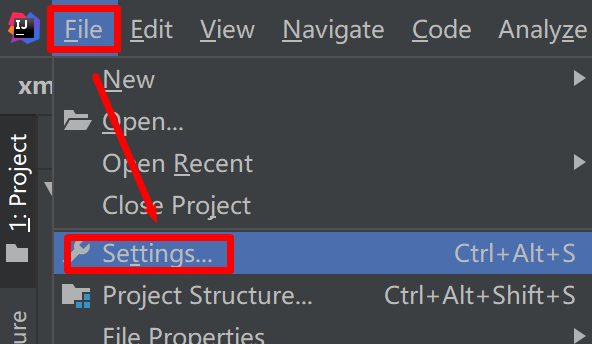

  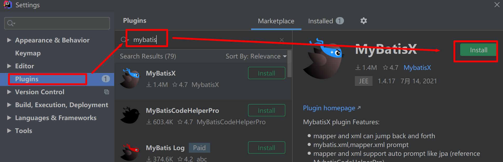

  

# 二、select

- 概述：查询语句是 MyBatis 中最常用的元素之一

- Select 元素的属性

  | 属性            | 使用目的                | 描述                                                         |
  | --------------- | ----------------------- | ------------------------------------------------------------ |
  | `id`            | 和Mapper 接口方法名关联 | 在命名空间中唯一的标识符，可以被用来引用这条语句。           |
  | `parameterType` |                         | 将会传入这条语句的参数的类全限定名或别名。这个属性是可选的，因为 MyBatis 可以通过类型处理器（TypeHandler）推断出具体传入语句的参数，默认值为未设置（unset）。 |
  | parameterMap    |                         | 用于引用外部 parameterMap 的属性，目前已被废弃。请使用行内参数映射和 parameterType 属性。 |
  | `resultType`    | 返回结果集              | 期望从这条语句中返回结果的类全限定名或别名。注意，如果返回的是集合，那应该设置为集合包含的类型，而不是集合本身的类型。resultType 和 resultMap 之间只能同时使用一个。 |
  | `resultMap`     | 返回结果集              | 对外部 resultMap 的命名引用。结果映射是 MyBatis 最强大的特性，如果你对其理解透彻，许多复杂的映射问题都能迎刃而解。resultType 和 resultMap 之间只能同时使用一个。 |
  | `flushCache`    |                         | 将其设置为 true 后，只要语句被调用，都会导致本地缓存和二级缓存被清空，默认值：false。 |
  | `useCache`      | 用于开启缓存            | 将其设置为 true 后，将会导致本条语句的结果被二级缓存缓存起来，默认值：对 select 元素为 true。 |
  | `timeout`       |                         | 这个设置是在抛出异常之前，驱动程序等待数据库返回请求结果的秒数。默认值为未设置（unset）（依赖数据库驱动）。 |
  | `fetchSize`     |                         | 这是一个给驱动的建议值，尝试让驱动程序每次批量返回的结果行数等于这个设置值。默认值为未设置（unset）（依赖驱动）。 |
  | `statementType` | 默认值：PREPARED。      | 可选 STATEMENT，PREPARED 或 CALLABLE。这会让 MyBatis 分别使用                Statement，PreparedStatement 或 CallableStatement，默认值：PREPARED。 |
  | `resultSetType` |                         | FORWARD_ONLY，SCROLL_SENSITIVE, SCROLL_INSENSITIVE 或                DEFAULT（等价于 unset） 中的一个，默认值为 unset （依赖数据库驱动）。 |
  | `databaseId`    |                         | 如果配置了数据库厂商标识（databaseIdProvider），MyBatis 会加载所有不带 databaseId 或匹配当前 databaseId 的语句；如果带和不带的语句都有，则不带的会被忽略。 |
  | `resultOrdered` |                         | 这个设置仅针对嵌套结果 select 语句：如果为true，则假设结果集以正确顺序（排序后）执行映射，当返回新的主结果行时，将不再发生对以前结果行的引用。 这样可以减少内存消耗。默认值：`false`。 |
  | `resultSets`    | 适用于多结果集的情况    | 这个设置仅适用于多结果集的情况。它将列出语句执行后返回的结果集并赋予每个结果集一个名称，多个名称之间以逗号分隔。 |

- 常用

  ```xml
  <select
    id="selectPerson"
    resultType="hashmap"
    resultMap="personResultMap"
    timeout="10" #除非有特殊需求，否则不用
   >
  ```

  

# 三、insert, update 和 delete

- Insert, Update, Delete 元素的属性

  | 属性               | 描述                                                         | 是否使用               |
  | ------------------ | ------------------------------------------------------------ | ---------------------- |
  | `id`               | 在命名空间中唯一的标识符，可以被用来引用这条语句。           | 关联mapper 和 xml 语句 |
  | `parameterType`    | 将会传入这条语句的参数的类全限定名或别名。这个属性是可选的，因为 MyBatis 可以通过类型处理器（TypeHandler）推断出具体传入语句的参数，默认值为未设置（unset）。 |                        |
  | `parameterMap`     | 用于引用外部 parameterMap 的属性，目前已被废弃。请使用行内参数映射和 parameterType 属性。 |                        |
  | `flushCache`       | 将其设置为 true 后，只要语句被调用，都会导致本地缓存和二级缓存被清空，默认值：（对 insert、update 和 delete 语句）true。 | 默认使用刷新缓存       |
  | `timeout`          | 这个设置是在抛出异常之前，驱动程序等待数据库返回请求结果的秒数。默认值为未设置（unset）（依赖数据库驱动）。 |                        |
  | `statementType`    | 可选 STATEMENT，PREPARED 或 CALLABLE。这会让 MyBatis 分别使用 Statement，PreparedStatement 或 CallableStatement，默认值：PREPARED。 |                        |
  | `useGeneratedKeys` | （仅适用于 insert 和 update）这会令 MyBatis 使用 JDBC 的 getGeneratedKeys 方法来取出由数据库内部生成的主键（比如：像 MySQL 和 SQL Server 这样的关系型数据库管理系统的自动递增字段），默认值：false。 | 获取数据库生成的主键id |
  | `keyProperty`      | （仅适用于 insert 和 update）指定能够唯一识别对象的属性，MyBatis 会使用                getGeneratedKeys 的返回值或 insert 语句的 selectKey 子元素设置它的值，默认值：未设置（`unset`）。如果生成列不止一个，可以用逗号分隔多个属性名称。 | keyProperty="id"       |
  | `keyColumn`        | （仅适用于 insert 和 update）设置生成键值在表中的列名，在某些数据库（像 PostgreSQL）中，当主键列不是表中的第一列的时候，是必须设置的。如果生成列不止一个，可以用逗号分隔多个属性名称。 |                        |
  | `databaseId`       | 如果配置了数据库厂商标识（databaseIdProvider），MyBatis 会加载所有不带 databaseId 或匹配当前 databaseId 的语句；如果带和不带的语句都有，则不带的会被忽略。 |                        |

- 常用案例

  ```xml
  <insert id="insertAuthor" useGeneratedKeys="true"
      keyProperty="id">
    insert into Author (username,password,email,bio)
    values (#{username},#{password},#{email},#{bio})
  </insert>
  ```

  - selectKey

    | 属性            | 描述                                                         |      |
    | --------------- | ------------------------------------------------------------ | ---- |
    | `keyProperty` | selectKey语句结果应该被设置到的目标属性。如果生成列不止一个，可以用逗号分隔多个属性名称。 ||
    | `keyColumn`     | 返回结果集中生成列属性的列名。如果生成列不止一个，可以用逗号分隔多个属性名称。 |      |
    | `resultType`    | 结果的类型。通常 MyBatis 可以推断出来，但是为了更加准确，写上也不会有什么问题。MyBatis 允许将任何简单类型用作主键的类型，包括字符串。如果生成列不止一个，则可以使用包含期望属性的 Object 或 Map。 |      |
    | `order`         | 可以设置为 `BEFORE` 或 `AFTER`。如果设置为  `BEFORE`，那么它首先会生成主键，设置 `keyProperty` 再执行插入语句。如果设置为AFTER`，那么先执行插入语句，然后是 `selectKey` 中的语句 - 这和 Oracle数据库的行为相似，在插入语句内部可能有嵌入索引调用。 |      |
    | `statementType` | 和前面一样，MyBatis 支持 `STATEMENT`，`PREPARED` 和 `CALLABLE` 类型的映射语句，分别代表 `Statement`, `PreparedStatement` 和 `CallableStatement` 类型。 |      |

    

  ```xml
  <selectKey
    keyProperty="id"
    resultType="int"
    order="BEFORE"
    statementType="PREPARED">
  ```

  

# 四、sql

- 注意：mybatis spring 底层都会用到反射创建对象

## 1.概述

- sql：可以用来定义可重用的 SQL 代码片段

## 2.使用

- 使用

  ```xml
  <sql id="userColumns"> ${alias}.id,${alias}.username,${alias}.password </sql>
  ```

  ```xml
  <select id="selectUsers" resultType="map">
    select
      <include refid="userColumns"><property name="alias" value="t1"/></include>,
      <include refid="userColumns"><property name="alias" value="t2"/></include>
    from some_table t1
      cross join some_table t2
  </select>
  ```

  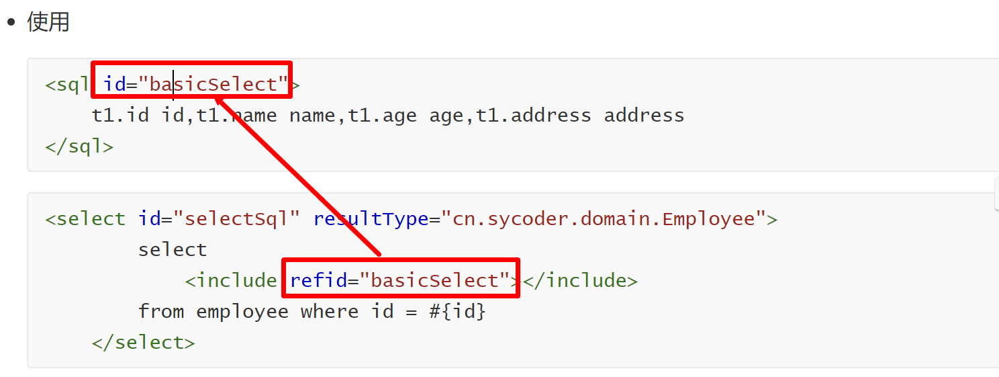

  

# 五、参数

## 1.#{参数名称}

- 原理：使用 `#{}`参数语法时，MyBatis 会创建 `PreparedStatement`参数占位符，并通过占位符安全地设置参数（就像使用 ? 一样

  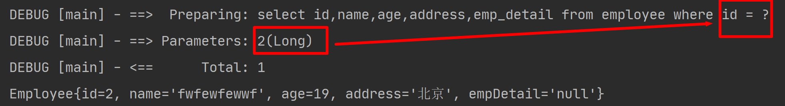

- 特点

  - 安全(防止SQL注入)
  - 迅速
  - 首选做法

## 2.${参数名称}

-  `${参数名称}` 会被直接替换，而 `#{value}` 会使用 `?` 预处理

-  作用: 当 SQL 语句中的元数据（如`表名`或`列名`）是动态生成的时候，字符串替换将会非常有用

- 实操

  ```xml
  <select id="selectSql" resultType="cn.sycoder.domain.Employee">
          select
              <include refid="basicSelect"></include>
          from ${tableName} where id = #{id}
      </select>
  ```

  ```java
  Employee selectSql(@Param("tableName") String tableName,@Param("id") Long id);
  ```

  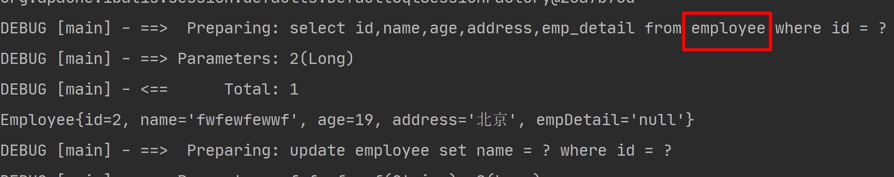

- 特点
  - 可以做表名拼接
  - 更加灵活方便
- 面试：说说 mybatis # 取参和 $ 取参的区别
  - `${参数名称}` 会被直接替换，而 `#{value}` 会使用 `?` 预处理

- 补充
  - **使用 @Param 底层自动给我们转换成一个 map 来传参的**

# 六、结果映射

## 1.ResultType 映射	

- 使用 resultType

  - 查询单个Map对象

    ```xml
    <select id="selectUsers" resultType="map">
      select id, username, hashedPassword
      from some_table
      where id = #{id}
    </select>
    ```

    ```java
    @MapKey("id")
    Map selectUsers(Long id);
    ```
  
  - 查询具体单个对象
  
    ```xml
    <select id="selectEmpById" resultType="cn.sycoder.domain.Employee">
        select
            <include refid="basicSelect"></include>
        from employee  where id = #{id}
    
    </select>
    <!--    定义sql-->
    <sql id="basicSelect">
        id,name,age,address,emp_detail
    </sql>
    ```
  
    ```java
    Employee selectEmpById(Long id);
    ```
  
  - 查询集合对象
  
    ```xml
    <select id="selectEmp" resultType="cn.sycoder.domain.Employee">
        select
            <include refid="basicSelect"></include>
        from employee
        where id = #{id}
    </select>
    ```
  
    ```java
    List<Employee> selectEmp(Long id);
    ```
  
  - 查询单个值
  
    ```xml
    <select id="selectCount" resultType="java.lang.Integer">
        select count(*) from employee
    </select>
    ```
  
    ```java
    Integer selectCount();
    ```

## 2.ResultMap 映射（⭐️）

### 2.1使用ResultType 问题

- > 单独使用ResultType 会出现如下问题
  >
  > mapUnderscoreToCamelCase  未开启
  >
  > ```xml
  > <setting name="mapUnderscoreToCamelCase" value="false"/>
  > ```
  >
  > 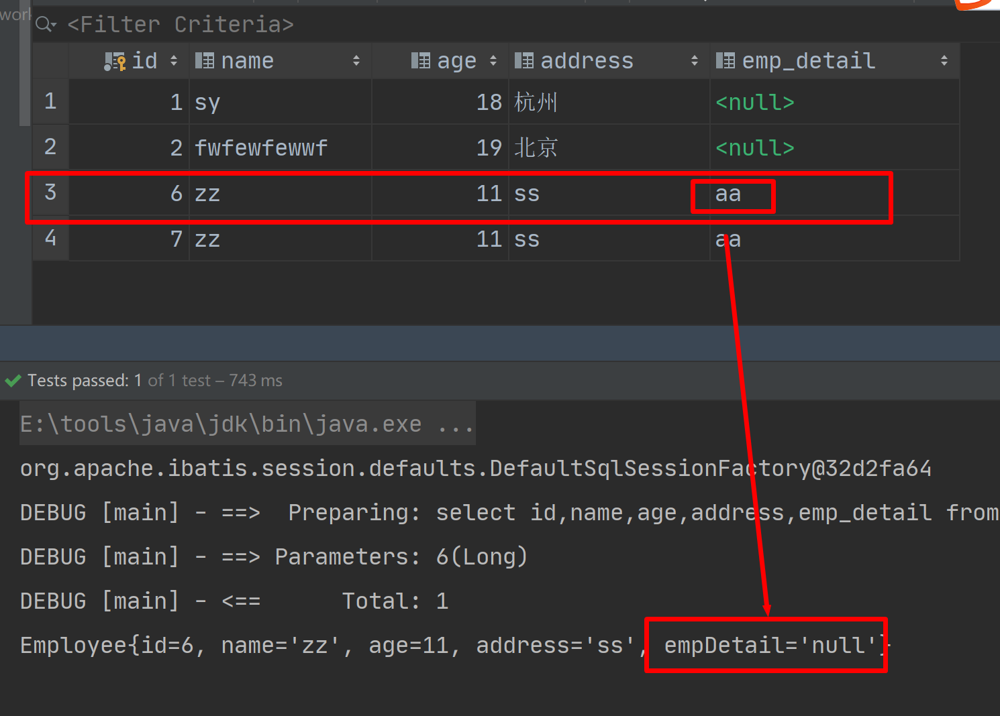

### 2.2ResultMap

- **应用场景**：实体类属性和数据库列名不匹配的时候（比如，数据库采用经典命名法，java 使用驼峰命名法（CamelCase）的时候）

  ```xml
  <resultMap id="basicMap" type="cn.sycoder.domain.Employee">
  <!--        设置数据库id 的对应字段-->
          <id property="id" column="id"></id>
          <result property="empDetail" column="emp_detail"></result>
          <result property="name" column="name"></result>
  
      </resultMap>
  
  <select id="selectEmpById" resultMap="basicMap">
          select
              <include refid="basicSelect"></include>
          from employee  where id = #{id}
  
      </select>
  ```

  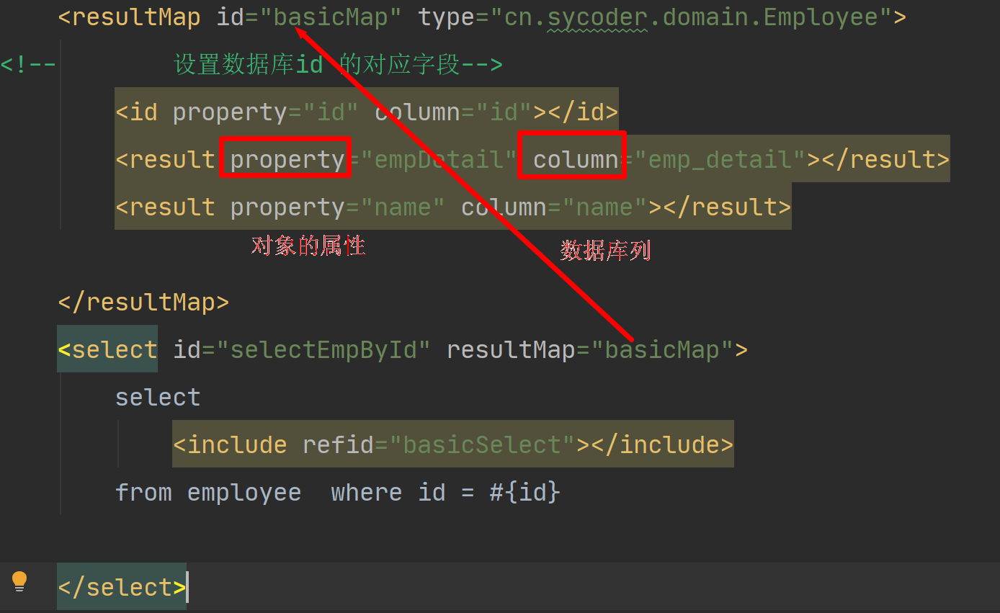

- 解决方式2

  ```xml
     <settings>
          <setting name="mapUnderscoreToCamelCase" value="true"/>
      </settings>
  ```

- #### id & result

  ```xml
  <id property="id" column="post_id"/>
  <result property="subject" column="post_subject"/>
  ```

- id & result 属性

  | 属性       | 描述                                                         |      |
  | ---------- | ------------------------------------------------------------ | ---- |
  | `property` | 映射到列结果的字段或属性。如果 JavaBean 有这个名字的属性（property），会先使用该属性。否则 MyBatis 将会寻找给定名称的字段（field）。无论是哪一种情形，你都可以使用常见的点式分隔形式进行复杂属性导航。 比如，你可以这样映射一些简单的东西：“username”，或者映射到一些复杂的东西（某个类中的字段）上：“address.street.number”。         stu.name |      |
  | `column`   | 数据库中的列名，或者是列的别名。一般情况下，这和传递给               `resultSet.getString(columnName)` 方法的参数一样。 |      |
  | `javaType` | 一个 Java 类的全限定名，或一个类型别名（关于内置的类型别名，可以参考上面的表格）。                如果你映射到一个 JavaBean，MyBatis 通常可以推断类型。然而，如果你映射到的是                HashMap，那么你应该明确地指定 javaType 来保证行为与期望的相一致。 |      |

### 2.3多结果集处理前期准备

- 新建学生和班级表

  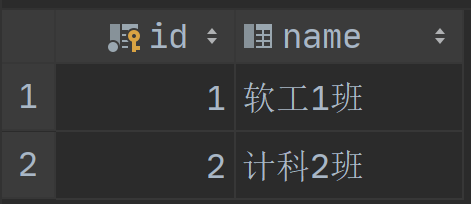

  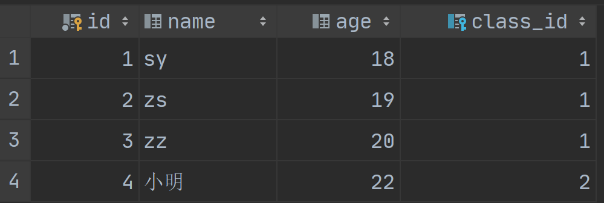

  ```sql
  
  create table class
  (
  	id bigint auto_increment
  		primary key,
  	name varchar(64) null
  );
  
  
  
  create table student
  (
  	id bigint auto_increment
  		primary key,
  	name varchar(64) null,
  	age int null,
  	class_id bigint null,
  	constraint student_class_id_fk
  		foreign key (class_id) references class (id)
  );
  
  insert into class values (null,'软工1班'),(null,'计科2班');
  
  insert into student (id, name, age,class_id)
  values (null,'sy',18,1),(null,'zs',19,1),(null,'zz',20,1),(null,'小明',22,2);
  
  ```

### 2.4一对多处理

- collection ：使用 collection 就可以获取到多个结果集对象

- 一个班级对应多个学生

- 操作

  - 第一步，新建 mapper 方法

    ```java
    public interface ClassMapper {
    
        MyClass getById(Long id);
    }
    ```

  - 第二步，编写 xml

    ```xml
    <resultMap id="basicMap" type="cn.sycoder.domain.MyClass">
            <id property="id" column="id"></id>
            <result property="name" column="name"></result>
    <!--        获取学生信息信息-->
            <collection property="stus" ofType="cn.sycoder.domain.Student">
                <id property="id" column="sId"></id>
                <result property="name" column="sName"></result>
                <result property="age" column="age"></result>
                <result property="classId" column="class_id"></result>
            </collection>
        </resultMap>
    
        <select id="getById" resultMap="basicMap">
            select
                c.*,s.id sId,s.name sName,s.age,s.class_id
            from
                class c left join student s on c.id = s.class_id
            where c.id = #{id}
        </select>
    ```

### 2.5多对一的处理

- 关联（association）：如果我的类里面有其它对象的关联关系，可以使用 association 来进行操作

  | 属性       | 描述                                                         |
  | ---------- | ------------------------------------------------------------ |
  | `property` | 映射到列结果的字段或属性。如果用来匹配的 JavaBean存在给定名字的属性，那么它将会被使用。否则 MyBatis 将会寻找给定名称的字段。无论是哪一种情形，你都可以使用通常的点式分隔形式进行复杂属性导航。比如，你可以这样映射一些简单的东西：“username”，或者映射到一些复杂的东西上：“address.street.number”。 |
  | `javaType` | 一个 Java 类的完全限定名，或一个类型别名（关于内置的类型别名，可以参考上面的表格）。 如果你映射到一个 JavaBean，MyBatis 通常可以推断类型。然而，如果你映射到的是HashMap，那么你应该明确地指定 javaType 来保证行为与期望的相一致。 |

  

- 传统操作

  - 使用级联操作

    ```xml
     <resultMap id="basicMap" type="cn.sycoder.domain.Student">
            <id property="id" column="id"></id>
            <result property="name" column="name"></result>
            <result property="age" column="age"></result>
            <result property="classId" column="class_id"></result>
            <result property="cls.id" column="cId"></result>
            <result property="cls.name" column="cName"></result>
        </resultMap>
    
        <select id="listAllStus" resultMap="basicMap">
            select
            stu.*,c.id cId,c.name cName
            from
            student stu left join class c on stu.class_id = c.id
        </select>
    ```

    

- 使用 association 操作

  - 代码

    ```xml
    <resultMap id="AssociationMap" type="cn.sycoder.domain.Student">
            <id property="id" column="id"></id>
            <result property="name" column="name"></result>
            <result property="age" column="age"></result>
            <result property="classId" column="class_id"></result>
            <association property="cls" javaType="cn.sycoder.domain.MyClass">
                <id property="id" column="cId"></id>
                <result property="name" column="cName"></result>
            </association>
        </resultMap>
    
        <select id="listAllStusByAssociation" resultMap="AssociationMap">
            select
            stu.*,c.id cId,c.name cName
            from
            student stu left join class c on stu.class_id = c.id
        </select>
    ```

    

## 3.嵌套 select 查询

- 以多条sql 的方式执行

### 3.1关联关系 assciation select

- 查询学生信息，包含班级信息

  ```xml
  <resultMap id="AssociationSelectMap" type="cn.sycoder.domain.Student">
          <id property="id" column="id"></id>
          <result property="name" column="name"></result>
          <result property="age" column="age"></result>
          <result property="classId" column="class_id"></result>
          <association property="cls" column="class_id"
                       select="cn.sycoder.mapper.StudentMapper.getClassById"/>
      </resultMap>
  
      <select id="listAllStusByAssociationSelect" resultMap="AssociationSelectMap">
          select * from student
      </select>
  
      <select id="getClassById" resultType="cn.sycoder.domain.MyClass">
          select * from class where id = #{id}
      </select>
  ```

  

- 如果关联的是多个结果集使用 resultSet

  

  | 属性            | 描述                                                         |
  | --------------- | ------------------------------------------------------------ |
  | `column`        | 当使用多个结果集时，该属性指定结果集中用于与 `foreignColumn`                匹配的列（多个列名以逗号隔开），以识别关系中的父类型与子类型。 |
  | `foreignColumn` | 指定外键对应的列名，指定的列将与父类型中 `column` 的给出的列进行匹配。 |
  | `resultSet`     | 指定用于加载复杂类型的结果集名字。                           |

  ```xml
  <resultMap id="blogResult" type="Blog">
    <id property="id" column="id" />
    <result property="title" column="title"/>
    <association property="author" javaType="Author" resultSet="authors" column="author_id" foreignColumn="id">
      <id property="id" column="id"/>
      <result property="username" column="username"/>
      <result property="password" column="password"/>
      <result property="email" column="email"/>
      <result property="bio" column="bio"/>
    </association>
  </resultMap>
  ```

### 3.2 collection select

- 需求：通过班级去查学生，使用嵌套 select 查询

  ```xml
  <resultMap id="collectionSelect" type="cn.sycoder.domain.MyClass">
          <id property="id" column="id"></id>
          <result property="name" column="name"></result>
          <!--        获取学生信息信息-->
          <collection property="stus" ofType="cn.sycoder.domain.Student"
                  select="getStudentByClassId"    column="id"/>
      </resultMap>
      <select id="getByClassId" resultMap="collectionSelect">
          select * from class where id = #{id}
      </select>
  
      <select id="getStudentByClassId" resultType="cn.sycoder.domain.Student">
          select * from student where class_id = #{id}
      </select>
  ```

  

### 3.3 关联查询的总结

- 优点：
  - 可以实现延迟加载，前提是要配置
  - sql 写起来变得简单了
- 缺点：
  - 发起了多条 sql,正常查询只发起一条sql

# 七、自动映射

- 自动映射：将列名和结果集关联。

  ```xml
  <select id="selectUsers" resultMap="userResultMap">
    select
      user_id             as "id",
      user_name           as "userName",
      hashed_password
    from some_table
    where id = #{id}
  </select>
  
  <resultMap id="userResultMap" type="User">
    <result property="password" column="hashed_password"/>
  </resultMap>
  ```

- 可以全局配置将经典的列名转换成驼峰的方式

- 映射等级分类

  - ​            `NONE` - 禁用自动映射。仅对手动映射的属性进行映射。          
  - ​            `PARTIAL` - 对除在内部定义了嵌套结果映射（也就是连接的属性）以外的属性进行映射          
  - ​            `FULL` - 自动映射所有属性。          

# 八、缓存

## 1.概述

- Mybatis 缓存：MyBatis 内置了一个强大的事务性查询缓存机制，它可以非常方便地配置和定制

## 2.会话缓存（一级缓存）

- sqlSession 级别的，也就是说，使用同一个 sqlSession 查询同一 sql 时，直接从缓存数据中取，不需要操作数据库

  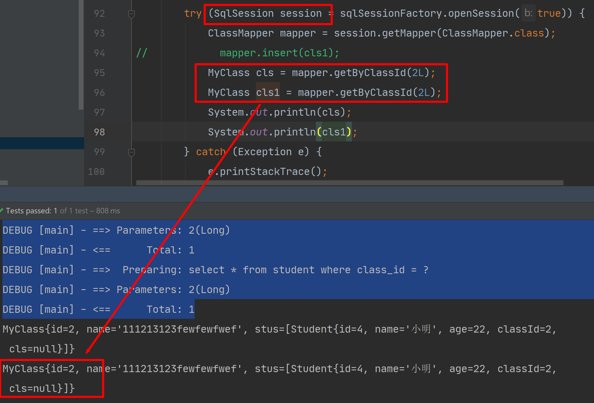

- 失效情况

  - 同一个 sqlSession 条件不同
  - 同一个 sqlSession 执行期间执行了增加、删除、修改操作
  - 手动清缓存

## 3.二级缓存

- 使用之前必须在mapper.xml 文件中添加 <cache/>

- 二级缓存：是 sqlSessionFactory 级别的，只要使用同一个 sqlSessionFactory 创建的 sqlSession 查询同一 sql 都可以使用缓存

- 使用前注意：

  - 先再 mapper.xml 中手动开启二级缓存

  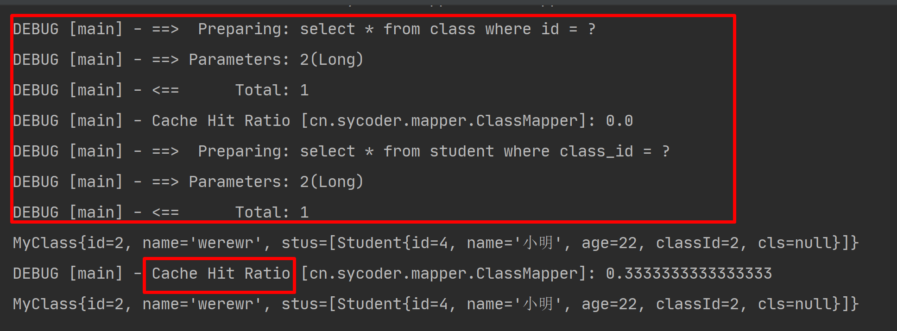

  

- 失效情况
  - 必须给类实现序列化接口（其实原理就是把对象信息写进一个序列化文件中，通过对象流）
  - 两次查询之间添加了任何的增删改操作
  -  insert、update 和 delete 语句会刷新缓存
- 二级缓存清除策略
  - `LRU` – （Least Recently Used）最近最少使用：移除最长时间不被使用的对象。**默认使用方式**   
  - `FIFO` – 先进先出：按对象进入缓存的顺序来移除它们。          
  - `SOFT` – 软引用：基于垃圾回收器状态和软引用规则移除对象。          
  - `WEAK` – 弱引用：更积极地基于垃圾收集器状态和弱引用规则移除对象。          

```xml
<cache
  eviction="FIFO"
  flushInterval="60000"
  size="512"
  readOnly="true"/>
```

- flushInterval:刷新间隔，单位毫秒
- size:引用数目，默认是1024
- readOnly:只读操作默认是 false
  - true,会给调用的地方返回相同实例，对象不能修改
  - false:可以修改，返回实例的拷贝

## 4.缓存查询顺序

- 先查二级缓存，范围比较大，可能有其它会话缓存的信息
- 再查一级缓存
- 再查数据库
- 如果sqlSession关闭会把一级缓存信息缓存到二级缓存