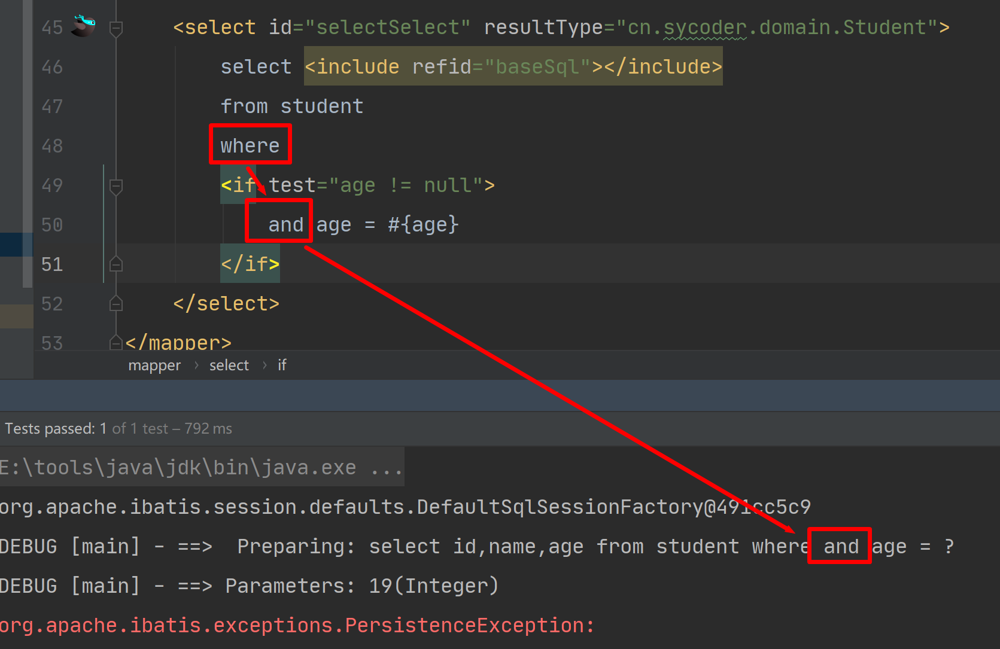
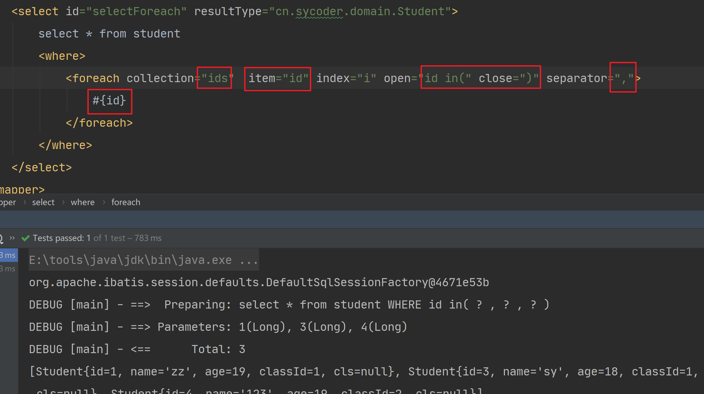

# 一、动态SQL

## 1.概述

- 动态SQL： 是 MyBatis 的强大特性之一，解决拼接动态SQL时候的难题，提高开发效率
- 分类
  - if
  - choose(when,otherwise)
  - trim(where,set)
  - foreach


## 2.if

- 做 where 语句后面条件查询的,if 语句是**可以拼接多条**的

- 需求：根据学生name 做模糊查询

- 代码

  - mapper.xml

    ```xml
    <select id="selectLikeName" resultType="cn.sycoder.domain.Student">
            select id,name,age
            from student
            where age = 19
            <if test="name != null">
                and name like concat(#{name},'%')
            </if>
    </select>
    ```

  - java 代码

    ```java
     List<Student> selectLikeName(String name);
    ```

    

  

## 3.choose、when、otherwise

- 概述：不想使用所有条件时候，他们可以从多个条件中选择一个使用，**相当于java 的 if ... else if ... else**

- 需求：按年龄19查找，如果id 不空按id 查找，名字不空按名字查找，否则按班级id 查找

  - mapper.xml

    ```xml
    <select id="selectChoose" resultType="cn.sycoder.domain.Student">
            select <include refid="baseSql"/>
            from student
            where age = 19
            <choose>
                <when test="id != null">
                    and id = #{id}
                </when>
                <when test="name != null">
                    and name like concat(#{name},'%')
                </when>
                <otherwise>
                    and class_id = #{clsId}
                </otherwise>
            </choose>
        </select>
    ```

  - mapper

    ```java
    List<Student> selectChoose(@Param("id") Long id,@Param("name")String name
                ,@Param("clsId") Long clsId);
    ```

  - 传入 id 参数

    

  - 不传 id 参数，传入name = 'z'

    

  - 不传入 id 参数和 name 参数

    

## 4.trim、where、set

### 4.1trim

- **trim : 用于去掉或者添加标签中的内容**

- prefix：可以在 trim 标签内容前面添加内容

  

  

- prefixOverrides：可以覆盖前面的某些内容

  

- suffix：在 trim 标签后面添加内容

  

- suffixOverrides：去掉 trim 标签内容最后面的值

  

  

### 4.2where

- where 后面直接跟  if

  

- age null

  

- 使用了 where 标签之后，解决了这些问题

  

  

### 4.3set

- **set:*set* 元素可以用于动态包含需要更新的列**

- mapper.xml

  ```xml
  <update id="updateSet">
          update student
          <set>
              <if test="name != null">
                  name = #{name},
              </if>
              <if test="age != null">
                  age = #{age},
              </if>
          </set>
          <where>
              <if test="id != null">
                  id = #{id}
              </if>
          </where>
      </update>
  ```

  ```java
  void updateSet(@Param("age") Integer age,@Param("name")String name
              ,@Param("clsId") Long clsId,@Param("id")Long id);
  ```

  

  

## 5.foreach

- **foreach** :**用于对集合遍历。** 动态 SQL 的另一个常见使用场景是对集合进行遍历（尤其是在构建 IN 条件语句的时候）

- 查询 id 在 1,3,4 之间的学生信息

- mapper.xml

  ```xml
  <select id="selectForeach" resultType="cn.sycoder.domain.Student">
          select * from student
          <where>
              <foreach collection="ids"  item="id" index="i" open="id in(" close=")" separator=",">
                  #{id}
              </foreach>
          </where>
      </select>
  ```

  ```java
  List<Student> selectForeach(@Param("ids") List<Long> ids);
  ```

  

  

  

  

  - collection：传参的数组集合
  - item：遍历拿到的每一个元素
  - index：索引
  - open : foreach 标签内容的开始符
  - close : foreach 标签内容的结束符
  - separator：分隔符
  - 取值取的就是 item 的元素值
  - 注意：当使用 Map 对象（或者 Map.Entry 对象的集合）时，index 是键，item 是值。

  

## 6.script

- **script:**要在带注解的映射器接口类中使用动态 SQL，可以使用 *script* 元素。

- 使用注解操作 mybatis

- 需求：查询所有的学生信息，用注解方式实现

  ```java
  @Select("select * from student")
      List<Student> selectAll();
  ```

- 更新学生信息，使用 script 标签

  ```java
  @Update({
              "<script>",
              "update student",
              "  <set>",
              "    <if test='name != null'>name=#{name},</if>",
              "    <if test='age != null'>age=#{age},</if>",
              "    <if test='clsId != null'>class_id=#{clsId},</if>",
              "  </set>",
              "where id=#{id}",
              "</script>"
      })
      void updateStu(@Param("age") Integer age,@Param("name")String name
              ,@Param("clsId") Long clsId,@Param("id")Long id);
  ```

  

## 7.bind

- `bind` 元素允许你在 OGNL 表达式以外创建一个变量，并将其绑定到当前的上下文。

- 需求：通过用户name 进行模糊查询

  ```xml
  <select id="listLike" resultType="cn.sycoder.domain.Student">
          <bind name="ret" value="'%' + name + '%'"/>
          select * from student
          where name like #{ret}
      </select>
  ```

  

# 二、MyBatis api

## 1.概述

- 目录结构，我们不使用，按我教的使用

  

- 不用官方推荐的，按照我教的目录结构来

  

  

## 2.SqlSession

- 概述：通过这个接口**SqlSession**来执行命令，获取映射器实例和管理事务，SqlSessions 是由 SqlSessionFactory 实例创建的。SqlSessionFactory 对象包含创建 SqlSession 实例的各种方法。而 SqlSessionFactory 本身是由 SqlSessionFactoryBuilder 创建的，它可以从 XML、注解或 Java 配置代码来创建 SqlSessionFactory。

### 2.1SqlSessionFactoryBuilder

- 有 5 个 builder 方法

  ```java
  SqlSessionFactory build(InputStream inputStream)
  SqlSessionFactory build(InputStream inputStream, String environment)
  SqlSessionFactory build(InputStream inputStream, Properties properties)
  SqlSessionFactory build(InputStream inputStream, String env, Properties props)
  SqlSessionFactory build(Configuration config)
  ```

  

### 2.2SqlSessionFactory 

- 获取方式

  ```java
  String resource = "mybatis-config.xml";
  InputStream inputStream = Resources.getResourceAsStream(resource);
  SqlSessionFactoryBuilder builder = new SqlSessionFactoryBuilder();
  SqlSessionFactory factory = builder.build(inputStream);
  ```

  

- 最终会将xml 配置文件，或者 properties 配置转换成一个 Configuration ,最后一个 build 方法接受一个 Configuration 实例。Configuration 类包含了对一个 SqlSessionFactory 实例你可能关心的所有内容。

- Configuration 类信息

  

- 提供了六个方法创建 SqlSession 的实例

  ```java
  SqlSession openSession()
  SqlSession openSession(boolean autoCommit)
  SqlSession openSession(Connection connection)
  SqlSession openSession(TransactionIsolationLevel level)
  SqlSession openSession(ExecutorType execType, TransactionIsolationLevel level)
  SqlSession openSession(ExecutorType execType)
  SqlSession openSession(ExecutorType execType, boolean autoCommit)
  SqlSession openSession(ExecutorType execType, Connection connection)
  Configuration getConfiguration();
  ```

- 主要支持如下操作

  - **事务处理**：你希望在 session 作用域中使用事务作用域，还是使用自动提交（auto-commit）？（对很多数据库和/或 JDBC 驱动来说，等同于关闭事务支持）
  - **数据库连接**：你希望 MyBatis 帮你从已配置的数据源获取连接，还是使用自己提供的连接？
  - **语句执行**：你希望 MyBatis 复用 PreparedStatement 和/或批量更新语句（包括插入语句和删除语句）吗？

- 默认的 openSession() 方法没有参数，它会创建具备如下特性的 SqlSession：

  - 事务作用域将会开启（也就是**不自动提交**）
  - 将由当前环境配置的 DataSource 实例中获取 Connection 对象。（mybatis-config.xml）
  - 事务隔离级别将会使用驱动或数据源的默认设置(**mysql 默认REPEATABLE_READ**)
  - 预处理语句不会被复用，也不会批量处理更新。

- **如果你需要开启事务自动提交**

  - 向 `autoCommit` 可选参数传递 `true` 值即可开启自动提交功能

- 如果你需要提供数据库隔离级别

  - 修改这个的值TransactionIsolationLevel ，提供了枚举

    

- 如果你需要修改执行类型

  - 修改ExecutorType值

    - `ExecutorType.SIMPLE`：该类型的执行器没有特别的行为。它为每个语句的执行创建一个新的预处理语句。
    - `ExecutorType.REUSE`：该类型的执行器会复用预处理语句。
    - `ExecutorType.BATCH`：该类型的执行器会批量执行所有更新语句，如果 SELECT 在多个更新中间执行，将在必要时将多条更新语句分隔开来，以方便理解。

  - 例子

    

    

### 2.3SqlSession

- ##### 语句执行方法:这些方法被用来执行定义在 SQL 映射 XML 文件中的 SELECT、INSERT、UPDATE 和 DELETE 语句。

  ```java
  <T> T selectOne(String statement, Object parameter)
  <E> List<E> selectList(String statement, Object parameter)
  <T> Cursor<T> selectCursor(String statement, Object parameter)
  <K,V> Map<K,V> selectMap(String statement, Object parameter, String mapKey)
  int insert(String statement, Object parameter)
  int update(String statement, Object parameter)
  int delete(String statement, Object parameter)
  ```

- RowBounds

  ```java
  int offset = 100;
  int limit = 25;
  RowBounds rowBounds = new RowBounds(offset, limit);
  ```

- ##### 立即批量更新方法(如果不调用这个方法，批处理不执行，只是缓存而已)

  ```java
  List<BatchResult> flushStatements()
  ```

- ##### 事务控制方法

  ```java
  void commit()
  void commit(boolean force)
  void rollback()
  void rollback(boolean force)
  ```

- ##### 本地缓存:Mybatis 使用到了两种缓存：

  - ##### 本地缓存（local cache）**:每当一个新 session 被创建，MyBatis 就会创建一个与之相关联的本地缓存**

  - ##### 二级缓存（second level cache）

  - 清空本地缓存

    ```java
    void clearCache()
    ```

  - ##### 确保 SqlSession 被关闭:如果没有使用新特性的方式，一定要finally手动关闭

    ```java
    void close()
    ```

### 2.4使用映射器

- 方法

  ```java
  <T> T getMapper(Class<T> type)
  ```

- 自定义方法执行最终都是调用 mybatis 的方法实现

  ```java
  public interface AuthorMapper {
    // (Author) selectOne("selectAuthor",5);
    Author selectAuthor(int id);
    // (List<Author>) selectList(“selectAuthors”)
    List<Author> selectAuthors();
    // (Map<Integer,Author>) selectMap("selectAuthors", "id")
    @MapKey("id")
    Map<Integer, Author> selectAuthors();
    // insert("insertAuthor", author)
    int insertAuthor(Author author);
    // updateAuthor("updateAuthor", author)
    int updateAuthor(Author author);
    // delete("deleteAuthor",5)
    int deleteAuthor(int id);
  }
  ```

- ##### 映射器注解

  

- ##### 映射注解示例

  - 插入语句

    ```java
    @Insert("insert into table3 (id, name) values(#{nameId}, #{name})")
    int insertTable3(Name name);
    ```

  - 查询语句

    ```java
    @Results(id = "userResult", value = {
      @Result(property = "id", column = "uid", id = true),
      @Result(property = "firstName", column = "first_name"),
      @Result(property = "lastName", column = "last_name")
    })
    @Select("select * from users where id = #{id}")
    User getUserById(Integer id);
    ```

  

# 三、分页查询

## 1.概述

- MyBatis 分页插件 PageHelper：是一款非常不错，并且企业用得很多的mybatis 分页插件

## 2.如何使用

### 2.1引入分页插件

- 导入 maven 依赖 pom

  ```java
  <dependency>
      <groupId>com.github.pagehelper</groupId>
      <artifactId>pagehelper</artifactId>
      <version>最新版本</version>
  </dependency>
     
  ```

### 2.2配置拦截插件

- 在 spring 中配置

  ```xml
  <bean id="sqlSessionFactory" class="org.mybatis.spring.SqlSessionFactoryBean">
    <!-- 注意其他配置 -->
    <property name="plugins">
      <array>
        <bean class="com.github.pagehelper.PageInterceptor">
          <property name="properties">
            <!--使用下面的方式配置参数，一行配置一个 -->
            <value>
              params=value1
            </value>
          </property>
        </bean>
      </array>
    </property>
  </bean>
  ```

  

-  在 MyBatis 配置 xml 中配置拦截器插件

  ```xml
  <!--
      plugins在配置文件中的位置必须符合要求，否则会报错，顺序如下:
      properties?, settings?,
      typeAliases?, typeHandlers?,
      objectFactory?,objectWrapperFactory?,
      plugins?,
      environments?, databaseIdProvider?, mappers?
  -->
  <plugins>
      <!-- com.github.pagehelper为PageHelper类所在包名 -->
      <plugin interceptor="com.github.pagehelper.PageInterceptor">
          <!-- 使用下面的方式配置参数，后面会有所有的参数介绍 -->
          <property name="param1" value="value1"/>
  	</plugin>
  </plugins>
  ```

### 2.3分页插件参数介绍

- pageNum : 当前页码
- pageSize : 每页显示的数量
- list : 分页后的集合数据
- total : 总记录数
- pages : 总页数
- prePage ： 上一页
- nextPage: 下一页


### 2.4如何在代码中使用

- 开启分页拦截查询

  ```java
  //①：开启分页功能,参数1是当前页码，参数是每页显示的条数
  PageHelper.startPage(1, 2);
  ```

- 执行查询

  ```java
  //②：开始执行结果，返回list
  List<Student> list = mapper.selectAll();
  Page page = (Page) list;
  PageInfo<Student> info = new PageInfo<>(list);
  System.out.println(list);
  ```

- page 里面有哪些属性

  ```java
  private int pageNum;
  private int pageSize;
  private long total;
  private int pages;
  ```

  

# 四、实战SQL常用操作

## 1.插入时获取主键

### 1.1注解方式


### 1.2xml 配置的方式

```java
<insert id="insertXml" useGeneratedKeys="true" keyProperty="id" keyColumn="id">
    insert into student values(null,#{name},#{age},#{classId})
</insert>
```


## 2.模糊查询

```xml
<select id="listLike1" resultType="cn.sycoder.domain.Student">
    select * from student
    where name like concat('%',#{name},'%')
</select>
```

- select * from student where name like ?


## 3.批量操作

### 3.1批量插入

- 开启sqlSession 批处理 ExecutorType.BATCH,但是记得刷新 statements session.flushStatements();

  ```java
  try (SqlSession session = sqlSessionFactory.openSession(ExecutorType.BATCH,true)) {
              StudentMapper mapper = session.getMapper(StudentMapper.class);
              Student student = new Student();
              mapper.insert(student);
              Student student1 = new Student();
              mapper.insert(student1);
              List<BatchResult> batchResults = session.flushStatements();
  
          } catch (Exception e) {
              e.printStackTrace();
          }
  ```

- 使用 foreach

  ```xml
  <insert id="batchInsert" useGeneratedKeys="true" keyColumn="id" keyProperty="id">
      insert into student (name,age) values
      <foreach collection="list"  item="stu"  separator=",">
          (#{stu.name},#{stu.age})
      </foreach>
  </insert>
  ```

  ```java
  int batchInsert(List<Student> list);
  ```

  

### 3.2批量删除

- $(ids)

  ```java
  @Delete("delete from student where id in(${ids})")
  int deleteBatch(String ids);
  ```

- foreach

  ```xml
  <delete id="del">
      delete from student 
      <where>
          <foreach collection="ids"  item="id" index="i" open="id in(" close=")" separator=",">
              #{id}
          </foreach>
      </where>
  </delete>
  ```

  

### 3.3批量修改（没什么用）

- 如果是给某一堆id 修改相同属性值，可以使用foreach

# 五、总结

- 把课堂上的知识点，不清楚的地方多写一遍，不要觉得只有单独布置作业才能够得到训练，课上知识点搞不清楚，作业布置也是抄视频没用
- 把如下的知识点多练练
  - 动态sql
  - 分页查询
  - 实战常用SQL
- 明天会带大家把 JavaWeb 留的大作业用 mybatis 带大家做掉，所以把 MyBatis 练熟悉