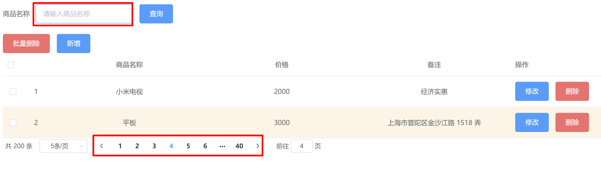

# 一、MyBatis 代码生成器

## 1.概述

- 通过逆向的方式，通过已经建好的表，反向生成 mapper 接口，mapper.xml 文件，domain 实体
- 官方文档：http://mybatis.org/generator/index.html

## 2.快速入门

### 2.1导入插件

```java
<plugin>
    <groupId>org.mybatis.generator</groupId>
    <artifactId>mybatis-generator-maven-plugin</artifactId>
    <version>1.4.1</version>
    <dependencies>
<!--                    引入插件需要的依赖-->
        <dependency>
            <groupId>mysql</groupId>
            <artifactId>mysql-connector-java</artifactId>
            <version>8.0.29</version>
        </dependency>
    </dependencies>
</plugin>
```

### 2.2添加配置文件

- 名称：generatorConfig.xml

- 关于jdbcConnection属性配置（**对于XML配置我们可以查阅官方文档**）

  

```xml
<!DOCTYPE generatorConfiguration PUBLIC
        "-//mybatis.org//DTD MyBatis Generator Configuration 1.0//EN"
        "http://mybatis.org/dtd/mybatis-generator-config_1_0.dtd">
<generatorConfiguration>
    <context id="simple" targetRuntime="MyBatis3">
<!--        jdbc 连接-->
        <jdbcConnection driverClass="com.mysql.cj.jdbc.Driver"
                        connectionURL="jdbc:mysql://localhost:3306/mybatis"
                        userId="root"
                        password="123456"
        />
<!--        生成 java 实体-->
        <javaModelGenerator targetPackage="cn.sycoder.domain" targetProject="src/main/java"/>
<!--            生成xml 文件-->
        <sqlMapGenerator targetPackage="cn.sycoder.mapper" targetProject="src/main/resources"/>
<!--        生成 mapper 接口文件-->
        <javaClientGenerator type="XMLMAPPER" targetPackage="cn.sycoder.mapper" targetProject="src/main/java"/>
<!--        设置表名-->
<!--        配置实体为 Gen-->
<!--        <table tableName="generator" domainObjectName="Gen" />-->
        <table tableName="generator"  />
    </context>
</generatorConfiguration>
```

### 2.3运行


### 2.4生成文件


### 2.5

**这三个文件需要自己手动添加**

> 官方的生成器有点乱，可以使用自己的


# 二、JavaWEB 项目实战

## 1.项目前期准备

### 1.1导入项目依赖

```java
<dependencies>
        <dependency>
            <groupId>junit</groupId>
            <artifactId>junit</artifactId>
            <version>4.11</version>
        </dependency>

        <!--    mysql-->
        <dependency>
            <groupId>mysql</groupId>
            <artifactId>mysql-connector-java</artifactId>
            <version>8.0.29</version>
        </dependency>
        <!--    mybatis-->
        <dependency>
            <groupId>org.mybatis</groupId>
            <artifactId>mybatis</artifactId>
            <version>3.5.6</version>
        </dependency>
        <!--    导入日志依赖-->
        <dependency>
            <groupId>log4j</groupId>
            <artifactId>log4j</artifactId>
            <version>1.2.17</version>
        </dependency>

        <!--    引入分页插件-->
        <dependency>
            <groupId>com.github.pagehelper</groupId>
            <artifactId>pagehelper</artifactId>
            <version>5.3.0</version>
        </dependency>

        <dependency>
            <groupId>javax.servlet</groupId>
            <artifactId>javax.servlet-api</artifactId>
            <version>3.1.0</version>
            <scope>provided</scope>
            <!--            提供provided 编译和测试有效，避免和 tomcat 中的 servlet-api 包冲突报错-->
        </dependency>
        <dependency>
            <groupId>javax.servlet</groupId>
            <artifactId>jsp-api</artifactId>
            <version>2.0</version>
            <scope>provided</scope>
        </dependency>
    </dependencies>

    <build>
        <plugins>
<!--           引入 generator 插件-->
            <plugin>
                <groupId>org.mybatis.generator</groupId>
                <artifactId>mybatis-generator-maven-plugin</artifactId>
                <version>1.3.2</version>
                <configuration>
                    <verbose>true</verbose>
                    <overwrite>false</overwrite>
                </configuration>
                <dependencies>
<!--                    引入插件需要的依赖-->
                    <dependency>
                        <groupId>mysql</groupId>
                        <artifactId>mysql-connector-java</artifactId>
                        <version>8.0.29</version>
                    </dependency>
                </dependencies>
            </plugin>
        </plugins>
    </build>
```

### 1.2新建用户表

```sql
create table user
(
	id bigint auto_increment
		primary key,
	name varchar(64) null,
	account varchar(64) null,
	password varchar(128) null,
	constraint user_account_uindex
		unique (account)
);


```


### 1.3新建商品表

```sql
create table product
(
	id bigint auto_increment
		primary key,
	name varchar(64) null,
	price double null,
	remark varchar(128) null,
	create_time datetime null,
	create_id bigint null,
	update_time datetime null,
	update_id bigint null
);


```

### 1.4搭建好的项目结构


## 2.注册功能实现

- 注册流程分析

  

  - servlet

    ```java
    @WebServlet("/register")
    public class RegisterController extends HttpServlet {
    
    
        @Override
        protected void doGet(HttpServletRequest req, HttpServletResponse resp) throws ServletException, IOException {
            String account = req.getParameter("account");
            IRegisterService service = new RegisterServiceImpl();
            boolean check = service.checkAccount(account);
            String ret = check ? "yes" : "no";
            resp.getWriter().write(ret);
        }
    
        @Override
        protected void doPost(HttpServletRequest req, HttpServletResponse resp) throws ServletException, IOException {
            //获取请求数据
            String account = req.getParameter("account");
            String password = req.getParameter("password");
            //直接插入用户
            IRegisterService service = new RegisterServiceImpl();
            int insertCount = service.insert(account, password);
            req.getRequestDispatcher("/login.html").forward(req,resp);
        }
    
    
    }
    ```

  - 异步检测是否注册用户
  
    ```js
    // 定义失去焦点事件发送异步请求去检验账户是否存在
        document.getElementById("account").onblur=function () {
            console.log(this.value);
            //发送到后端进行account 检验
            axios({
                method:'get',
                url:'/register',
                params:{
                    account:this.value
                }
            }).then(function (response) {
                if("no" == response.data){
                    document.getElementById("account_err").style.display='none'
                }else{
                    document.getElementById("account_err").style.display=''
                }
            })
        }
    ```
  
  - 检验与注册 service
  
    ```java
     @Override
        public boolean checkAccount(String account) {
            try(SqlSession sqlSession = MyBatisUtils.getSqlSession()){
                UserMapper mapper = sqlSession.getMapper(UserMapper.class);
                //查询用户是否存在
                User user = mapper.selectByAccount(account);
                return user != null;
            }catch (Exception e){
                e.printStackTrace();
            }
            return false;
        }
    
        @Override
        public int insert(String account, String password) {
            try(SqlSession sqlSession = MyBatisUtils.getSqlSession()){
                UserMapper mapper = sqlSession.getMapper(UserMapper.class);
                //查询用户是否存在
                User user1 = new User();
                user1.setAccount(account);
                user1.setPassword(password);
                int insert = mapper.insert(user1);
                return insert;
            }catch (Exception e){
                e.printStackTrace();
            }
            return 0;
        }
    ```
  
    

## 3.登录功能实现

- 流程图分析

  

  

## 4.列表查询功能实现

- 功能分析

  

  

- 添加 fasterjson 依赖

  ```java
  <dependency>
       <groupId>com.alibaba.fastjson2</groupId>
       <artifactId>fastjson2</artifactId>
       <version>2.0.52</version>
  </dependency>
  
  ```

- 通过序列化的方式输出

## 5.商品新增

- 新增前端

  ```js
  insert(){
                  let _this = this;
                  //关掉弹框
                  _this.dialogVisible=false,
                  axios({
                      method:'post',
                      url:'/product',
                      params:_this.insertForm
                  }).then(function (response) {
  
                      if("no" == response.data){
                          alert("新增失败")
                      }else{
                          _this.listProduct();
                      }
                  })
  
                  _this.insertForm = {
                      name:'',
                      price:'',
                      remark:''
                  }
              },
  ```

  


## 6.商品修改

- 修改前端

  ```js
   // 编辑商品
              updateSubmit(){
                  let _this = this;
                  //关掉弹框
                  _this.updateDialogVisible=false,
                      axios({
                          method:'put',
                          url:'/product',
                          params:_this.updateForm
                      }).then(function (response) {
                          if("no" == response.data){
                              alert("更新失败")
                          }else{
                              _this.listProduct();
                          }
                      })
              },
  ```

  

## 7.批量删除

- 删除前端

  ```js
  //删除方法
              del(row){
                  console.log(row.id);
                  let _this = this;
                      axios({
                          method:'delete',
                          url:'/product',
                          params:{
                              ids:row.id
                          }
                      }).then(function (response) {
                          if("no" == response.data){
                              alert("删除失败")
                          }else{
                              _this.listProduct();
                          }
                      })
              },
              // 批量删除
              batchDelete(){
                  _this = this;
                  let param ='';
                  let arr = this.multipleSelection;
                  for (let i = 0; i <arr.length ; i++) {
                      if(i ==0){
                          param = arr[i].id
                      }else{
                          param = param + ','+arr[i].id
                      }
  
                  }
                  console.log(param);
                  axios({
                      method:'delete',
                      url:'/product',
                      params:{
                          ids:param
                      }
                  }).then(function (response) {
                      if("no" == response.data){
                          alert("删除失败")
                      }else{
                          _this.listProduct();
                      }
                  })
              },
  ```

  

## 8.优化

- 修改日期显示

  ```java
  @JSONField(format = "yyyy-MM-dd MM:hh:ss")
  ```

- 新增结束数据还在

  ```js
  _this.insertForm = {
        name:'',
        price:'',
        remark:''
   }
  ```

- 页码显示不对

  ```js
   handleSizeChange(val) {
      console.log(`每页 ${val} 条`);
      this.queryParam.pageSize = val;
      this.queryParam.currentPage = 1;
      this.listProduct();
  },
  handleCurrentChange(val) {
      console.log(`当前页: ${val}`);
      this.queryParam.currentPage = val;
      this.listProduct();
  
  },
  ```


# 三、项目部署上线(知识点补充)

- 不用去纠结 axios 没有定义的问题，后面学习完 vue 脚手架， npm 等之后，安装一下就好了

## 1.修改数据库连接配置

- 修改数据库配置

  

## 2.检查maven 打包方式

- 需要 war 包打包方式

  

## 3.打包

- 使用 maven 插件打包 mvn package

  

## 4.上传war包到linux 服务器

- rz 命令，上传war 文件到服务器

- 备份 webapps  文件夹

  ```shell
  cp webapps ./webapps_back
  ```

- 新建webapps 目录

  ```shell
  mkdir webapps
  ```

- 将上传的 war 包移动到 webapps 目录下并且重命名

  ```shell
  mv WebProject-04-1.0-SNAPSHOT.war ./apache-tomcat-9.0.68/webapps/ROOT.war
  ```

- 重启tomcat

  ```shell
  sh ./bin/startup.sh
  ```

- 查看日志

  ```shell
  tail -n 500 -f logs/catalina.out 
  ```

## 5.linux mysql 新建 mybatis 库

- 新建数据表 user 和 product

## 6将war包命名为ROOT的情况

- 如果希望Tomcat在启动时默认打开某个web应用，可以将该应用的war包命名为ROOT.war。这是因为在Tomcat的默认配置中，会寻找webapps目录下的ROOT应用作为根应用。具体做法如下：

  1. 将webapps目录下原有的ROOT文件夹（如果有的话）删除。

  1. 将要部署的war包复制到webapps目录下，并重命名为ROOT.war。

  1. 重新启动Tomcat服务器。

完成以上步骤后，Tomcat会将ROOT.war解压并部署为根应用，此时只需通过URL“http://localhost:8080/”即可访问该应用，而无需在URL中包含项目名称。

### 不将war包命名为ROOT的情况

如果不希望将某个web应用部署为根应用，或者希望保留Tomcat的默认ROOT应用，那么可以将war包保留其原始名称（例如myapp.war）。在这种情况下，Tomcat会将该war包解压并部署为一个具有特定上下文路径（也称为项目名称）的应用。要访问该应用，需要在URL中包含其上下文路径，例如“http://localhost:8080/myapp/”。