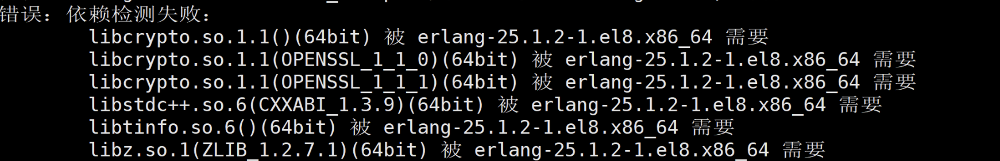
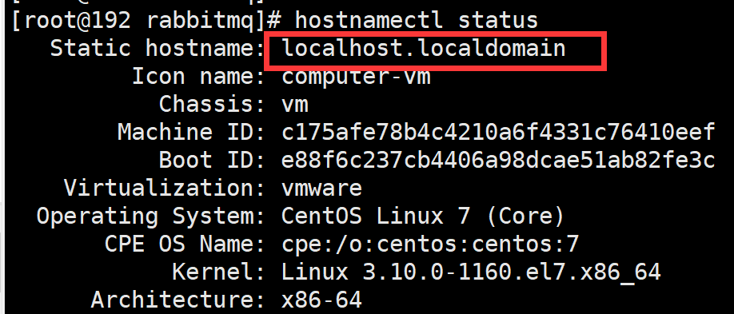

-------

**讲师：上云**

**网址：www.sycoder.cn**

------

# RabbitMQ安装文档

RabbitMQ官网下载地址：https://www.rabbitmq.com/download.html

## 1.安装依赖

- 在线安装依赖环境：

  ```shell
  yum install build-essential openssl openssl-devel unixODBC unixODBC-devel make gcc gcc-c++ kernel-devel m4 ncurses-devel tk tc xz
  ```

## 2.安装环境

- 上传安装包到linux 环境

  

### 2.1安装erlang环境

```java
rpm -ivh erlang-23.3.4.5-1.el7.x86_64.rpm
```

- 如果出现如下错误

  

- 使用yum升级gblic 版本

  ```shell
  sudo yum install zlib-devel bzip2-devel openssl-devel ncurses-devel sqlite-devel readline-devel tk-devel gcc make -y
  ```

### 2.2安装rabbitMQ

- 安装socat

  ```shell
  yum install socat -y
  ```

- 安装rabbitMQ

  ```shell
  rpm -ivh rabbitmq-server-3.8.34-1.suse.noarch.rpm
  ```

- 开启管理界面

  ```shell
  rabbitmq-plugins enable rabbitmq_management
  ```

- 启动rabbitmq

  ```shell
  /bin/systemctl start rabbitmq-server.service
  ```

### 	2.3rabbitMQ操作

- 开放端口

  ```shell
  firewall-cmd --zone=public --add-port=15672/tcp --permanent
  firewall-cmd --zone=public --add-port=5672/tcp --permanent
  firewall-cmd --reload
  ```

- 查看服务状态

  ```shell
  /sbin/service rabbitmq-server status
  ```

- 停止服务

  ```shell
  /sbin/service rabbitmq-server stop
  ```

- 添加开机自启动

  ```shell
  chkconfig rabbitmq-server on
  ```

  

## 3.添加用户密码

- 添加账户密码

  ```shell
  rabbitmqctl add_user sy 123456
  ```

- 设置角色

  ```java
  rabbitmqctl set_user_tags sy administrator
  ```

- 设置用户权限

  ```shell
  rabbitmqctl set_permissions -p "/" sy ".*" ".*" ".*"
  ```

- 查看用户和角色

  ```shell
  rabbitmqctl list_users
  ```

## 4.重置命令

- 关闭rabbitMQ

  ```shell
  rabbitmqctl stop_app
  ```

- 重置命令

  ```shell
  rabbitmqctl reset
  ```

- 重新启动

  ```shell
  rabbitmqctl start_app
  ```

  

## 5.服务出问题

- 查看主机名称

  ```shell
  hostnamectl status
  ```

  

- 重新设置一下主机名称

  ```shell
  hostnamectl set-hostname localhost.localdomain
  ```

  
