# 一、配置高级

## 1.临时属性设置

### 1.1引出问题

- 如果目标电脑上8080端口已经使用，再次使用该端口会出现端口占用问题

  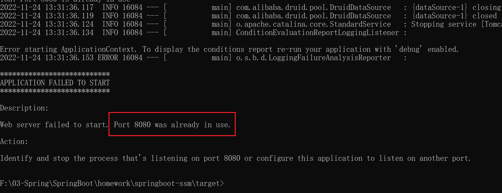

- 解决方式

  - 重新更换配置文件修改端口打包
  - 通过临时属性配置新端口
  - 更换配置文件


### 1.2添加临时属性配置

- 通过临时属性修改8080端口

  ```java
  java -jar 项目.jar --server.port=8081
  ```

- 添加web部分使用 dbug 日志

  ```java
  java -jar springboot-ssm-0.0.1-SNAPSHOT.jar --server.port=8081 --logging.level.org.springframework.web=debug
  ```

## 2.属性加载优先级

- 文档地址

  https://docs.spring.io/spring-boot/docs/current/reference/html/features.html#features.external-config

- 优先级说明

  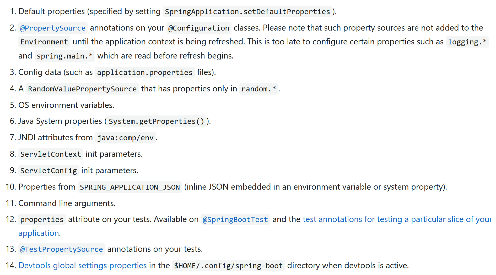

- 注意：从上往下优先级越来越高

  - 开发中使用的是3，刚才使用命令行使用的是11

  - 在开发中，会遇见自己定义属性名和系统变量名一致的情况，导致自己配置的数据被覆盖

    ```java
    user:
      name: sy
    ```

  - 实际取出来值是电脑用户名称值

    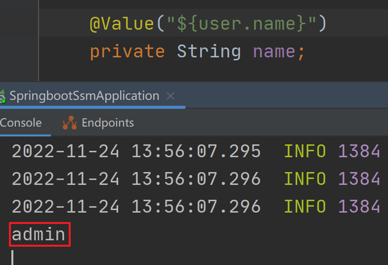

  - **以后如果你们再开发中，自己定义变量但是发现取出来的不是想要的值时，优先考虑属性优先级问题**

## 3.开发环境使用临时属性设置

- 设置主流方式步骤

  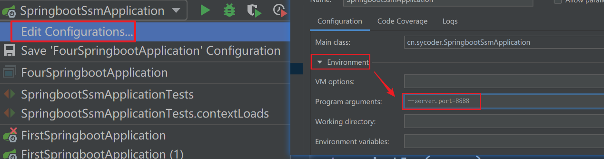

- 了解内容

  ```
  public static void main(String[] args) {
      args[0] = "--server.port=9999";
      SpringApplication.run(SpringbootSsmApplication.class, args);
  }
  ```

- 问题：如果需要修改的配置很多，那么使用这种手动输入的方式很容易出错，可以通过配置文件解决


## 4.配置文件分类

- 类路径下配置文件
  - 开发人员使用
- 类路径下config目录下配置文件
  - 项目经理、技术经理使用
- 程序包所在目录中配置文件
  - 运维人员、架构师使用
- 程序包所在目录中config目录下配置文件
  - 最高等级，技术总监
- 应用场景
  - A 开发项目时候使用的是类路径下配置文件
  - A 开发完成之后，需要部署到测试环境，需要修改配置
  - 测试B测试出问题，A 需要去修改bug(需要把配置修改回来)
  - 测试没问题之后，A需要再次修改生产环境的配置

### 4.1类路径下配置文件

- **类路径下配置文件**：就是我们默认使用的配置文件，优先级是最低

  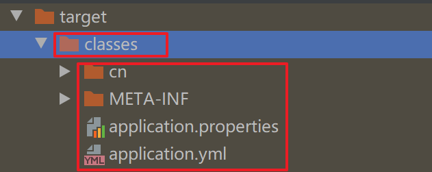

### 4.2类路径下config目录下配置文件

- 类路径下config目录下配置

  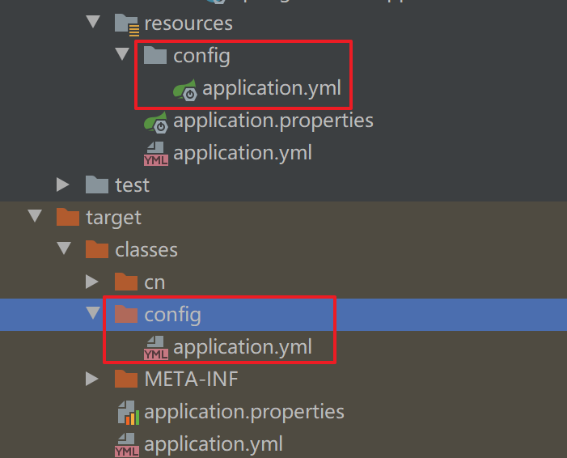

  

### 4.3程序包所在目录中配置文件

- 程序包所在目录中配置文件

  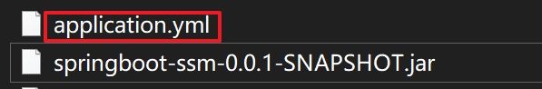

  

### 4.4程序包所在目录中config目录下配置文件

- 程序包所在目录中config目录下配置文件

  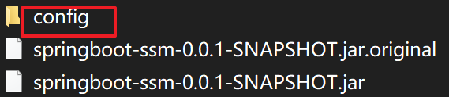

### 4.5通过临时变量设置配置文件

- 通过名称设置图示

  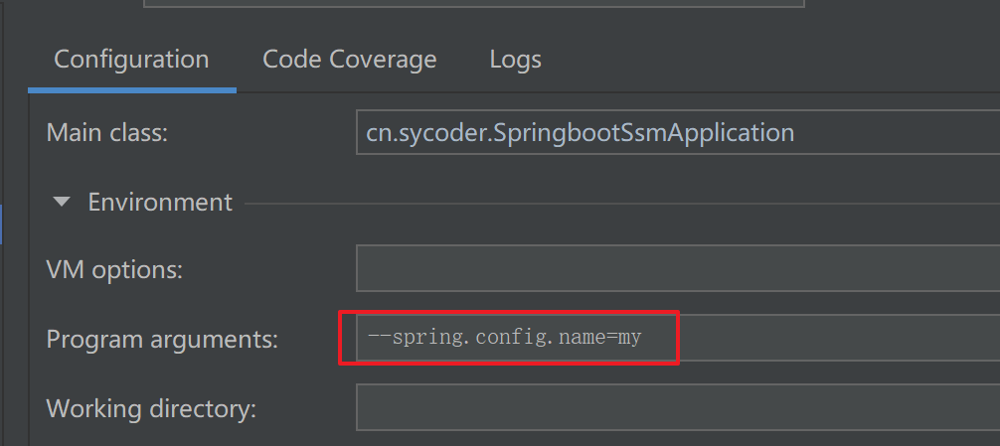


- 通过具体路径设置具体文件

  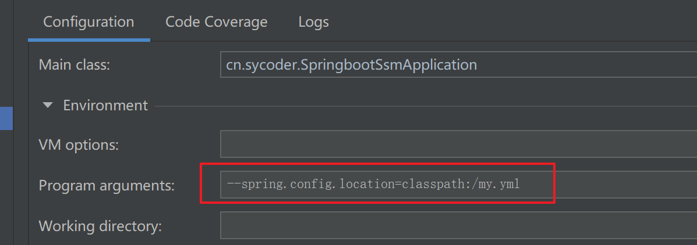


## 5.@ConfigurationProperties

### 5.1.回顾基础使用

- 绑定类

  ```java
  @Data
  @Component
  @ConfigurationProperties(prefix = "dbconfig")
  public class DbConfig {
      private String url;
      private String username;
  }
  ```

- 配置文件

  ```java
  dbconfig.url=123123
  dbconfig.username=sy
  ```

- 加入如下的依赖，可以解决提示问题

  ```java
  <dependency>
      <groupId>org.springframework.boot</groupId>
      <artifactId>spring-boot-configuration-processor</artifactId>
  </dependency>
  ```

  

### 5.2配置第三方类

- 配置德鲁伊连接池

  ```java
  <dependency>
      <groupId>com.alibaba</groupId>
      <artifactId>druid</artifactId>
      <version>1.2.15</version>
  </dependency>
  ```

- 配置三方bean

  ```java
  @Bean
  @ConfigurationProperties(prefix = "druid")
  public DruidDataSource dataSource(){
      DruidDataSource druidDataSource = new DruidDataSource();
      return druidDataSource;
  }
  ```

  

## 6.宽松绑定/松散绑定

- 如果你这样配置会报错

  ```java
  @Component
  @ConfigurationProperties(prefix = "dbConfig")
  public class DbConfig {
      private String url;
      private String username;
  }
  ```

- 报错如下

  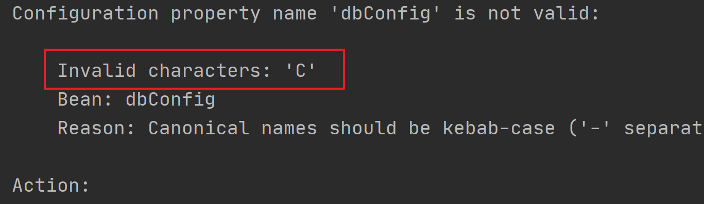


- 宽松绑定

  ```java
  dbConfig.url=123123
  dbConfig.user_name=sy
  db-config.PASSWORD=12345223123
  db-config.home-address=bj
  ```

  ```java
  @Data
  @Component
  @ConfigurationProperties(prefix = "db-config")
  public class DbConfig {
      private String url;
      private String username;
      private String password;
      private String homeAddress;
  }
  
  ```


## 7.常用计量单位绑定

- 配置时间需求

  ```java
  db-config.timeout=600
  ```

- 使用 Duration 表示时间

  ```java
  @DurationUnit(ChronoUnit.HOURS)
  private Duration timeout;
  ```

- 使用DataSize来表示空间

  ```java
  @DataSizeUnit(DataUnit.MEGABYTES)
  private DataSize datasize;
  ```

## 8.检验

- 导入依赖

  ```java
  <dependency>
      <groupId>javax.validation</groupId>
      <artifactId>validation-api</artifactId>
  </dependency>
  ```

- 检验配置如下

  ```java
  @Max(value = 9999,message = "无效的配置")
  @Min(value = 80,message = "无效的配置")
  private int port;
  ```

## 9.数据类型转换

- 之前学生出现的一个问题

  

- 他的密码 010101

  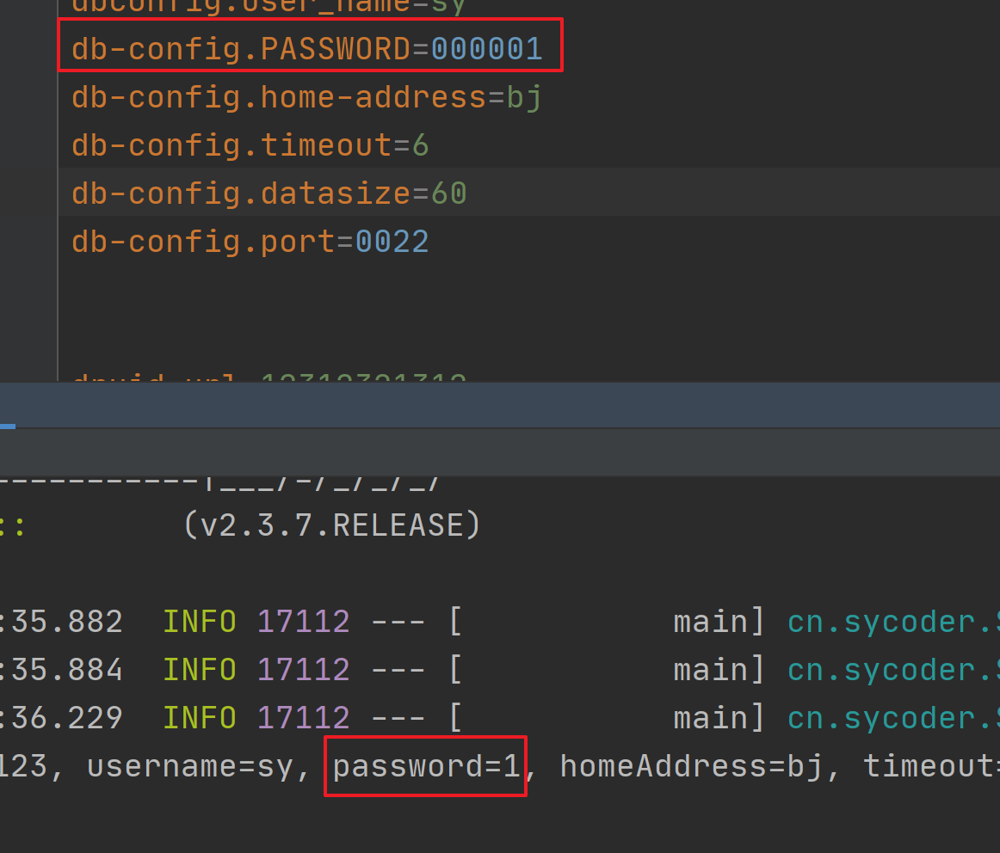

- 可以通过引号的方式解决

- boolean 类型直接使用 true / false

# 二、多环境开发

## 1.概述

- 概述：开发环境、测试环境、生产环境

- 分类

  - 开发环境

    ```java
    spring:
      datasource:
        druid:
          url: jdbc:mysql://localhost:3306/springboot_ssm
          username: root
          password: 123456
          driver-class-name: com.mysql.cj.jdbc.Driver
    ```

    

  - 测试环境

    ```java
    spring:
      datasource:
        druid:
          url: jdbc:mysql://测试环境服务器地址:3306/springboot_ssm
          username: root
          password: 123456
          driver-class-name: com.mysql.cj.jdbc.Driver
    ```

    

  - 生产环境

    ```java
    spring:
      datasource:
        druid:
          url: jdbc:mysql://阿里云地址:3306/springboot_ssm
          username: root
          password: adminroot
          driver-class-name: com.mysql.cj.jdbc.Driver
    ```

    

## 2.单文件控制多环境开发

- 单文件多环境的使用

  ```java
  server:
    port: 8082
  ```

- 配置多环境的时候使用 --- 隔开

  ```java
  server:
    port: 8082
  ---
  server:
    port: 8888
  ```

- 使用 spring profiles 区分是什么环境

  ```java
  spring:
    profiles: dev
  server:
    port: 8082
  ---
  spring:
    profiles: test
  server:
    port: 8888
  
  ---
  spring:
    profiles: prod
  server:
    port: 9999
  ```

- 设置启动环境

  ```java
  spring:
    profiles:
      active: test
  ---
  #开发环境
  spring:
    profiles: dev
  server:
    port: 8082
  ---
  #测试环境
  spring:
    profiles: test
  server:
    port: 8888
  
  ---
  #生产环境
  spring:
    profiles: prod
  server:
    port: 9999
  
  ```

  

## 3.properties 多文件多环境开发

- 图示

  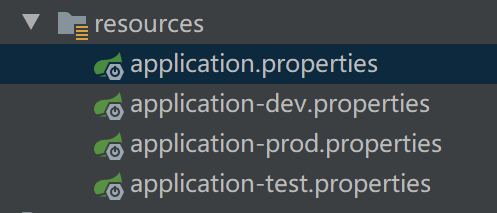

- 主配置文件

  ```java
  spring.profiles.active=dev
  ```

- 开发环境

  ```java
  # 应用名称
  spring.application.name=springboot-dev
  # 应用服务 WEB 访问端口
  server.port=8082
  ```

- 测试环境

  ```java
  # 应用名称
  spring.application.name=springboot-test
  # 应用服务 WEB 访问端口
  server.port=8888
  ```

- 生产环境

  ```java
  # 应用名称
  spring.application.name=springboot-prod
  # 应用服务 WEB 访问端口
  server.port=9999
  ```

## 4.yml 多文件多环境开发

- 图示

  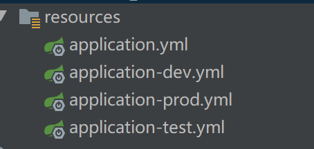

- 新建主配置

  ```yaml
  spring:
    profiles:
      active: test
  ```

  

- 开发环境

  ```yaml
  server:
    port: 8082
  ```

- 测试环境

  ```yaml
  server:
    port: 8888
  ```

- 生产环境

  ```yaml
  server:
    port: 9999
  ```

  

  

## 5.多环境开发抽取独立配置

- 背景：因为全部把配置配置到一个大文件里面，很多很乱，所以有的公司就使用拆分配置的方式来解决独立的配置耦合太严重的问题

- 图示

  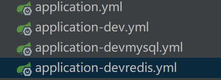

- 如果需要用到devredis 中的 redis 配置，直接在主配置中引入即可

  ```yaml
  spring:
    profiles:
      active: dev
      include: devmysql,devredis
  ```

- 这种切换还是存在问题，每次都得修改 include 中的value 值，所以，2.4版本之后新加了一个 group

  ```yaml
  spring:
    profiles:
      active: dev
      group:
        "dev": devmysql,devredis
        "test": testmysql,testredis
  ```

## 6.总结

- 总结
  - 实际开发中，多环境开发很常用
  - dev 开发环境
  - test 测试环境
  - prod 生产环境

# 三、日志

## 1.日志的使用

- 使用

  ```java
  @RestController
  public class LogController {
  
      public static final Logger log = LoggerFactory.getLogger(LogController.class);
  
      @GetMapping("/index")
      public String index(){
          log.info("请求info 信息");
          log.debug("请求debug 信息");
          log.warn("请求warn 信息");
          log.error("请求错误信息");
  
          return "OK";
      }
  
  }
  ```

  

- 日志级别

  - FATAL  灾难信息
  - ERROR 错误
  - WARN 警告
  - INFO  运维过程信息
  - DEBUG 调试信息
  - TRACE 堆栈信息

- 一般的使用

  - INFO
  - DEBUG

- 设置日志的级别

  ```yaml
  logging:
    level:
      root: info
  ```

- 注意：打印的内容越多，级别也就越低

- 设置组

  ```yaml
  logging:
  #  设置组
    group:
      controller: cn.sycoder.springbootlog.controller
    level:
      root: info
  #    cn.sycoder.springbootlog.controller: warn
      controller: warn
  ```

  

## 2.使用lombok简化日志操作

- 导入依赖

  ```java
  <dependency>
      <groupId>org.projectlombok</groupId>
      <artifactId>lombok</artifactId>
  </dependency>
  ```

- 使用

  ```java
  @Slf4j
  @RestController
  public class LogController {
  
      @GetMapping("/index")
      public String index(){
          log.info("请求info 信息");
          log.debug("请求debug 信息");
          log.warn("请求warn 信息");
          log.error("请求错误信息");
  
          return "OK";
      }
  }
  ```

- 底层反编译

  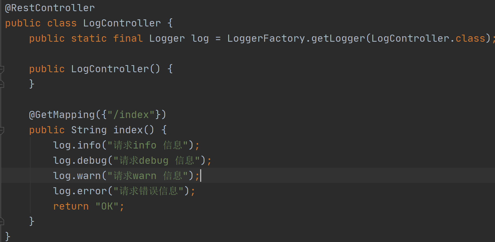

## 3.日志输出格式

- 图示

  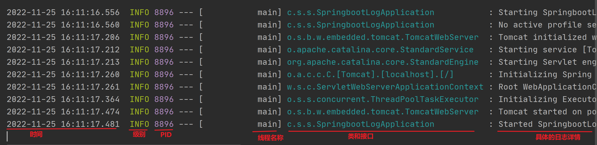

- 模仿springboot 写一下日志文件

  ```yml
  logging:
    pattern:
      console: "%d %clr(%-5p){yellow} %clr(${pid}){magenta} ---[%20t] %-40.40c : %m %n"
  ```

  

## 4.输出日志到文件

- 背景：项目持续跑，日志文件会越来越大。


### 4.1指定路径输出

- 指定路径

  ```java
  logging:
    file:
      path: F:\03-Spring\SpringBoot\homework\springboot-log
  ```

  

### 4.2指定名称输出

- 指定名称

  ```yaml
  logging:
    file:
      name: F:\03-Spring\SpringBoot\homework\springboot-log\sy.log
  ```

- **注意：指定名称输出的优先级会更高**

### 4.3拆分日志文件

- 注意版本信息，如果版本太低的时候不支持 logback

- 按照日期的格式拆分

  - sy2023-01-10-1.log
  - sy2023-01-10-2.log

- 拆分日志文件

  ```yaml
  logdir: F:\03-Spring\SpringBoot\homework\springboot-log\
  logging:
    logback:
      rollingpolicy:
        max-file-size: 2KB
        file-name-pattern: ${logdir}sy-%d{yyyy-MM-dd}-%i.log
    file:
      name: ${logdir}sy.log
  ```

  

# 四、测试用例

## 1.准备工作

- 添加依赖

  ```java
  <dependency>
              <groupId>org.springframework.boot</groupId>
              <artifactId>spring-boot-devtools</artifactId>
              <optional>true</optional>
          </dependency>
          <dependency>
              <groupId>com.alibaba</groupId>
              <artifactId>druid-spring-boot-starter</artifactId>
              <version>1.2.15</version>
          </dependency>
          <dependency>
              <groupId>org.projectlombok</groupId>
              <artifactId>lombok</artifactId>
          </dependency>
          <dependency>
              <groupId>org.mybatis.spring.boot</groupId>
              <artifactId>mybatis-spring-boot-starter</artifactId>
              <version>2.2.2</version>
          </dependency>
  
          <dependency>
              <groupId>com.mysql</groupId>
              <artifactId>mysql-connector-j</artifactId>
              <scope>runtime</scope>
          </dependency>
          <dependency>
              <groupId>org.springframework.boot</groupId>
              <artifactId>spring-boot-starter-web</artifactId>
          </dependency>
  
          <dependency>
              <groupId>org.springframework.boot</groupId>
              <artifactId>spring-boot-starter-test</artifactId>
              <scope>test</scope>
              <exclusions>
                  <exclusion>
                      <groupId>org.junit.vintage</groupId>
                      <artifactId>junit-vintage-engine</artifactId>
                  </exclusion>
              </exclusions>
          </dependency>
  ```

- 写mapper

  ```java
  @Mapper
  @Repository
  public interface ItemMapper {
      @Insert("insert into item(name,remark) value(#{name},#{remark})")
      boolean insert(Item item);
  
      @Select("select * from item where id = #{id}")
      public Item getById(Long id);
  
  }
  ```

- 写接口

  ```java
  @RestController
  @RequestMapping("/item")
  @Slf4j
  public class ItemController {
  
      @Autowired
      ItemMapper mapper;
  
      @GetMapping("/{id}")
      public Item getById(@PathVariable Long id){
          return mapper.getById(id);
      }
  
      @PostMapping
      public boolean save(@RequestBody Item item){
          log.info("获取方法的入参为:{}",item);
         return mapper.insert(item);
      }
  
  }
  ```

- 写 domain

  ```java
  @Data
  public class Item {
      private Long id;
      private String name;
      private String remark;
  }
  ```

- 提供配置文件

  ```yaml
  spring:
    datasource:
      druid:
        url: jdbc:mysql://localhost:3306/springboot_ssm
        username: root
        password: 123456
        driver-class-name: com.mysql.cj.jdbc.Driver
  ```

  

## 2.Web环境模拟测试

### 2.1目前存在的问题

- 实际测试没有走mvcweb环境，是直接调用接口的

  ```java
  @SpringBootTest
  class SpringbootTestApplicationTests {
      @Autowired
      ItemController controller;
  
      @Test
      public void testSave(){
          Item item = new Item();
          item.setName("键盘");
          item.setRemark("1000元");
          controller.save(item);
      }
  }
  ```

- 数据是实际添加到数据库的，应该回滚

- 缺乏实际返回值的对比

### 2.2模拟web环境测试

- 添加如下属性

  ```java
  @SpringBootTest(webEnvironment = SpringBootTest.WebEnvironment.RANDOM_PORT)
  ```

  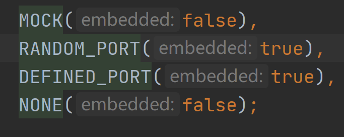

- 开启虚拟mvc调用

  ```java
  @AutoConfigureMockMvc
  ```

- 测试一个请求方法

  ```java
  @Test
      public void getById(@Autowired MockMvc mvc) throws Exception {
          //创建虚拟请求的
          MockHttpServletRequestBuilder builder =
                  MockMvcRequestBuilders.get("/item/29");
  
          mvc.perform(builder);
      }
  ```

### 2.3预期结果比较

- 对于请求结果的比对

  - 比较请求状态码

    ```java
    @Test
        public void getById(@Autowired MockMvc mvc) throws Exception {
            //创建虚拟请求的
            MockHttpServletRequestBuilder builder =
                    MockMvcRequestBuilders.get("/item/20");
    
            ResultActions actions = mvc.perform(builder);
            //定义请求结果的预期值
            ResultMatcher ok = MockMvcResultMatchers.status().isOk();
            actions.andExpect(ok);
        }
    ```

  - 比较实际返回值

    ```java
    @Test
        public void getById(@Autowired MockMvc mvc) throws Exception {
            //创建虚拟请求的
            MockHttpServletRequestBuilder builder =
                    MockMvcRequestBuilders.get("/item/20");
    
            ResultActions actions = mvc.perform(builder);
            //定义请求结果的预期值
            ResultMatcher ok = MockMvcResultMatchers.status().isOk();
            actions.andExpect(ok);
    
            //比较你实际结果值
            ResultMatcher json = MockMvcResultMatchers.content().json(
                    "{\n" +
                            "  \"id\": 20,\n" +
                            "  \"name\": \"笔记本电脑\",\n" +
                            "  \"remark\": \"1二手电脑只要一千块\"\n" +
                            "}"
            );
            actions.andExpect(json);
        }
    ```

    - 如果返回值和实际不匹配会提示如下错误

      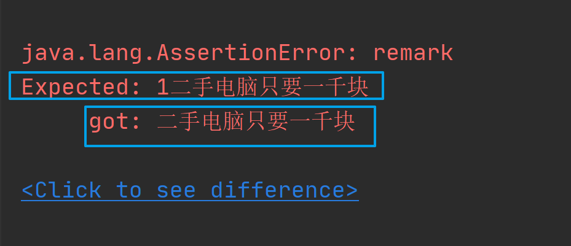

  - 比较响应头

    ```java
    @Test
        public void getByIdHeader(@Autowired MockMvc mvc) throws Exception {
            //创建虚拟请求的
            MockHttpServletRequestBuilder builder =
                    MockMvcRequestBuilders.get("/item/20");
    
            ResultActions actions = mvc.perform(builder);
            //比较响应头
            ResultMatcher header = MockMvcResultMatchers.header().string("Content-Type","application/json");
            actions.andExpect(header);
        }
    ```

  - 发起post 请求直接在 content 中添加即可

    ```java
    @Test
        public void postItemBoolean(@Autowired MockMvc mvc,@Autowired ItemTest itemTest) throws Exception {
            Item item = new Item();
            item.setName("键盘111");
            item.setRemark("1000元1111");
            System.out.println("==================");
            System.out.println(itemTest);
            //创建虚拟请求的
            MockHttpServletRequestBuilder builder =
                    MockMvcRequestBuilders.post("/item");
            builder.contentType("application/json");
            builder.accept(MediaType.APPLICATION_JSON);
            ObjectMapper objectMapper = new ObjectMapper();
            String s = objectMapper.writeValueAsString(itemTest);
            builder.content(s);
            ResultActions actions = mvc.perform(builder);
            MvcResult mvcResult = actions.andReturn();
            System.out.println(mvcResult.getResponse().getStatus());
    
            ResultMatcher ret = MockMvcResultMatchers.content().string("true");
            actions.andExpect(ret);
        }
    ```

### 2.4.测试用例数据设定

- 直接提供配置即可

  ```java
  testcase:
    item:
      name: ${random.int(5)}
      remark: ${random.int(5)}
  ```

- domain

  ```java
  @ConfigurationProperties(prefix = "testcase.item")
  @Component
  @Data
  public class ItemTest {
      private String name;
      private String remark;
  }
  ```

  

### 2.5数据层测试回滚

- 使用注解 rollback + Transactional

  ```java
  @SpringBootTest(webEnvironment = SpringBootTest.WebEnvironment.RANDOM_PORT)
  //开启虚拟mvc的调用
  @AutoConfigureMockMvc
  @Rollback
  @Transactional
  class SpringbootTestApplicationTests {
  }
  ```

- 开启事务和回滚之后，数据就不会写入数据库了。

# 五、项目实战

## 1.新建项目

- 新建模块

  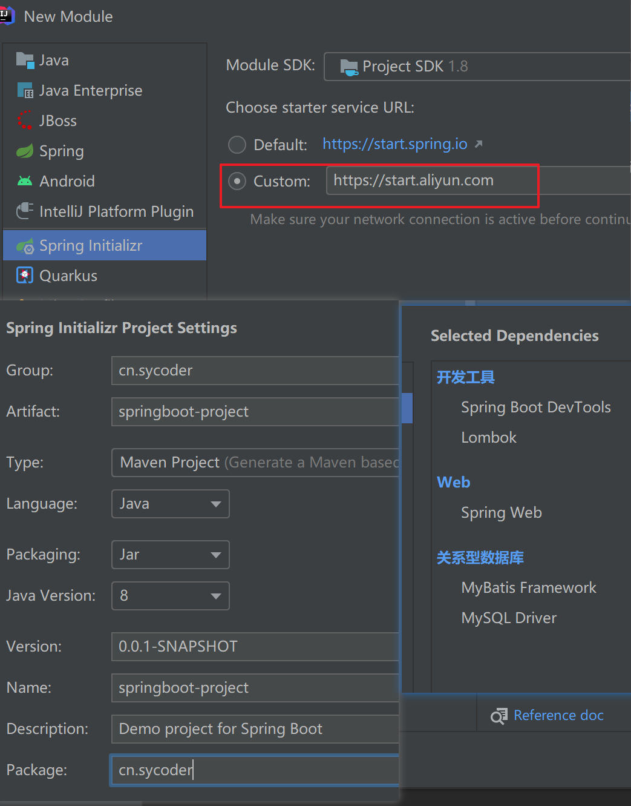

  

## 2.创建配置文件并且拷贝前端资源

- 创建配置文件

  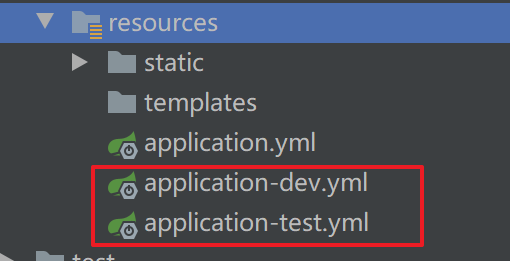

- application-dev.yml

  ```yaml
  server:
    port: 8083
  spring:
    datasource:
      druid:
        url: jdbc:mysql://localhost:3306/springboot_project
        username: root
        password: 123456
        driver-class-name: com.mysql.cj.jdbc.Driver
  logging:
    level:
      root: info
  ```

- application-test.yml

  ```yaml
  server:
    port: 8088
  spring:
    datasource:
      druid:
        url: jdbc:mysql://localhost:3306/springboot_project
        username: root
        password: 123456
        driver-class-name: com.mysql.cj.jdbc.Driver
  logging:
    level:
      root: info
  ```

- application.yml

  ```yaml
  spring:
    profiles:
      active: dev
  ```

  

## 3.后端开发

### 3.1domain

```java
@Data
public class Item {
    private Long id;
    private String name;
    private String remark;
    private String type;
}
```

### 3.2mapper

```java
@Mapper
@Repository
public interface ItemMapper {
    @Insert("insert into items(name,type,remark) value(#{name},#{type},#{remark})")
    int save(Item item);
    @Update("update items set name =#{name},type=#{type},remark=#{remark} where id=#{id}")
    int update(Item item);
    @Select("select * from items where name like concat('%',#{name},'%')")
    List<Item> listByName(@Param("name") String name);
    @Select("select * from items")
    List<Item> list();
    @Delete("delete from items where id = #{id}")
    int delete(@Param("id") Long id);
}
```

### 3.3service

- service 接口设计

  ```java
  public interface IItemService {
      /**
       * 添加操作
       * @param item
       * @return
       */
      boolean save(Item item);
  
      /**
       * 删除操作
       * @param id
       * @return
       */
      boolean delete(Long id);
  
      /**
       * 查询操作
       * @param name
       * @return
       */
      List<Item> list(String name);
  
      /**
       * 修改操作
       * @param item
       * @return
       */
      boolean update(Item item);
  }
  ```

- serviceimpl

  ```java
  @Service
  @Transactional
  public class ItemServiceImpl implements IItemService {
  
      @Autowired
      ItemMapper mapper;
  
      @Override
      public boolean save(Item item) {
          return mapper.save(item) > 0;
      }
  
      @Override
      public boolean delete(Long id) {
          return mapper.delete(id) > 0;
      }
  
      @Override
      public List<Item> list(String name) {
          if(name != null && !"".equals(name.trim())){
              return mapper.listByName(name);
          }
          return mapper.list();
      }
  
      @Override
      public boolean update(Item item) {
          return mapper.update(item) >0;
      }
  }
  ```

  

### 3.4controller

- 统一结果处理

  ```java
  @Data
  @Builder
  public class Resp {
      private int code;
      private String msg;
      private Object data;
  }
  ```

- 封装状态码

  ```java
  public interface RespCode {
  
      int SAVE_SUCCESS_CODE = 20000;
      int UPDATE_SUCCESS_CODE = 20010;
      int DELETE_SUCCESS_CODE = 20020;
      int List_SUCCESS_CODE = 20040;
      int SAVE_FAIL_CODE = 20001;
      int UPDATE_FAIL_CODE = 20011;
      int DELETE_FAIL_CODE = 20021;
      int LIST_FAIL_CODE = 20041;
  
  }
  ```

- 开发控制层接口

  ```java
  @RestController
  @Slf4j
  @RequestMapping("/item")
  public class ItemController {
  
      @Autowired
      IItemService service;
  
      @PostMapping
      public Resp save(@RequestBody Item item){
          log.info("请求save方法的入参为:{}",item);
          boolean ret = service.save(item);
          return Resp.builder().
                  code(ret?RespCode.SAVE_SUCCESS_CODE:RespCode.SAVE_FAIL_CODE)
                  .data(ret)
                  .build();
      }
  
      @PutMapping
      public Resp update(@RequestBody Item item){
          log.info("请求update方法的入参为:{}",item);
          boolean ret = service.update(item);
          return Resp.builder().
                  code(ret?RespCode.UPDATE_SUCCESS_CODE:RespCode.UPDATE_FAIL_CODE)
                  .data(ret)
                  .build();
      }
  
      @DeleteMapping("/{id}")
      public Resp delete(@PathVariable Long id){
          log.info("请求delete方法的入参为:{}",id);
          boolean ret = service.delete(id);
          return Resp.builder().
                  code(ret?RespCode.DELETE_SUCCESS_CODE:RespCode.DELETE_FAIL_CODE)
                  .data(ret)
                  .build();
      }
  
      @GetMapping
      public Resp list(@RequestParam(required = false) String name){
          log.info("请求list方法的入参为:{}",name);
          List<Item> list = service.list(name);
          return Resp.builder().
                  code(RespCode.List_SUCCESS_CODE)
                  .data(list)
                  .build();
      }
  }
  ```

  

## 4.上线部署

### 4.1提供数据库的建表语句

```java
create table items
(
	id bigint auto_increment
		primary key,
	name varchar(64) null,
	type varchar(64) null,
	remark varchar(128) null
);
```


### 4.2提供jar包

```java
mvn package
```

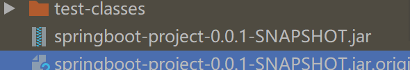


### 4.3上传jar到服务器

- rz 命令找到自己的jar ,上传到 /opt/springboot-project

### 4.4创建数据库并且初始化表

- 启动mysql 服务器

  ```java
  ./mysqld
  ```


### 4.5开放新端口

- 使用临时配置的方式修改端口信息

  ```java
  java -jar springboot-project-0.0.1-SNAPSHOT.jar --spring.profiles.active=test --server.port=8080
  ```


### 4.6linux启动方式

- 目前存在问题：关闭窗口后程序停止了

- 以后台的方式启动

  ```java
  nohup java -jar springboot-project-0.0.1-SNAPSHOT.jar --spring.profiles.active=test --server.port=8080 &
  ```

- nohup （no hang up）

  - 表示关闭终端的时候程序也能继续运行 & 来搭配

- 自定义日志文件名称

  ```java
  nohup java -jar springboot-project-0.0.1-SNAPSHOT.jar --spring.profiles.active=test --server.port=8080 >sy.log 2>&1 &
  ```

- 2>&1 &

  - 0 表示 stdin 标准输入

  - 1 表示 stdout 标准输出

  - 2 表示 stderr 标准错误

    ```java
    标准输出到文件 >filename = 1>filename
    错误也要输出到文件 2>&1>filename
    >sy.log 2>&1 =  2>&1>sy.log
    ```

- & ：放到命令行结尾，表示以后台运行

  

- 提示：
  - linux
    - 开放端口
    - 杀进程
    - 启动程序
    - 上传包
    - 下载包
    - 查看日志
    - 删除文件
    - 解压文件