# 一、引言

## 1.回顾 JavaWEB

### 1.1新建项目结构

- 新建 javaweb 项目目录结构

  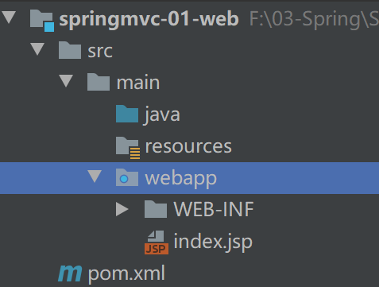

### 1.2导入依赖

- 依赖

  ```java
  <dependency>
        <groupId>javax.servlet</groupId>
        <artifactId>javax.servlet-api</artifactId>
        <version>3.1.0</version>
        <scope>provided</scope>
      </dependency>
      <dependency>
        <groupId>javax.servlet</groupId>
        <artifactId>jsp-api</artifactId>
        <version>2.0</version>
        <scope>provided</scope>
      </dependency>
  
  	<dependency>
        <groupId>jstl</groupId>
        <artifactId>jstl</artifactId>
        <version>1.2</version>
      </dependency>
      <dependency>
        <groupId>taglibs</groupId>
        <artifactId>standard</artifactId>
        <version>1.1.2</version>
      </dependency>
  ```

### 1.3实现第一个 servlet

- 通过注解写 servlet 实现 HttpServlet

  ```java
  @WebServlet("/first")
  public class FirstServlet extends HttpServlet {
      @Override
      protected void service(HttpServletRequest req, HttpServletResponse resp) throws ServletException, IOException {
          System.out.println("====进入了servlet===");
          req.setAttribute("username","sy");
  
          req.getRequestDispatcher("/test.jsp").forward(req,resp);
      }
  }
  ```

- 通过 web.xml 配置

  ```java
  <web-app>
    <display-name>Archetype Created Web Application</display-name>
    <servlet>
      <servlet-name>first-servlet</servlet-name>
      <servlet-class>cn.sycoder.FirstServlet</servlet-class>
    </servlet>
    <servlet-mapping>
      <servlet-name>first-servlet</servlet-name>
      <url-pattern>/test</url-pattern>
    </servlet-mapping>
  </web-app>
  ```

- 开启 el 表达式支持

  ```java
  <%@ page contentType="text/html;charset=UTF-8" language="java" %>
  <%@ taglib uri="http://java.sun.com/jsp/jstl/core" prefix="c" %>
  <%@page isELIgnored="false" %>
  <html>
  <head>
      <title>Title</title>
  </head>
  <body>
  ${username}
  </body>
  </html>
  ```

  

### 1.4思考问题

- 获取请求参数不方便

  ```java
  //获取请求参数
  String username = req.getParameter("username");
  String password = req.getParameter("password");
  ```

  - 给出的解决方案

    - 如果可以直接从方法入参传参是不是很方便,可以直接拿来用

      ```java
      protected void service(String username,String password)
      ```

- 设置响应视图或者设置响应的参数类型不方便

  ```java
  req.getRequestDispatcher("/test.jsp").forward(req,resp);
  ```

  - 给出的解决方案

    - 如果不需要设置响应类型

    - 如果不需要设置请求转发，直接跳转更方便

      ```java
      req.getRequestDispatcher("/test.jsp").forward(req,resp);
      //return "test";
      ```

## 2.回顾MVC

- 概述：MVC是一种软件架构的思想，将软件按照模型、视图、控制器来划分
- MVC分别是什么
  - M：Model：模型层，指工程中的JavaBean，作用是处理数据
    - domain 对象，Student 对象
    - 业务bean，Service,Mapper
  - V：View：视图层，指工程中的html或jsp等页面，作用是与用户进行交互，展示数据
  - C：Controller：控制层，指工程中的servlet，作用是接收请求和响应浏览器


## 3.SpringMVC

- 概述：SpringMVC是一种基于原生的 Servlet 实现MVC模型的轻量级Web框架，基于原生的Servlet，通过前端控制器DispatcherServlet，对请求和响应进行统一处理
- 特点：
  - Spring 系列产品，可以与Spring无缝衔接
  - 基于原生的Servlet,使用DispatcherServlet对Servlet进行封装，可以对请求或者响应做统一的处理
  - 组件非常丰富，以后想用什么组件，直接配置使用就可以

# 二、SpringMVC快速入门

## 1.基于XML方式配置

### 1.1导入依赖

- 导入依赖

  ```java
  <dependency>
        <groupId>org.springframework</groupId>
        <artifactId>spring-webmvc</artifactId>
        <version>5.2.17.RELEASE</version>
      </dependency>
      <dependency>
        <groupId>javax.servlet</groupId>
        <artifactId>javax.servlet-api</artifactId>
        <version>3.1.0</version>
        <scope>provided</scope>
      </dependency>
      <dependency>
        <groupId>javax.servlet</groupId>
        <artifactId>jsp-api</artifactId>
        <version>2.0</version>
        <scope>provided</scope>
      </dependency>
  
      <dependency>
        <groupId>jstl</groupId>
        <artifactId>jstl</artifactId>
        <version>1.2</version>
      </dependency>
      <dependency>
        <groupId>taglibs</groupId>
        <artifactId>standard</artifactId>
        <version>1.1.2</version>
      </dependency>
  ```

### 1.2创建SpringMVC配置文件

- 配置文件

  ```java
  ```

### 1.3配置DispatcherServlet

- web.xml

  ```java
  <!DOCTYPE web-app PUBLIC
   "-//Sun Microsystems, Inc.//DTD Web Application 2.3//EN"
   "http://java.sun.com/dtd/web-app_2_3.dtd" >
  
  <web-app>
    <display-name>Archetype Created Web Application</display-name>
    <servlet>
      <servlet-name>spring-mvc</servlet-name>
      <servlet-class>org.springframework.web.servlet.DispatcherServlet</servlet-class>
  <!--    初始化 spring-mvc 配置-->
      <init-param>
        <param-name>contextConfigLocation</param-name>
        <param-value>classpath:spring-mvc.xml</param-value>
      </init-param>
    </servlet>
    <servlet-mapping>
      <servlet-name>spring-mvc</servlet-name>
      <url-pattern>/</url-pattern>
    </servlet-mapping>
  </web-app>
  
  ```

  

### 1.4配置控制器

- 配置

  ```java
  @Controller
  public class XmlController {
  
      @RequestMapping("/test")
      public void test(){
          System.out.println("---------");
      }
  }
  ```

  

### 1.5配置视图解析器

- 视图解析器

  ```java
  <?xml version="1.0" encoding="UTF-8"?>
  <beans xmlns="http://www.springframework.org/schema/beans"
         xmlns:xsi="http://www.w3.org/2001/XMLSchema-instance"
         xmlns:context="http://www.springframework.org/schema/context"
         xsi:schemaLocation="http://www.springframework.org/schema/beans http://www.springframework.org/schema/beans/spring-beans.xsd http://www.springframework.org/schema/context https://www.springframework.org/schema/context/spring-context.xsd">
  <!--    配置包扫描-->
      <context:component-scan base-package="cn.sycoder.controller"/>
      <bean id="view" class="org.springframework.web.servlet.view.InternalResourceViewResolver">
  <!--        配置视图前缀-->
          <property name="prefix" value="/WEB-INF/pages/"/>
  <!--        配置视图后缀-->
          <property name="suffix" value=".jsp"/>
      </bean>
  </beans>
  ```

- 视图解析操作

  - 配置控制器

    ```java
    @RequestMapping("/login")
        public String login(String username, String password) {
            if ("sy".equals(username) && "123456".equals(password))
                return "success";
    
            return "fail";
        }
    ```

    

  - 配置视图

    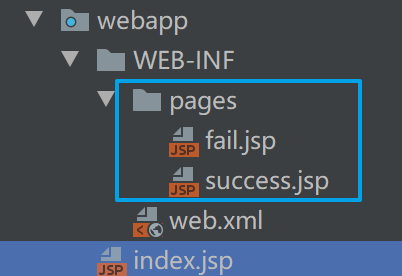

    

    

## 2.基于注解方式配置

### 2.1导入依赖

- 导入依赖

  ```java
  <dependency>
        <groupId>org.springframework</groupId>
        <artifactId>spring-webmvc</artifactId>
        <version>5.2.17.RELEASE</version>
      </dependency>
      <dependency>
        <groupId>javax.servlet</groupId>
        <artifactId>javax.servlet-api</artifactId>
        <version>3.1.0</version>
        <scope>provided</scope>
      </dependency>
      <dependency>
        <groupId>javax.servlet</groupId>
        <artifactId>jsp-api</artifactId>
        <version>2.0</version>
        <scope>provided</scope>
      </dependency>
  ```

### 2.2创建SpringMVC配置类

- 创建配置类

  ```java
  @Configuration
  @ComponentScan("cn.sycoder.controller")
  public class SpringMvcConfig {
  }
  ```

### 2.3通过配置类替换web.xml

- 替换操作

  ```java
  public class ServletConfig extends AbstractDispatcherServletInitializer {
  
      @Override
      protected WebApplicationContext createServletApplicationContext() {
          //获取SpringMVC容器
          AnnotationConfigWebApplicationContext context = new AnnotationConfigWebApplicationContext();
          context.register(SpringMvcConfig.class);
          return context;
      }
  
      @Override
      protected String[] getServletMappings() {
          return new String[]{"/"};
      }
  
      @Override
      protected WebApplicationContext createRootApplicationContext() {
          return null;
      }
  }
  ```

### 2.4配置Controller

- 配置Controller

  ```java
  @Controller
  public class SpringMvcController {
      @RequestMapping("/get")
      public void getSpring(){
          System.out.println("========");
      }
  }
  ```

  

# 三、发送Http请求

- 准备工作

  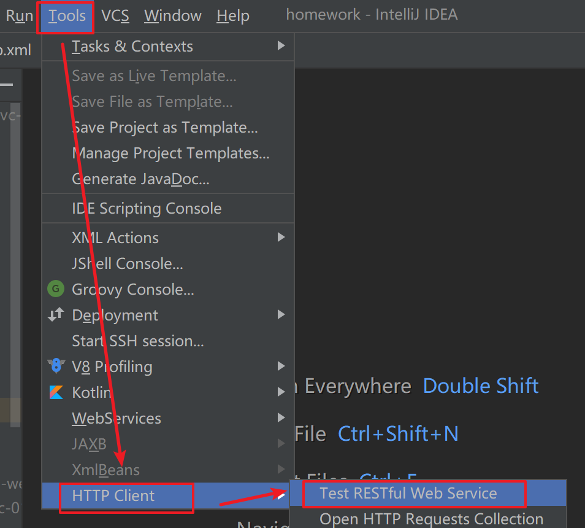

  

## 1.发起get请求

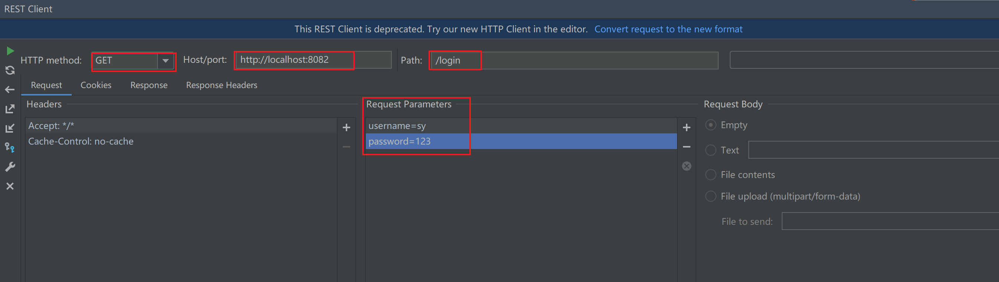


## 2.发起Post请求

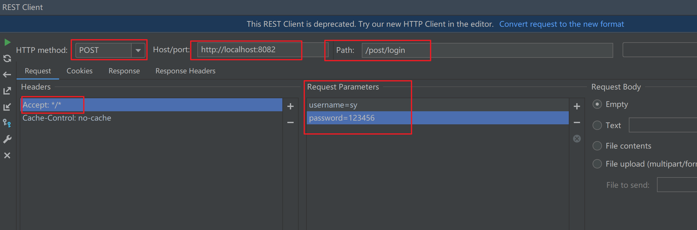

# 四、请求

## 1.@RequestMapping

- 作用：设置请求映射路径

- SpringMVC 接收到指定请求时，在映射关系中找到对应的控制方法

| 名称 | @RequestMapping                                              |
| ---- | ------------------------------------------------------------ |
| 位置 | 类或接口、或者方法上                                         |
| 作用 | 设置定义控制器方法的访问路径                                 |
| 属性 | String[] value() 设置访问路径的，RequestMethod[] method() 指定访问方法 |


- 使用位置

  ```java
  @Controller
  @RequestMapping("/requestMappingController")
  public class RequestMappingController {
  
      @RequestMapping(headers ={"header=123"} ,value = {"/test"})// /requestMapping/test
      @ResponseBody
      public String test(){
          System.out.println("============");
          return "OK";
      }
  }
  ```

- 指定请求类型

  - 延伸注解
    - @GetMapping 发起get 请求
    - @PostMapping 发起Post 请求
    - @PutMapping 发起 put 请求
    - @DeleteMapping 发起 delete 请求

  ```java
  @RequestMapping(value = "/test1",method = RequestMethod.POST)
      @ResponseBody
      public String test1(){
          System.out.println("============");
          return "OK";
      }
  ```

- 指定请求头(可以做权限拦截)（了解一下就行）

  ```java
  @RequestMapping(headers ={"header=123"} ,value = {"/test"})// /requestMapping/test
      @ResponseBody
      public String test(){
          System.out.println("============");
          return "OK";
      }
  ```

- 指定请求参数（没用）

  ```java
  @RequestMapping(params = {"username=123"},value = {"/test2"})// /requestMapping/test
      @ResponseBody
      public String test2(){
          System.out.println("============");
          return "OK";
      }
  ```

  

## 2.获取请求参数

### 2.1一般获取参数方式

- 获取方式

  ```java
  @Controller
  @RequestMapping("/requestParams")
  public class RequestParams {
  
      @RequestMapping("/test")
      @ResponseBody
      public String test(String username,String password){
          System.out.println("username:"+username+",password:"+password);
          return "ok";
      }
  }
  ```

### 2.2参数名称不对应

- @RequestParam

  | 名称 | @RequestParam                                                |
  | ---- | ------------------------------------------------------------ |
  | 位置 | 控制器方法中的形参上                                         |
  | 属性 | boolean required() 表示是否必填String value()，参数重命名名称 |
  | 作用 | 绑定请求参数与处理器方法之间形参的关系                       |

  

- 出现问题，获取不到参数值

  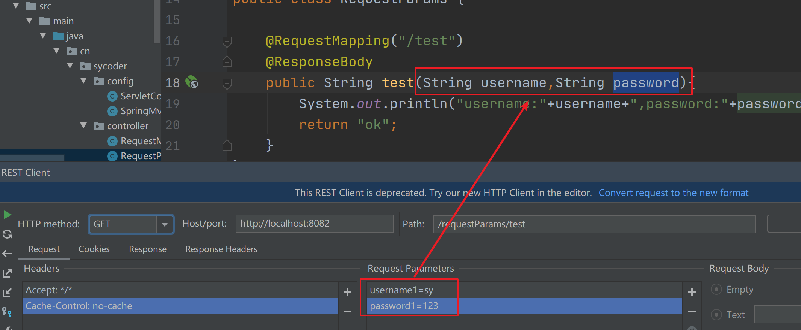

- 解决方案

  ```java
  @Controller
  @RequestMapping("/requestParams")
  public class RequestParams {
  
      @RequestMapping("/test")
      @ResponseBody
      public String test(@RequestParam(value = "un",required = false) String username,
                         @RequestParam(value = "password1",required = false) String password){
          System.out.println("username:"+username+",password:"+password);
          return "ok";
      }
  }
  ```

  

## 3.参数传递

### 3.1对象参数传递

- 传递方式

  ```java
  @RequestMapping("/user")
      @ResponseBody
      public String user(User user){
          System.out.println("username:"+user.getAccount()+",password:"+user.getPassword());
          return "ok";
      }
  ```

- 图示

  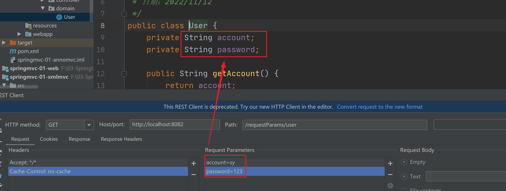

  

### 3.2复合型对象参数传递

- 如果出现对象嵌套，直接通过属性名称.传参即可

  ```java
  public class User {
      private String account;
      private String password;
  
      private Address address;
  }
  ```

- 图示

  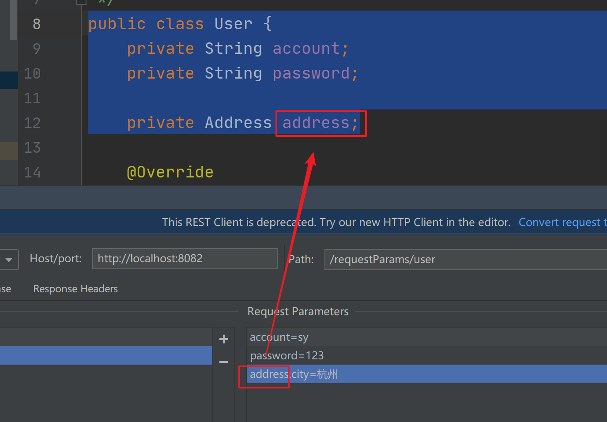


### 3.3数组参数传递

- 传数组

  ```java
  @RequestMapping("/array")
      @ResponseBody
      public String array(String[] cities){
          System.out.println(Arrays.toString(cities));
          return "ok";
      }
  ```

- 传递参数

  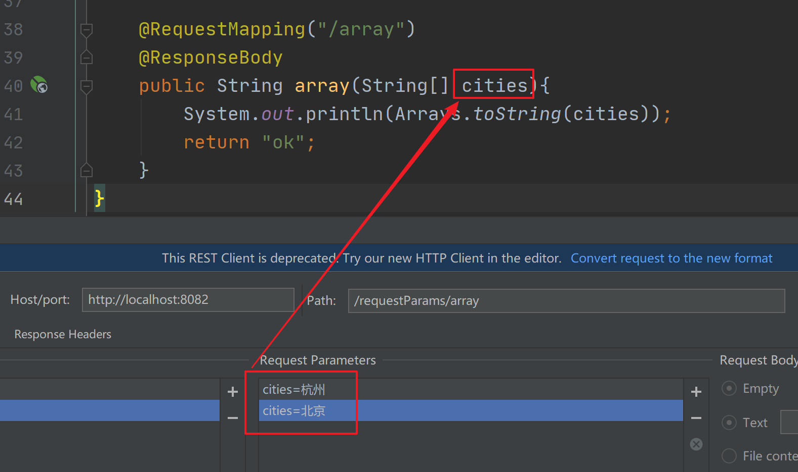

  

### 3.4集合参数传递

- 传集合

  ```java
  @RequestMapping("/list")
      @ResponseBody
      public String list(@RequestParam List<String> cities){
          System.out.println(cities);
          return "ok";
      }
  ```

- 传参图示

  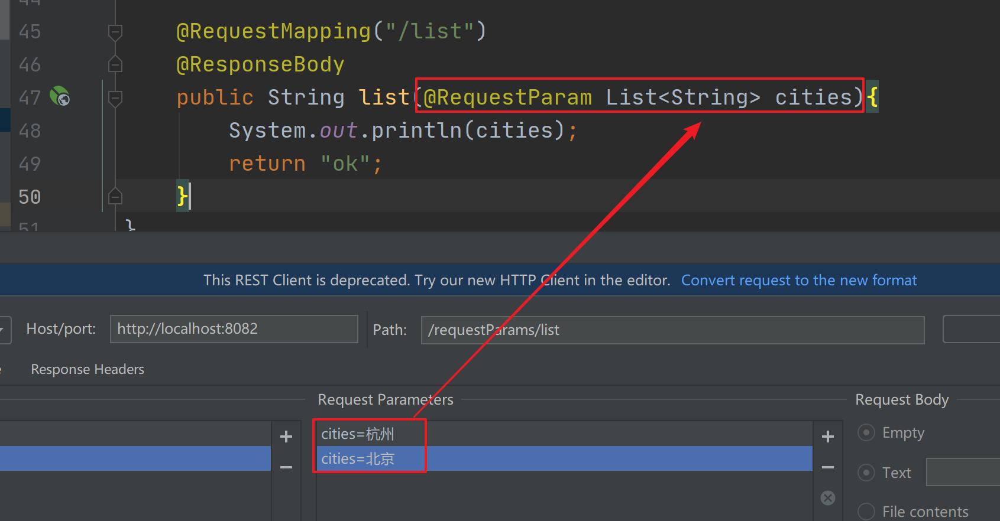


## 4.JSON 参数传递

- springMVC 默认支持的json处理不是使用fastjson,而是使用 jackson 处理的

### 4.1导入依赖

- 依赖

  ```java
  <dependency>
    <groupId>com.fasterxml.jackson.core</groupId>
    <artifactId>jackson-databind</artifactId>
    <version>2.12.5</version>
  </dependency>
  ```


### 4.2开启 SpringMVC 注解支持

- 开启支持

  ```java
  @Configuration
  @ComponentScan("cn.sycoder.controller")
  @EnableWebMvc
  public class SpringMvcConfig {
  }
  ```

- @EnableWebMvc

  | 名称 | @EnableWebMvc                |
  | ---- | ---------------------------- |
  | 位置 | SpringMVC 配置类上           |
  | 作用 | 开启SpringMVC 的辅助功能支持 |

- @RequestBody

  | 名称 | @RequestBody                         |
  | ---- | ------------------------------------ |
  | 位置 | SpringMVC控制方法形参里面            |
  | 作用 | 将请求中的请求体包含的数据传递给形参 |
  | 属性 | boolean required() 表示是否必填      |

  

### 4.2发送 json数据

- 传送 json 用户数据到后台

  ```java
  @Controller
  @RequestMapping("/RequestBodyController")
  public class RequestBodyController {
  
      @PostMapping("/user/save")
      @ResponseBody
      public String saveUser(@RequestBody User user){
          System.out.println(user);
          return "OK";
      }
  }
  ```

- 图示

  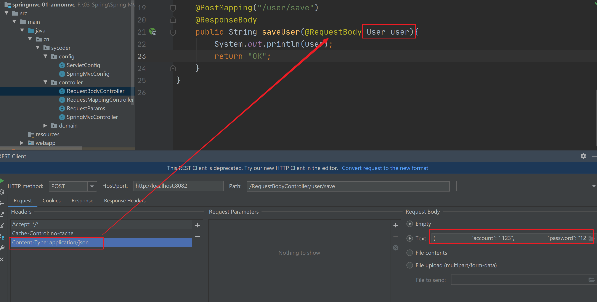

- 如果 json 参数有嵌套也是老样子传参即可

  ```java
  {  	"account": " 123", 	"password": "123456", 	"address": {  		"city": "杭州" 	} }
  ```

- 接收图示

  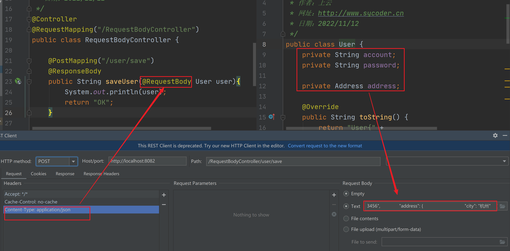

### 4.3传 json 数组到后台

- 传递json 数组

  ```java
  @PostMapping("/user/lists")
  @ResponseBody
  public String saveUser(@RequestBody List<String> lists){
      System.out.println(lists);
      return "OK";
  }
  ```

- 图示

  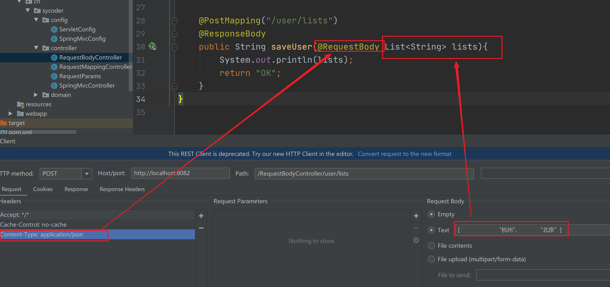

  

  

### 4.4传递对象集合json 数据

- 传递对象集合json数据

  ```java
   @PostMapping("/user/lists/user")
      @ResponseBody
      public String listUser(@RequestBody List<User> lists){
          System.out.println(lists);
          return "OK";
      }
  ```

- 传递图示

  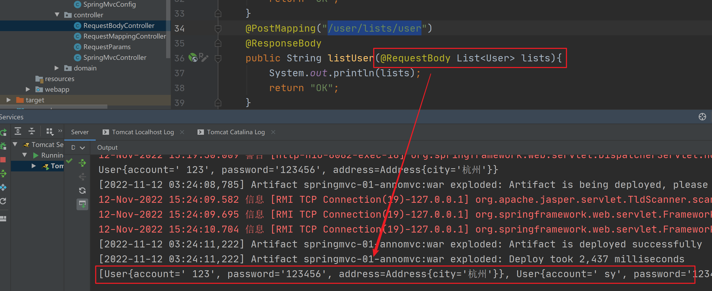

- json 数据

  ```java
  [{"account":" 123","password":"123456","address":{"city":"杭州"}},{"account":" sy","password":"123456","address":{"city":"北京"}}]
  ```

## 5.@RequestParam 和 @RequestBody总结

- 区别
  - @RequestBody 用于接收json 数据的[application/json]
  - @RequestParam 用于接收 url 地址参数的 [application/x-www-form]
- 应用
  - 后面的开发，都是前后端分离的，以 json 数据传输为主，所以 @RequestBody 使用更多
  - 如果不是使用json传输，就用 @RequestParam


## 6.日期类型参数传递


- 2022-11-12
- 2022/11/12


### 6.1常规格式

- 控制器

  ```java
  @Controller
  @RequestMapping("/date")
  public class DateController {
  
      @RequestMapping("/test")
      @ResponseBody
      public String testDate(Date date){
          System.out.println(date);
          return "ok";
      }
  }
  ```

- 图示

  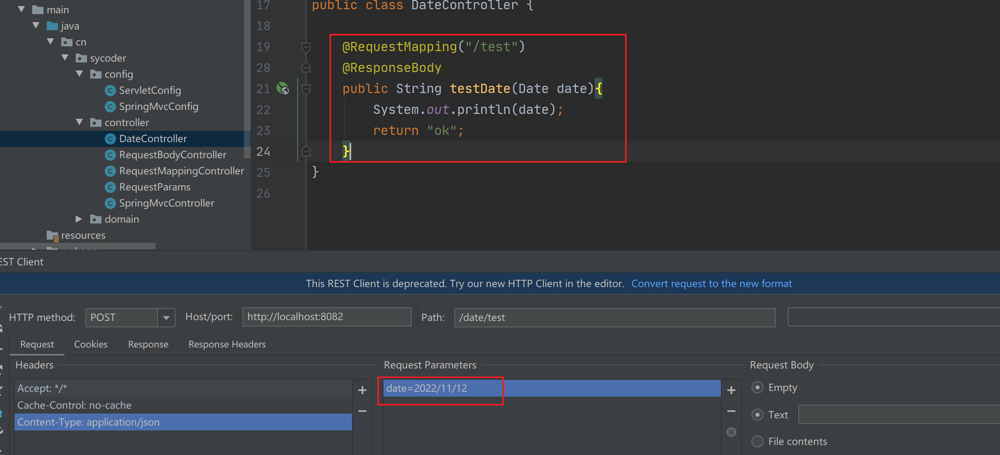

  

### 6.2修改格式

- 出现错误

  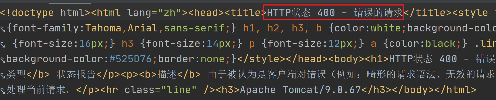

- 定制化格式操作

  ```java
  @Controller
  @RequestMapping("/date")
  public class DateController {
  
      @RequestMapping("/test")
      @ResponseBody
      public String testDate(@DateTimeFormat(pattern = "yyyy-MM-dd") Date date){
          System.out.println(date);
          return "ok";
      }
  }
  ```

### 6.3@DateTimeFormat

| 名称     | @DateTimeFormat                                            |
| -------- | ---------------------------------------------------------- |
| 作用     | 指定日期格式（yyyy-MM-dd）                                 |
| 属性     | String pattern() 指定日期格式                              |
| 使用位置 | SpringMVC 控制器方法形参前面，还可以使用到具体的对象属性上 |

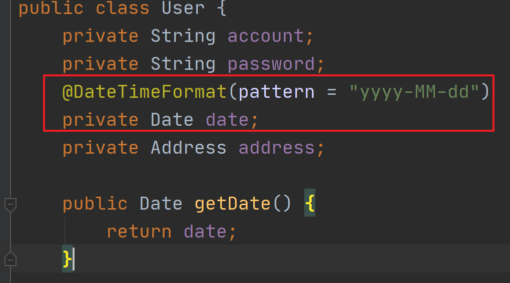

### 6.4底层转换的原理

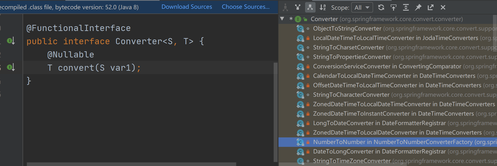

## 7.路径中占位符

- 路径占位符获取参数

  ```java
  @RequestMapping("/path")
  public class PathController {
  
      @RequestMapping("/test/{id}")
      @ResponseBody
      public String test(@PathVariable("id")String name){
          System.out.println(name);
          return "ok";
      }
  }
  ```

- 参数传递

  ```java
  http://localhost:8082/path/test/2
  ```

  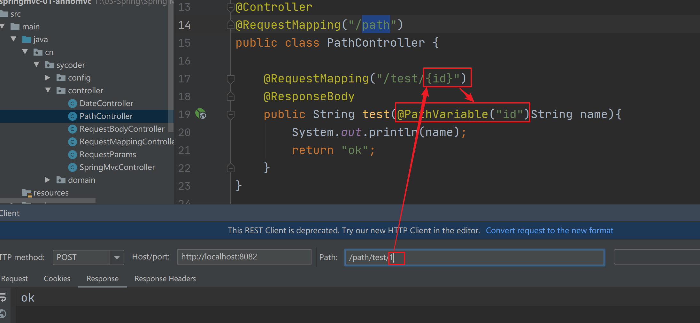

- @PathVariable

  | 名称 | @PathVariable                               |
  | ---- | ------------------------------------------- |
  | 作用 | 从请求路径上获取参数                        |
  | 位置 | 控制器方法形参前                            |
  | 属性 | String value() default ""; 指定路径参数名称 |

  

# 五、响应

## 1.注解配置的另一种方式

- 配置

  ```java
  public class ServletConfig  extends AbstractAnnotationConfigDispatcherServletInitializer {
      @Override
      protected Class<?>[] getRootConfigClasses() {
          return new Class[0];
      }
  
      @Override
      protected Class<?>[] getServletConfigClasses() {
          return new Class[]{SpringMvcConfig.class};
      }
  
      @Override
      protected String[] getServletMappings() {
          return new String[]{"/"};
      }
  }
  ```


## 2.设置响应页面

- 注解配置视图解析器

  ```java
  @Configuration
  @ComponentScan("cn.sycoder.controller")
  @EnableWebMvc
  public class SpringMvcConfig implements WebMvcConfigurer {
  
  
     @Bean
     public ViewResolver viewResolver(){
         InternalResourceViewResolver resolver = new InternalResourceViewResolver();
         resolver.setPrefix("/WEB-INF/pages/");
         resolver.setSuffix(".jsp");
         return resolver;
     }
  }
  ```

- 配置视图解析器之后跳转

  ```java
  @Controller
  public class TestController {
      @RequestMapping("/test")
      public String test(){
          return "ok.jsp";
      }
      //配置视图解析器之后的视图跳转
      @RequestMapping("/view")
      public String view(){
          return "view";
      }
  }
  ```

- 图示

  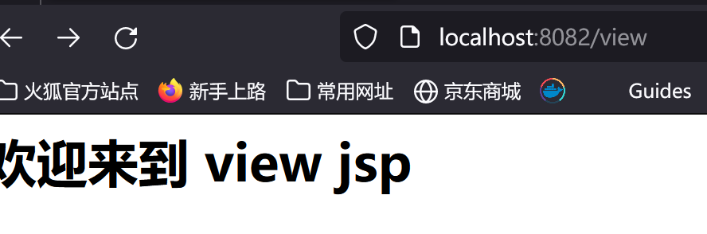

  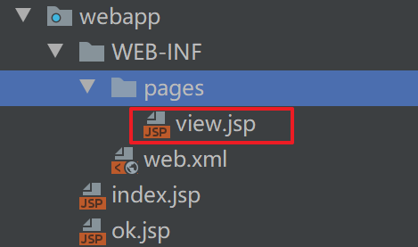

  

## 3.响应文本类型

- 如果没有使用 @ResponseBody 会出现如下问题

  ```java
  @RequestMapping("/respbody")
  //    @ResponseBody
      public String respbody(){
          return "ok";
      }
  ```

  

  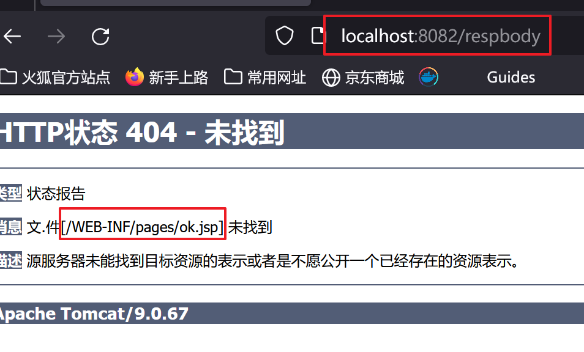

- 响应文本类型使用 @ResponseBody

  ```java
  @RequestMapping("/respbody")
      @ResponseBody
      public String respbody(){
          return "ok";
      }
  ```

## 4.响应JSON数据

- 使用 @ResponseBody + @EnableWebMvc 才能返回 json

- SpringMVC 配置类

  ```java
  @Configuration
  @ComponentScan("cn.sycoder.controller")
  @EnableWebMvc
  public class SpringMvcConfig {
  
  
     @Bean
     public ViewResolver viewResolver(){
         InternalResourceViewResolver resolver = new InternalResourceViewResolver();
         resolver.setPrefix("/WEB-INF/pages/");
         resolver.setSuffix(".jsp");
         return resolver;
     }
  }
  ```

### 4.1响应单个json对象

- 控制器方法使用 @ResponseBody 

  ```java
  @RequestMapping("/userjson")
      @ResponseBody
      public User respUserJson(){
          User user = new User();
          user.setAddTime(new Date());
          user.setName("sy");
          user.setUsername("sy666");
          user.setId(1L);
          return user;
      }
  ```

  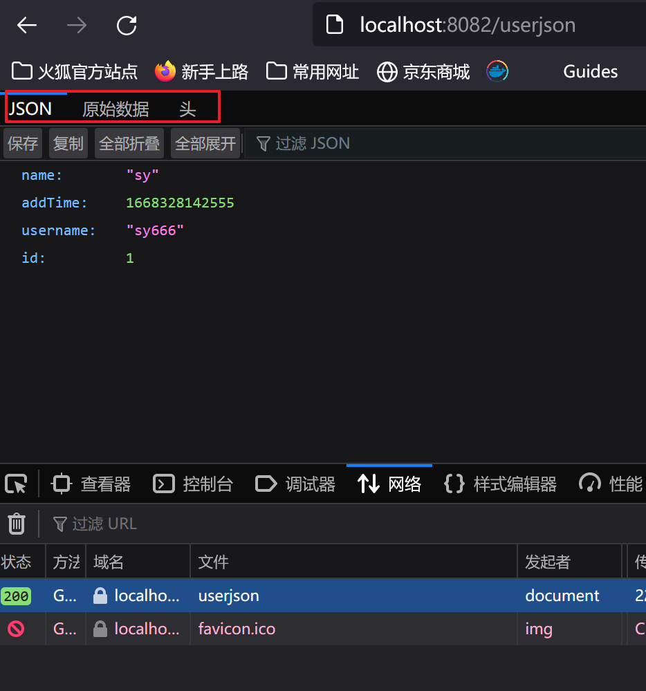

  

  

### 4.2响应集合json对象

- 控制器方法

  ```java
  @RequestMapping("/listuserjson")
      @ResponseBody
      public List<User> respListUserJson(){
          List<User> list = new ArrayList<>();
          User user = new User();
          user.setAddTime(new Date());
          user.setName("sy");
          user.setUsername("sy666");
          user.setId(1L);
          list.add(user);
          User user1 = new User();
          user1.setAddTime(new Date());
          user1.setName("sy");
          user1.setUsername("sy666");
          user1.setId(1L);
          list.add(user1);
          return list;
      }
  ```

  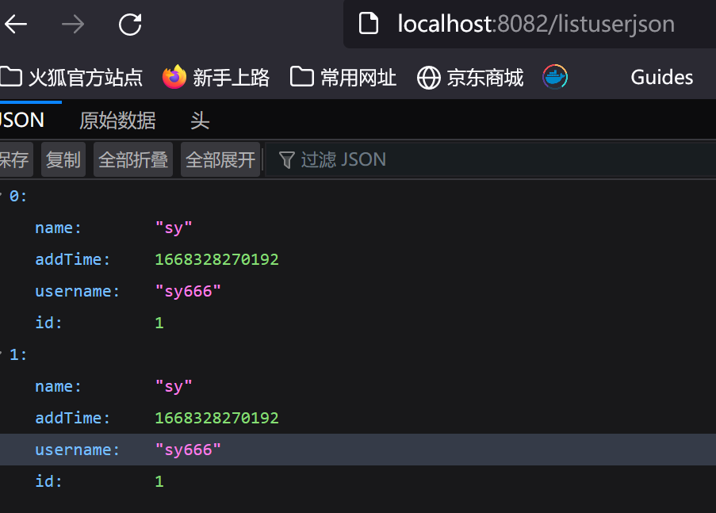

### 4.3@RestController

- @RestController =  @Controller + @ResponseBody

- 应用

  ```java
  @RestController
  public class MyRestController {
  
      @RequestMapping("/listuserjson")
      public List<User> respListUserJson(){
          List<User> list = new ArrayList<>();
          User user = new User();
          user.setAddTime(new Date());
          user.setName("sy");
          user.setUsername("sy666");
          user.setId(1L);
          list.add(user);
          User user1 = new User();
          user1.setAddTime(new Date());
          user1.setName("sy");
          user1.setUsername("sy666");
          user1.setId(1L);
          list.add(user1);
          return list;
      }
  }
  ```

  

### 4.4@ResponseBody 总结

| 名称 | @ResponseBody                                                |
| ---- | ------------------------------------------------------------ |
| 作用 | 设置控制器的返回值作为响应体，如果返回的是对象类型，会转换成 json 对象传输 |
| 位置 | 可以使用到类上，或者控制器方法上                             |

# 六、域对象共享

## 1.HttpServletRequest

- 具体应用

  ```java
  @RequestMapping("/ok")
      public String okServletRequest(HttpServletRequest request){
          request.setAttribute("ok","66666");
          return "ok";
      }
  ```

- jsp

  ```jsp
  <%@ page contentType="text/html;charset=UTF-8" language="java" %>
  <%@ taglib uri="http://java.sun.com/jsp/jstl/core" prefix="c" %>
  <%@page isELIgnored="false" %>
  <html>
  <head>
      <title>Title</title>
  </head>
  <body>
  ${ok}
  </body>
  </html>
  ```

  

  

## 2.ModelAndView

- 具体应用

  ```java
  @RequestMapping("/modelAndView")
      public ModelAndView modelAndView(){
          ModelAndView view = new ModelAndView();
          view.setViewName("ok");
          view.addObject("ok","==============");
          return view;
      }
  ```

- jsp

  ```jsp
  <%@ page contentType="text/html;charset=UTF-8" language="java" %>
  <%@ taglib uri="http://java.sun.com/jsp/jstl/core" prefix="c" %>
  <%@page isELIgnored="false" %>
  <html>
  <head>
      <title>Title</title>
  </head>
  <body>
  ${ok}
  </body>
  </html>
  ```

## 3.Map 向 Request 中共享数据

- 具体应用

  ```java
  @RequestMapping("/testMap")
  public String testMap(Map<String,Object> map){
      map.put("ok","-------------");
      return "ok";
  }
  ```

- jsp

  ```jsp
  <%@ page contentType="text/html;charset=UTF-8" language="java" %>
  <%@ taglib uri="http://java.sun.com/jsp/jstl/core" prefix="c" %>
  <%@page isELIgnored="false" %>
  <html>
  <head>
      <title>Title</title>
  </head>
  <body>
  ${ok}
  </body>
  </html>
  ```

  

# 七、RESTFul 风格

## 1.REST简介

- REST概述：Representational State Transfer，表现层资源状态转移


## 2.传统访问资源和 REST 对照

| 操作     | 传统方式              | REST风格              |
| -------- | --------------------- | --------------------- |
| 查询操作 | /student/getById?id=5 | student/5 get请求     |
| 保存操作 | /saveStudent          | student   post 请求   |
| 更新     | /updateStudent        | student   put 请求    |
| 删除     | /deleteById?id=5      | student/5 delete 请求 |

- REST 优点
  - 隐藏资源访问行为，做到无法根据资源访问猜测是什么样的逻辑
  - 书写也简单化
- 注意
  - REST 风格只是一种约定方式，并不是规范
  - 以后通过 REST 风格访问网络资源就叫 RESTFul

## 3.案例实现

### 3.1案例分析

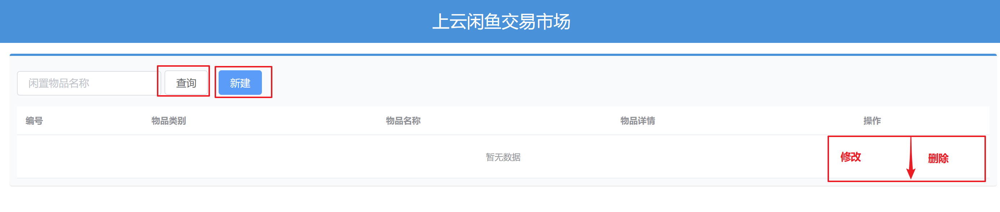

### 3.2传统实现方式

- 实现

  ```java
  @Controller
  @RequestMapping("/item")
  public class ItemController {
  
      //增加
      @RequestMapping("/save")
      @ResponseBody
      public String save(@RequestBody Item item){
          System.out.println(item);
          return "save OK";
      }
      //删除
      @RequestMapping("/delete")
      @ResponseBody
      public String delete(Long id){
          System.out.println(id);
          return "delete OK";
      }
      //修改
      @RequestMapping("/update")
      @ResponseBody
      public String update(@RequestBody Item item){
          System.out.println(item);
          return "update OK";
      }
      //查询
      @RequestMapping("/getById")
      @ResponseBody
      public String getById(Long id){
          System.out.println(id);
          return "getById OK";
      }
  }
  ```

### 3.3RESTFul 实现方式

- 实现

  ```java
  @RestController
  public class ItemRestController {
      //增加
      @PostMapping("/item")
      public String save(@RequestBody Item item){
          System.out.println(item);
          return "rest save OK";
      }
      //删除
      @DeleteMapping("/item/{id}")
      public String delete(@PathVariable Long id){
          System.out.println(id);
          return "rest delete OK";
      }
      //修改
      @PutMapping("/item")
      public String update(@RequestBody Item item){
          System.out.println(item);
          return "rest update OK";
      }
      //查询
      @GetMapping("/item/{id}")
      public String getById(@PathVariable Long id){
          System.out.println(id);
          return "rest getById OK";
      }
  }
  ```

## 4.静态资源的处理

### 4.1拷贝静态资源到项目webapp 下面

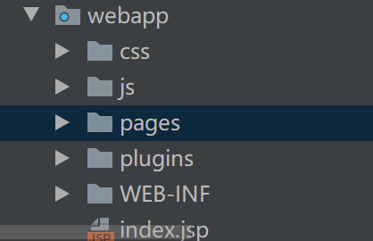

- 但是出现如下问题

  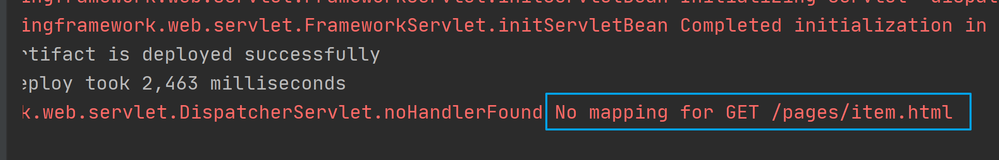

  

- 原因：SpringMVC 拦截了静态资源，根据 /pages/item.html 去找对于的 controller 方法执行，匹配我们配置的 / 的getServletMappings，找不到所以 404 

### 4.2解决方案

- 配置静态资源放行就可以了

- 配置如下

  ```java
  @Configuration
  public class StaticSupport extends WebMvcConfigurationSupport {
  
      @Override
      protected void addResourceHandlers(ResourceHandlerRegistry registry) {
          //当访问 /pages/ 资源的时候，设置放行
          registry.addResourceHandler("/pages/**").addResourceLocations("/pages/");
          registry.addResourceHandler("/js/**").addResourceLocations("/js/");
          registry.addResourceHandler("/css/**").addResourceLocations("/css/");
          registry.addResourceHandler("/plugins/**").addResourceLocations("/plugins/");
  
      }
  }
  ```

- 注意，需要将静态支持交给 springmvc 管理

  ```java
  @Configuration
  @ComponentScan("cn.sycoder")
  @EnableWebMvc
  public class SpringMvcConfig  {
  }
  ```

  