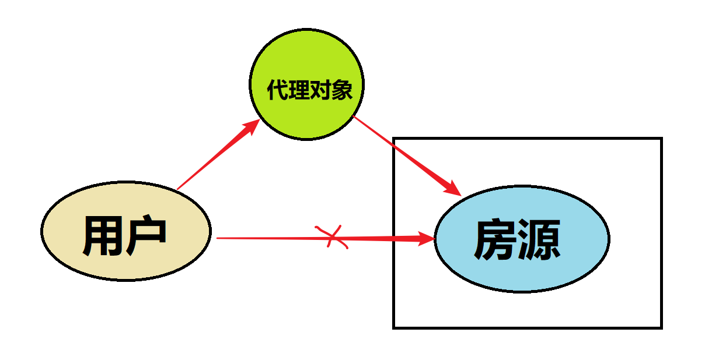
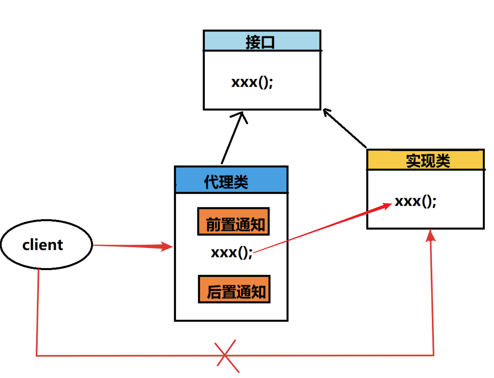
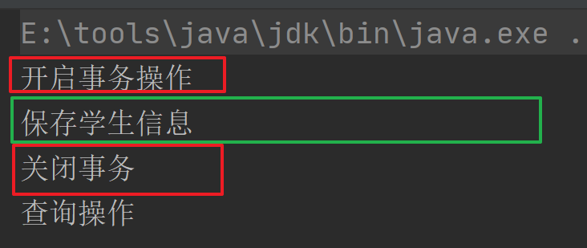
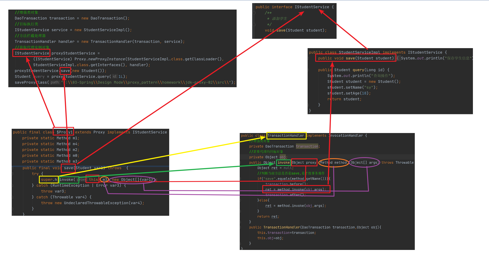
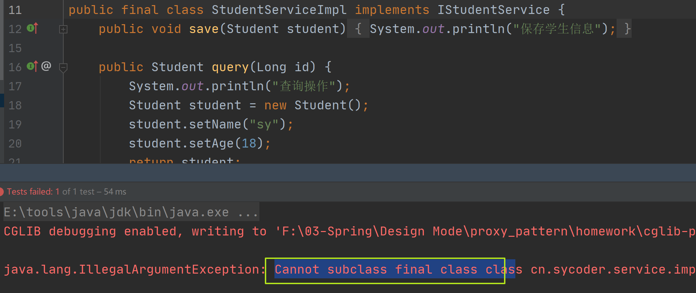
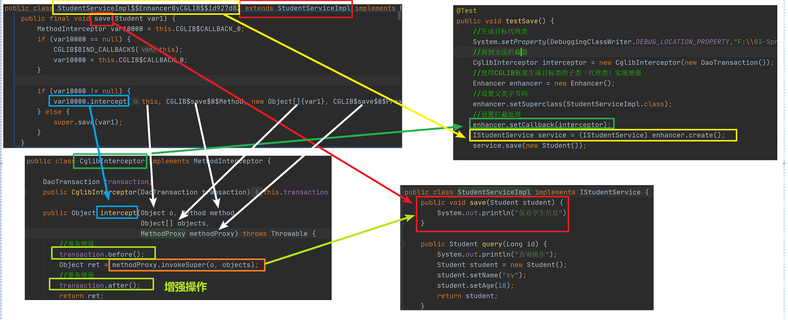

# 一、代理模式概述

## 1.生活中代理案例

- 房屋中介代理
  - 客户手里面没有房源信息，找一个中介
- 商品代购
  - 这些代购者可以去拿到比较低成本的商品，拥有自己的渠道


## 2.为什么要使用代理

- 对于消费者而言，可以减少成本，只需要关心自己需要的商品，不需要去寻找渠道或者是找房源。

## 3.代理模式在 Java 中的应用

- 统一异常处理
- Mybatis 使用了代理
- Spring aop实现原理
- 日志框架


## 4.概述

- 代理模式（Proxy Pattern）：是23种设计模式中的一种，属于结构型的模式。指一个**对象本身不做实际的操作**，而是通过**其它对象**来得到自己想得到的结果。
- **意义**：目标对象只需要关心自己的实现细节，通过代理对象来实现功能的增强，可以扩展目标对象的功能。
- 体现了非常重要的编程思想：不能随便修改源码，如果需要修改源码，通过修改代理的方式来实现功能的拓展。

## 5.生活中代理图示

- 图示

  

# 二、代理的实现方式

## 1.Java 中代理图示

- 图示

  

- 元素组成

  - 接口，定义行为和规范的
  - 被代理类，是目标对象
  - 代理类，做功能增强的

## 2.静态代理

### 2.1案例

- 通过代理模式实现事务操作

### 2.2实现案例

- 创建 domain 对象

  ```java
  @Data
  public class Student {
      private String name;
      private int age;
  }
  ```

  

- 创建service 接口定义规范

  ```java
  public interface IStudentService {
      /**
       * 添加学生
       */
      void save();
  
      /**
       * 查询学生信息
       * @param id
       * @return
       */
      Student query(Long id);
  }
  ```

  

- 创建实现类，被代理类

  ```java
  public class StudentServiceImpl implements IStudentService {
      public void save() {
          System.out.println("保存学生信息");
      }
  
      public Student query(Long id) {
          Student student = new Student();
          student.setName("sy");
          student.setAge(18);
          return student;
      }
  }
  ```

- 创建事务类对象

  ```java
  public class DaoTransaction {
      public void before(){
          System.out.println("开启事务操作");
      }
  
      public void after(){
          System.out.println("关闭事务");
      }
  }
  ```

- 创建代理类对象

  ```java
  public class ProxyStudent implements IStudentService {
      //目标类对象
      private StudentServiceImpl studentService;
      //需要做的增强对象
      private DaoTransaction transaction;
      //通过构造器获取目标类和增强类对象
      public ProxyStudent(StudentServiceImpl studentService,DaoTransaction daoTransaction){
          this.studentService = studentService;
          this.transaction = daoTransaction;
      }
          
  
      public void save() {
          //开启事务操作
          transaction.before();
          //目标类的操作
          studentService.save();
          //关闭事务操作
          transaction.after();
      }
  
      public Student query(Long id) {
          return studentService.query(id);
      }
  }
  ```

  

- 测试代理类对象

  ```java
  public class TestStudent {
  
      @Test
      public void testSave(){
          DaoTransaction transaction = new DaoTransaction();
          StudentServiceImpl studentService = new StudentServiceImpl();
          //获取代理类对象
          //包含了目标对象以及前置通知和后置通知
          ProxyStudent proxyStudent = new ProxyStudent(studentService, transaction);
          proxyStudent.save();
          proxyStudent.query(1L);
  
      }
  }
  ```

  

  

- 运行结果

  

  

### 2.3静态代理存在问题

- 不利于代码拓展，比如接口中新添加一个抽象方法时，所有实现类都需要重新实现，否则报错
- 代理对象需要创建很多，这种设计很不方便和麻烦

# 三、动态代理

## 1.概述

- 概述：在不改变原有功能代码的前提下，能够动态的实现方法的增强

## 2.JDK动态代理

### 2.1基础准备

- 创建 service 接口

  ```java
  public interface IStudentService {
      /**
       * 添加学生
       */
      void save();
  
      /**
       * 查询学生信息
       * @param id
       * @return
       */
      Student query(Long id);
  }
  ```

- 创建service实现类(需要代理的类)

  ```java
  public class StudentServiceImpl implements IStudentService {
      public void save() {
          System.out.println("保存学生信息");
      }
  
      public Student query(Long id) {
          System.out.println("查询操作");
          Student student = new Student();
          student.setName("sy");
          student.setAge(18);
          return student;
      }
  }
  ```

- 增强类

  ```java
  public class DaoTransaction {
      public void before(){
          System.out.println("开启事务操作");
      }
  
      public void after(){
          System.out.println("关闭事务");
      }
  }
  ```

### 2.2实现InvocationHandler 接口

- InvocationHandler 接口，用来做方法拦截

- 实现接口

  ```java
  public class TransactionHandler implements InvocationHandler {
      //增强类对象
      private DaoTransaction transaction;
      //需要代理的目标对象
      private Object obj;
      
      public TransactionHandler(DaoTransaction transaction,Object obj){
          this.transaction=transaction;
          this.obj=obj;
      }
      
      public Object invoke(Object proxy, Method method, Object[] args) throws Throwable {
          Object ret = null;
          
          //判断当前方法是否是save,是才做事务操作
          if("save".equals(method.getName())){
              transaction.before();
              ret = method.invoke(obj,args);
              transaction.after();
          }else{
              ret = method.invoke(obj,args);
          }
              
          
          return ret;
      }
  }
  ```

- 分别介绍里面的参数

  - Proxy:代理实例，可以通过newProxyInstance创建代理实例

    ```java
    public static Object newProxyInstance(ClassLoader loader,
                                              Class<?>[] interfaces,
                                              InvocationHandler h)
    ```

    - ClassLoader 类加载器，直接通过需要代理的类获取就行
    - Class[]: 目标类所实现的所有接口
    - InvocationHandler：方法拦截处理器，可以在里面实现方法的增强

  - Method:执行目标方法的，invoke 方法执行

  - args:参数数组


### 2.3测试

- 方法

  ```java
   @Test
      public void testSave(){
          //增强类对象
          DaoTransaction transaction = new DaoTransaction();
          //目标执行类
          IStudentService service = new StudentServiceImpl();
          //方法拦截处理器
          TransactionHandler handler = new TransactionHandler(transaction, service);
          //获取代理实例对象
          IStudentService proxyStudentService =(IStudentService) Proxy.newProxyInstance(StudentServiceImpl.class.getClassLoader(),
                  StudentServiceImpl.class.getInterfaces(), handler);
          proxyStudentService.save();
          Student query = proxyStudentService.query(1L);
  
      }
  ```

### **2.4底层运行原理**

- 生成代理类的字节码来学习

  ```java
  private void saveProxyClass(String path){
          byte[] $proxy1s = ProxyGenerator.generateProxyClass("$Proxy1",
                  StudentServiceImpl.class.getInterfaces());
          FileOutputStream out = null;
          try {
              out =  new FileOutputStream(new File(path + "$Proxy1.class"));
              out.write($proxy1s);
          } catch (Exception e) {
              e.printStackTrace();
          }finally {
              if(out !=null){
                  try {
                      out.flush();
                      out.close();
                  } catch (IOException e) {
                      e.printStackTrace();
                  }
              }
  
          }
  
      }
  ```

- 生成字节码反编译结果

  ```java
  public final class $Proxy1 extends Proxy implements IStudentService {
      private static Method m1;
      private static Method m4;
      private static Method m2;
      private static Method m0;
      private static Method m3;
  
      public $Proxy1(InvocationHandler var1) throws  {
          super(var1);
      }
  
      public final boolean equals(Object var1) throws  {
          try {
              return (Boolean)super.h.invoke(this, m1, new Object[]{var1});
          } catch (RuntimeException | Error var3) {
              throw var3;
          } catch (Throwable var4) {
              throw new UndeclaredThrowableException(var4);
          }
      }
  
      public final Student query(Long var1) throws  {
          try {
              return (Student)super.h.invoke(this, m4, new Object[]{var1});
          } catch (RuntimeException | Error var3) {
              throw var3;
          } catch (Throwable var4) {
              throw new UndeclaredThrowableException(var4);
          }
      }
  
      public final String toString() throws  {
          try {
              return (String)super.h.invoke(this, m2, (Object[])null);
          } catch (RuntimeException | Error var2) {
              throw var2;
          } catch (Throwable var3) {
              throw new UndeclaredThrowableException(var3);
          }
      }
  
      public final int hashCode() throws  {
          try {
              return (Integer)super.h.invoke(this, m0, (Object[])null);
          } catch (RuntimeException | Error var2) {
              throw var2;
          } catch (Throwable var3) {
              throw new UndeclaredThrowableException(var3);
          }
      }
  
      public final void save(Student var1) throws  {
          try {
              super.h.invoke(this, m3, new Object[]{var1});
          } catch (RuntimeException | Error var3) {
              throw var3;
          } catch (Throwable var4) {
              throw new UndeclaredThrowableException(var4);
          }
      }
  
      static {
          try {
              m1 = Class.forName("java.lang.Object").getMethod("equals", Class.forName("java.lang.Object"));
              m4 = Class.forName("cn.sycoder.service.IStudentService").getMethod("query", Class.forName("java.lang.Long"));
              m2 = Class.forName("java.lang.Object").getMethod("toString");
              m0 = Class.forName("java.lang.Object").getMethod("hashCode");
              m3 = Class.forName("cn.sycoder.service.IStudentService").getMethod("save", Class.forName("cn.sycoder.domain.Student"));
          } catch (NoSuchMethodException var2) {
              throw new NoSuchMethodError(var2.getMessage());
          } catch (ClassNotFoundException var3) {
              throw new NoClassDefFoundError(var3.getMessage());
          }
      }
  }
  ```

  

- 执行原理图

  

  

  - 文字说明：
    - 通过实现接口，获取到接口里面的所有方法
    - 通过Proxy 创建代理类实例
    - 通过反射机制，获取到一个个的方法对象
    - 调用InvocationHandler 接口中的invoke 方法，从而实现业务的增强

  

## 3.CGLIB动态代理

- JDK动态代理有一个前提，需要代理的类必须实现接口，如果没有实现接口，只能通过CGLIB来实现，其实就是对于JDK动态代理的一个补充

- 注意：

  - 类不能被 final 修饰

  - 方法不能被 final 修饰

    

### 3.1基础准备

- 导包

  ```java
  <dependency>
      <groupId>cglib</groupId>
      <artifactId>cglib</artifactId>
      <version>2.2.2</version>
  </dependency>
  ```

- 准备需要代理目标类

  ```java
  public class StudentServiceImpl implements IStudentService {
      public void save(Student student) {
          System.out.println("保存学生信息");
      }
  
      public Student query(Long id) {
          System.out.println("查询操作");
          Student student = new Student();
          student.setName("sy");
          student.setAge(18);
          return student;
      }
  }
  ```

  ```java
  public interface IStudentService {
      /**
       * 添加学生
       */
      void save(Student student);
  
      /**
       * 查询学生信息
       * @param id
       * @return
       */
      Student query(Long id);
  }
  ```

### 3.2实现方法拦截MethodInterceptor 

- 实现方法拦截

  ```java
  public class CglibInterceptor implements MethodInterceptor {
  
      DaoTransaction transaction;
      public CglibInterceptor(DaoTransaction transaction){
          this.transaction = transaction;
      }
      
      public Object intercept(Object o, Method method, Object[] objects, MethodProxy methodProxy) throws Throwable {
          //事务增强
          transaction.before();
          Object ret = methodProxy.invokeSuper(o, objects);
          //事务增强
          transaction.after();
          return ret;
      }
  }
  ```

### 3.3测试

- 测试代码

  ```java
  @Test
      public void testSave() {
          //生成目标代理类
          System.setProperty(DebuggingClassWriter.DEBUG_LOCATION_PROPERTY,"F:\\03-Spring\\Design Mode\\proxy_pattern\\homework\\cglib-proxy-03\\src\\");
          //得到方法拦截器
          CglibInterceptor interceptor = new CglibInterceptor(new DaoTransaction());
          //使用CGLIB框架生成目标类的子类（代理类）实现增强
          Enhancer enhancer = new Enhancer();
          //设置父类字节码
          enhancer.setSuperclass(StudentServiceImpl.class);
          //设置拦截处理
          enhancer.setCallback(interceptor);
          IStudentService service = (IStudentService) enhancer.create();
          service.save(new Student());
  
      }
  ```

### **3.4底层运行原理**

- 运行原理图

  

  

- 文字说明：
  - 通过继承的方式去获取到目标对象的方法
  - 通过传递方法拦截器 MethodInterceptor 实现方法拦截，在这里面做具体的增强
  - 调用生成的代理类对象具体执行重写的 save 方法，直接去调用方法拦截器里面的 intercept 方法
  - 前后加上了增强操作，从而实现了不修改目标代码实现业务增强

# 四、总结

| 代理类型      | 实现机制                                                     | 回调方式                 | 使用场景                    | 效率                                             |
| ------------- | ------------------------------------------------------------ | ------------------------ | --------------------------- | ------------------------------------------------ |
| JDK动态代理   | 通过实现接口，通过反射机制获取到接口里面的方法，并且自定义InvocationHandler 接口，实现方法拦截 | 调用 invoke 方法实现增强 | 目标类有接口实现            | 1.8高于CGLIB                                     |
| CGLIB动态代理 | 继承机制，通过继承重写目标方法，使用MethodInterceptor 调用父类的目标方法从而实现代理 | 调用interceptor方法      | 不能使用final修饰的类和方法 | 第一次调用生成字节码比较耗时间，多次调用性能还行 |

