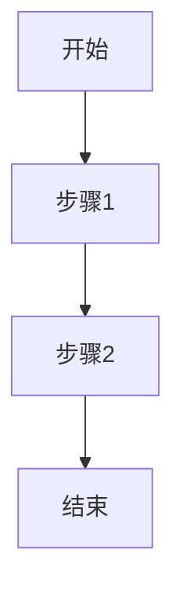
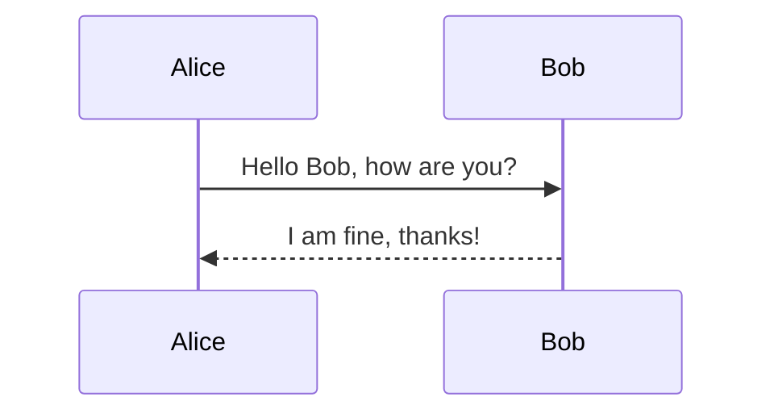
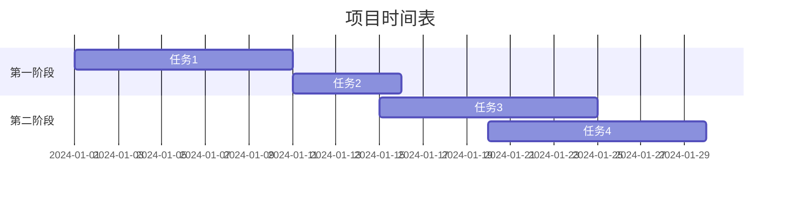

# Idea快捷键

| 指令                  | 用途                               |
| :------------------------: | :--------------------------------: |
| ctrl + alt + M           | 将代码快变成方法                          |
| ctrl + y | 删除一行 |
| ctrl + P | 显示方法参数             |
| ctrl + F10 | 运行程序               |
| ctrl + alt + L | java格式化代码 （如果失效，可能比如QQ快捷键占用了） |
| alt + enter | 快速生成赋值变量 |
| ctrl + alt + t | 产生try...catch |
| shift + F6 | 批量替换某些字符 |
| ctrl + d | 复制一行 |
| ctrl + shift + 上下键 | 将一行代码上下移动 |
| ctrl + H | 查看当前类的继承关系 |
| ctrl + shift + L / ctrl + F | 查找/替换 |
| shift + shift | 全局查找 |
| ctrl + Y | 删除一行 |

# Other

|      F       |    B站切换全屏     |
| :----------: | :----------------: |
| **ctrl + F** | **浏览器页面搜索** |
| **win + D**  |    **回到桌面**    |
|              |                    |
|              |                    |
|              |                    |
|              |                    |
|              |                    |

# Mermaid

Mermaid 是一种用于生成图表的简单标记语言。它允许用户通过编写简单的文本描述来创建流程图、序列图、甘特图等多种类型的图表。Mermaid 的一大优势在于它的易用性和与 Markdown 的兼容性，这使得它非常适合在文档、博客和笔记中嵌入图表。

### 基本语法

#### 流程图


#### 序列图


#### 甘特图


### 使用方法

1. **Markdown 文件**：许多 Markdown 编辑器（如 VSCode、Typora）支持直接渲染 Mermaid 图表。只需将上述代码块插入到 Markdown 文件中即可。

2. **HTML 页面**：可以在 HTML 页面中使用 Mermaid.js 库来渲染图表。首先需要引入 Mermaid.js 库，然后在页面中添加 Mermaid 代码块。

   ```html
   <script src="https://cdn.jsdelivr.net/npm/mermaid/dist/mermaid.min.js"></script>
   <div class="mermaid">
     graph TD
         A[开始] --> B[步骤1]
         B --> C[步骤2]
         C --> D[结束]
   </div>
   <script>
     mermaid.initialize({ startOnLoad: true });
   </script>
   ```

### 示例

下面是一个完整的示例，展示如何在 Markdown 文件中使用 Mermaid 创建一个简单的流程图：

```markdown
# 示例流程图


