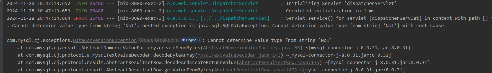

# Mybatis

## 错误一：



由于 @Data和@Builder 同时使用会导致 **无参构造函数失效。**

```java
// 建议进行如下注解
@Data
@Builder
@AllArgsConstructor
@NoArgsConstructor
```

参考文章：https://blog.csdn.net/kingwinstar/article/details/107106239