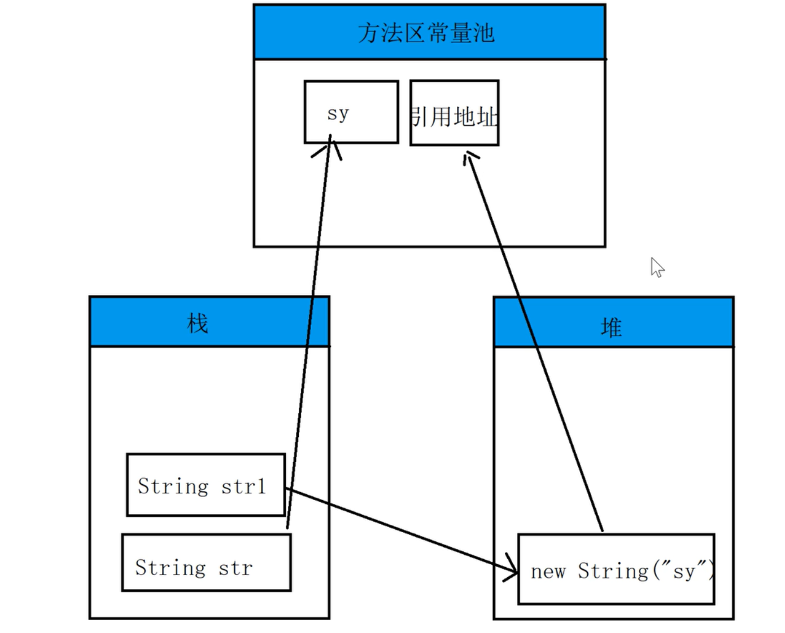

## String 常量池

- String str = "sy"；
- String strNew = new String("sy");
- 比较内容时怎么比较？
- **怎么判断这两块空间不是同一块？（javap -verbose xx.class）**
- 画出String 创建的一个流程图？

## String StringBuilder StringBuffer 区别

- StringBuilder 性能最好 > StringBuffer > String
- StringBuffer  是线程安全的 